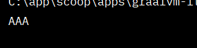
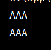
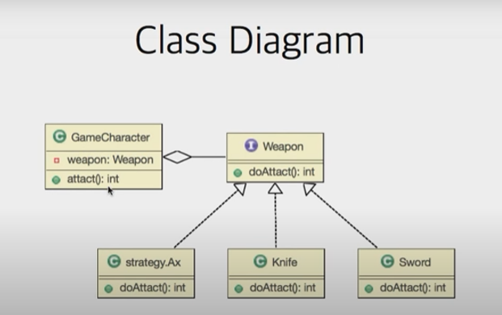

## 인터페이스

- 두 객체를 연결해주는 접점
- 기능에 대한 **선언과 구현 분리**
    - A라는 기능을 인터페이스를 통해 구현

```java
public interface Ainterface {
    // 기능 선언
    public void funcA();
}// end interface
```

```java
public class AinterfaceImpl implements Ainterface {

    // 기능 구현
    @Override
    public void funcA() {
        System.out.println("AAA");
    }// funcA

}// end class
```

- 기능을 사용 **통로**

```java
public class Main {
    public static void main(String[] args) {
        Ainterface ainterface = new AinterfaceImpl();
        // 통로
        ainterface.funcA();
    }// main
} // end class
```

     


## 델리게이트

- **위임**하다

```java
public class AObj {
    Ainterface ainterface;

    public AObj() {
        ainterface = new AinterfaceImpl();
    }// constructor

    public void funcAA() {
        // 위임한다
        ainterface.funcA();
        ainterface.funcA();

//        System.out.println("AAA");
//        System.out.println("AAA");
        // ~ 기능이 필요합니다.. 복붙 X A인터페이스로 구현 가능

    }// funcAA
}// end class
```

```java
public class Main {
    public static void main(String[] args) {
        Ainterface ainterface = new AinterfaceImpl();
        // 통로
//        ainterface.funcA();

        AObj aObj = new AObj();
        aObj.funcAA();
    }// main
} // end class
```

     


## Strategy Pattern

- 여러 알고리즘을 하나의 **추상적인 접근점**을 만들어 접근점에서 서로 **교환** 가능하도록 하는 패턴

- 예시
    - 요구사항
        - 신작 게임에서 캐릭터와 무기를 구현해보세요
        - 무기(접근점)는 두가지 종류가 있습니다. → 칼로 선택할 수 있고 검을 선택할 수 있다.. strategy pattern
            - 칼
            - 검
    - interface
    
    ```java
    public interface Weapon {
        public void attack();
    }// end interface
    ```
    
    - 칼
    
    ```java
    public class Knife implements Weapon{
    
        @Override
        public void attack() {
            System.out.println("칼 공격");
        }// attack
    
    }// end class
    ```
    
    - 검
    
    ```java
    public class Sword implements Weapon {
        @Override
        public void attack() {
            System.out.println("검 공격");
        }// attack
    } // end class
    ```
    
    - 게임 캐릭터
    
    ```java
    public class GameCharacter {
    
        // 접근점
       private Weapon weapon;
    
        // 교환 가능 하게 set 으로
        public void setWeapon(Weapon weapon) {
            this.weapon = weapon;
        }// setter
    
        public void attack() {
            if (weapon == null) {
                System.out.println("맨손 공격");
            } else {
                // 델리게이트
                weapon.attack();
            } // if-else
    
        }// attack
    } // end class
    ```
    
    - main
    
    ```java
    public class Main {
        public static void main(String[] args) {
    
            GameCharacter character = new GameCharacter();
            character.attack();
    
            character.setWeapon(new Knife());
            character.attack();
    
            character.setWeapon(new Sword());
            character.attack();
    
        }// main
    } // end class
    ```
    
    ❗ 유지보수 (도끼 무기를 추가해주세요)
    
    → GameChracter 의 코드를 고치지 않고 도끼만 추가해주면 쉽게 유지보수 가능
    
    - 도끼
    
    ```java
    public class Ax implements Weapon {
    
        @Override
        public void attack() {
            System.out.println("도끼 공격");
        }// attack
    
    } // end class
    ```
    
    ```java
    public class Main {
        public static void main(String[] args) {
    
            GameCharacter character = new GameCharacter();
            character.attack();
    
            character.setWeapon(new Knife());
            character.attack();
    
            character.setWeapon(new Sword());
            character.attack();
    
            character.setWeapon(new Ax());
            character.attack();
    
        }// main
    } // end class
    ```
    
      
