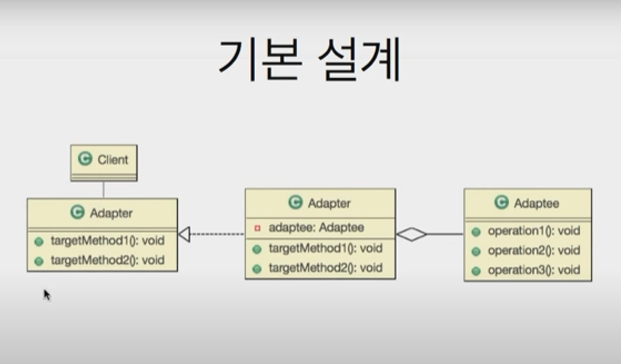

## Adapter?

- 다목적으로 사용하기 위한 **부가기구**

     


- 예시
    - 요구사항
        - 두 수에 대한 다음 연산을 수행하는 객체를 만들어 주세요
            - 수의 두 배의 수를 반환 : twiceOf(Float) : Float
            - 수의 반(1/2)의 수를 반환 : halfOf(Float): Float
        - 구현 객체 이름은 ‘Adapter’으로 해주세요
        - Math 클래스에서 두 배와 절반을 구하는 함수는 이미 구현 되어 있습니다
        
        ```java
        public class Math {
            // 두배
            public static double twoTime(double num){
                return num * 2;
            }// twoTime
        
            // 절반
            public static double half(double num) {
                return num / 2;
            }// half
        
            // 강화된 알고리즘
            public static Double doubled(Double d) {
                return d * 2;
            } // doubled
        }// end class
        ```
        
- interface
    
    ```java
    public interface Adapter {
        // 원하는 기능
        public Float twiceOf(Float f);
        public Float halfOf(Float f);
    }// end interface
    ```
    
    ```java
    public class AdapterImpl implements Adapter {
    
    //    Math math;
    
        @Override
        public Float twiceOf(Float f) {
    //        return (float) Math.twoTime(f.doubleValue());
    				// 강화된 알고리즘으로 변경
            return Math.doubled(f.doubleValue()).floatValue();
        }// twiceOf
    
        @Override
        public Float halfOf(Float f) {
            // Math 클래스에서 X
            System.out.println("절반 함수 호출 시작");
            return (float) Math.half(f.doubleValue());
        }// halfOf
    }// end class
    ```
    
- main

```java
public class Main {
    public static void main(String[] args) {
        Adapter adapter = new AdapterImpl();
        System.out.println(adapter.twiceOf(100f));
        System.out.println(adapter.halfOf(88f));
    }// main
}// end class
```