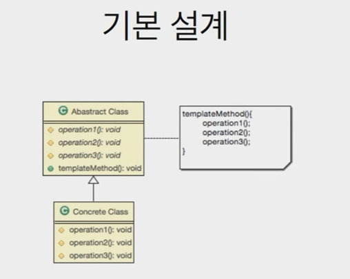
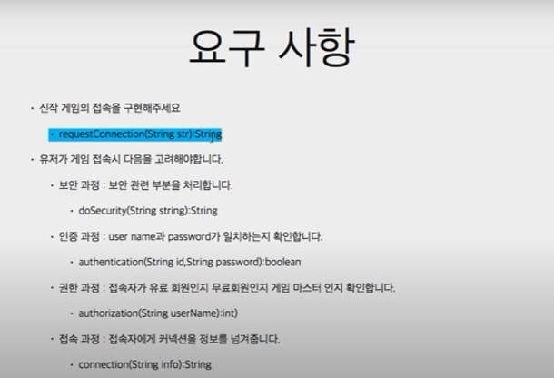
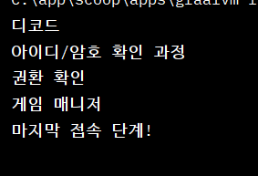
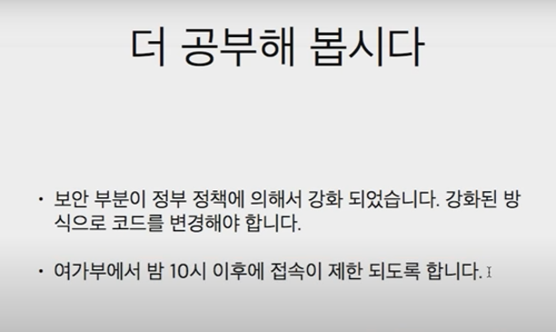

- 알고리즘의 **구조를 메소드에 정의** 하고 하위 클래스에서 알고리즘 구조의 변경없이 알고리즘을 **재정의** 하는 패턴

## 언제 사용?

- 구현하려는 알고리즘이 **일정한 프로세스**가 있다. (여러 단계로 나눌 수 있다)
- 구현하려는 알고리즘이 **변경 가능성**이 있다.

## 어떻게?

- 알고리즘을 **여러 단계**로 나눈다.
- 나눠진 알고리즘의 단계를 **메소드로 선언**한다.
- 알고리즘을 수행할 **템플릿 메소드**를 만든다.
- 하위 클래스에서 **나눠진 메소드들을 구현**한다.

     


     


- abstract

```java
package com.ex;

public abstract class AbstGameConnectHelper {

    protected abstract String doSecurity(String string);

    protected abstract boolean authentication(String id, String password);

    protected abstract int authorization(String userName);

    protected abstract String connection(String info);

    // 템플릿 메소드
    public String requestConnection(String encodedInfo) {
        // 보안 작업 -> 암호화 된 문자열을 디코드(복구화)
        String decodedInfo = doSecurity(encodedInfo);

        // 반환된 것을 가지고 아이디, 암호를 할당한다.
        String id = "aaa";
        String password = "bbb";
        if (!authentication(id, password)) {
            throw new Error("아이디 암호 불일치");
        }// if

        String userName = "userName";
        int i = authorization(userName);
        switch (i) {
            case 0:
                System.out.println("게임 매니저");
                break;
            case 1:
                System.out.println("유료 회원");
                break;
            case 2:
                System.out.println("무료 회원");
                break;
            case 3:
                System.out.println("권한 없음");
                break;
            default:
                System.out.println("기타 상황");
                break;
        }// while

        return connection(decodedInfo);
    }// requestConnection
} // end class
```

```java
package com.ex;

public class DefaultGameConnectHelpper extends AbstGameConnectHelper{
    @Override
    protected String doSecurity(String string) {
        System.out.println("디코드");
        return string;
    }// doSecurity

    @Override
    protected boolean authentication(String id, String password) {
        System.out.println("아이디/암호 확인 과정");
        return true;
    }// authentication

    @Override
    protected int authorization(String userName) {
        System.out.println("권환 확인");
        return 0;
    }// authorization

    @Override
    protected String connection(String info) {
        System.out.println("마지막 접속 단계!");
        return info;
    }// connection
}// end class
```

- main

```java
import com.ex.AbstGameConnectHelper;
import com.ex.DefaultGameConnectHelpper;

public class Main {
    public static void main(String[] args) {
        AbstGameConnectHelper helper = new DefaultGameConnectHelpper();

        helper.requestConnection("아이디 암호 등 접속 정보");
    }// main
}// Main
```

     


➕ 

     


```java
package com.ex;

public class DefaultGameConnectHelpper extends AbstGameConnectHelper{
    @Override
    protected String doSecurity(String string) {
        System.out.println("강화된 알고리즘을 이용한 디코드");
        return string;
    }// doSecurity

    @Override
    protected boolean authentication(String id, String password) {
        System.out.println("아이디/암호 확인 과정");
        return true;
    }// authentication

    @Override
    protected int authorization(String userName) {
        System.out.println("권환 확인");
        // 서버에서 유저 이름을 통해 유저의 나이를 알 수 있다.
        // 나이를 확인하고 시간을 확인하고 성인이 아니고 10시가 지났다면
        // 권한이 없는 것으로 한다.

        return 0;
    }// authorization

    @Override
    protected String connection(String info) {
        System.out.println("마지막 접속 단계!");
        return info;
    }// connection
}// end class
```

- abstract

```java
// 템플릿 메소드
    public String requestConnection(String encodedInfo) {
        // 보안 작업 -> 암호화 된 문자열을 디코드(복구화)
        String decodedInfo = doSecurity(encodedInfo);

        // 반환된 것을 가지고 아이디, 암호를 할당한다.
        String id = "aaa";
        String password = "bbb";
        if (!authentication(id, password)) {
            throw new Error("아이디 암호 불일치");
        }// if

        String userName = "userName";
        int i = authorization(userName);
        switch (i) {
            case -1:
                throw new Error("셧다운");
            case 0:
                System.out.println("게임 매니저");
                break;
            case 1:
                System.out.println("유료 회원");
                break;
            case 2:
                System.out.println("무료 회원");
                break;
            case 3:
                System.out.println("권한 없음");
                break;
            default:
                System.out.println("기타 상황");
                break;
        }// while

        return connection(decodedInfo);
    }// requestConnection
```