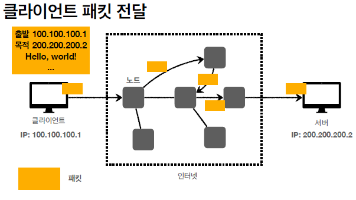

# 인터넷 네트워크

## IP(인터넷 프로토콜)

     

✅ 인터넷 프로토콜 역할     
- 지정한 IP 주소(IP Address)에 데이터 전달     
- 패킷(Packet)이라는 통신 단위로 데이터 전달     
🌟 패킷(Packet) : pack 과 bucket의 합친 말, 컴퓨터 간에 데이터를 주고받을 때 네트워크를 통해서 전송되는 데이터의 형식화된 블록(조각)     

     
     
     

✅ IP 프로토콜의 한계     
- 비연결성     
　- 패킷을 받을 대상이 없거나 서비스 불능 상태여도 패킷 전송     
- 비신뢰성     
　- 중간에 패킷이 사라지면?     
　- 패킷이 순서대로 안오면?     
- 프로그램 구분     
　- 같은 IP를 사용하는 서버에서 통신하는 애플리케이션이 둘 이상이면?     

     
     
     
    

예) 총 3000바이트 → hello : 1500 바이트 , world! : 1500바이트 나눠서 보내면서 순서가 문제...    

 

## TCP (Transmission Control Protocol), UDP(User Datagram Protocol)

     
     
     
     
     

✅ TCP 특징     
전송 제어 프로토콜(Transmission Control Protocol)     
- 연결지향 - TCP 3 way handshake (가상 연결)     

     

- 데이터 전달 보증 (데이터 잘 받았다고 응답을 해줌)     
- 순서 보장     

     

- 신뢰할 수 있는 프로토콜     
- 현재는 대부분 TCP 사용     
 

✅ UDP 특징     
사용자 데이터그램 프로토콜(User Datagram Protocol)     
- 하얀 도화지에 비유(기능이 거의 없음)     
- 연결지향 - TCP 3 way handshake X, 데이터 전달 보증 X, 순서 보장 X     
- **데이터 전달 및 순서가 보장되지 않지만, 단순하고 빠름**     
- 정리     
　- IP와 거의 같다. +PORT +체크섬 정도만 추가     
　- 애플리케이션에서 추가 작업 필요     

 

## PORT

     
     
     
     

출발지 IP(아파트) 와 PORT(몇동 몇호) 를 같이 보낸다    

 

- 0 ~ 65535 할당 가능     
- 0 ~ 1023: 잘 알려진 포트, 사용하지 않는 것이 좋음     
　- FTP - 20, 21     
　- TELNET - 23     
　- HTTP - 80     
　- HTTPS - 443     

 

## DNS

- IP는 기억하기 어렵다.     
- IP는 변경될 수 있다.     
 

✅ DNS     
도메인 네임 시스템(Domain Name System)     
- 전화번호부     
- 도메인 명을 IP 주소로 변환     

     

🎯 데이터 전송을 위해 IP 필요하지만 IP만으로 데이터 전달이나 순서가 보장되지 않는 것을 TCP 프로토콜이 해결해주고 UDP는 IP랑 비슷하고 Port만 제공해준다.  필요하다면 UDP에서 기능을 확장 할 수 있다.     