# URI와 웹 브라우저 요청 흐름

## URI (Uniform Resource Identifier)

- URI는 로케이터(locator), 이름(name) 또는 둘 다 추가로 분류될 수 있다"     

[https://www.ietf.org/rfc/rfc3986.txt](https://www.ietf.org/rfc/rfc3986.txt) - 1.1.3. URI, URL, and URN

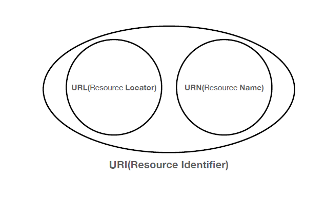     
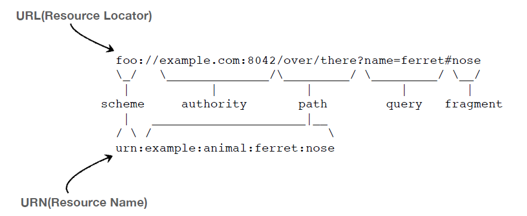     

✅ URI 뜻     
- Uniform: 리소스 식별하는 통일된 방식     
- Resource: 자원, URI로 식별할 수 있는 모든 것(제한 없음)     
- Identifier: 다른 항목과 구분하는데 필요한 정보     
 

✅ URL (Uniform Resource Locator), URN (Uniform Resource Name)     
- URL - Locator: 리소스가 있는 위치를 지정     
- URN - Name: 리소스에 이름을 부여     
- 위치는 변할 수 있지만, 이름은 변하지 않는다.     
- urn:isbn:8960777331 (어떤 책의 isbn URN)     
- URN 이름만으로 실제 리소스를 찾을 수 있는 방법이 보편화 되지 않음     
- 앞으로 URI를 URL과 같은 의미로 이야기하겠음     
 

✅ URL 전체 문법     
- scheme://[userinfo@]host[:port][/path][?query][#fragment]     
- [https://www.google.com:443/search?q=hello&hl=ko](https://www.google.com/search?q=hello&hl=ko)     
 

- 프로토콜(https)     
- 호스트명([www.google.com](http://www.google.com/))     
- 포트 번호(443)     
- 패스(/search)     
- 쿼리 파라미터(q=hello&hl=ko)     
✅ scheme     
**scheme**://[userinfo@]host[:port][/path][?query][#fragment]     
https     
- 주로 프로토콜 사용     
- 프로토콜: 어떤 방식으로 자원에 접근할 것인가 하는 약속 규칙     
- 예) http, https, ftp 등등     
- http는 80 포트, https는 443 포트를 주로 사용, 포트는 생략 가능     
- https는 http에 보안 추가 (HTTP Secure)     
✅ host     
scheme://[userinfo@]**host**[:port][/path][?query][#fragment]     
www.google.com     
- 호스트명     
- 도메인명 또는 IP 주소를 직접 사용가능     
✅ PORT     
scheme://[userinfo@]host**[:port]**[/path][?query][#fragment]     
:443     
- 포트(PORT)     
- 접속 포트     
- 일반적으로 생략, 생략시 http는 80, https는 443     
✅ path     
scheme://[userinfo@]host[:port]**[/path]**[?query][#fragment]     
/search     
- 리소스 경로(path), 계층적 구조     
- 예) /home/file1.jpg     
　/members     
　/members/100, /items/iphone12     
✅ query     
scheme://[userinfo@]host[:port][/path]**[?query]**[#fragment]     
?q=hello&hl=ko     
- key=value 형태     
- ?로 시작, &로 추가 가능 ?keyA=valueA&keyB=valueB     
- query parameter, query string 등으로 불림, 웹서버에 제공하는 파라미터, 문자 형태     
✅ fragment     
scheme://[userinfo@]host[:port][/path][?query]**[#fragment]**     
https://docs.spring.io/spring-boot/docs/current/reference/html/gettingstarted.html**#getting-started-introducing-spring-boot**     
- fragment     
- html 내부 북마크 등에 사용     
- 서버에 전송하는 정보 아님     

 

## 웹 브라우저 요청 흐름

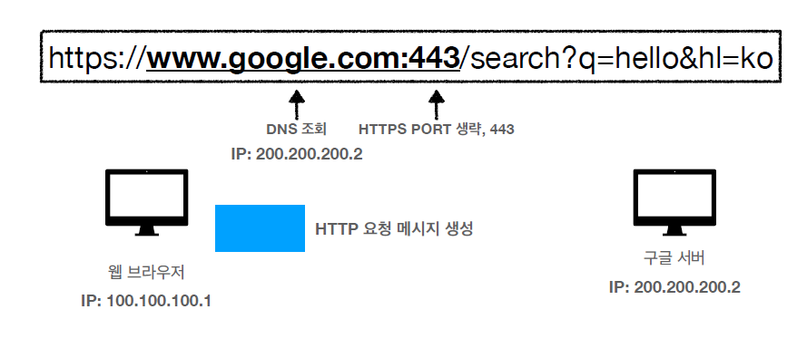     
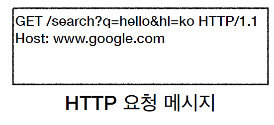     
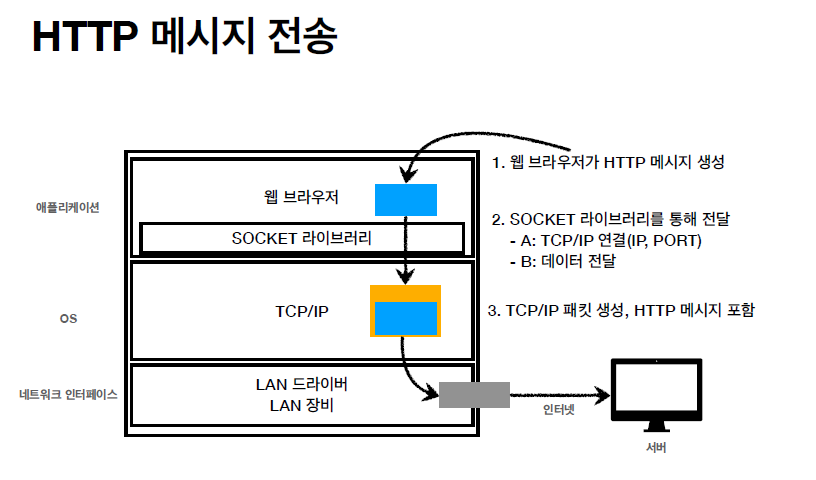     
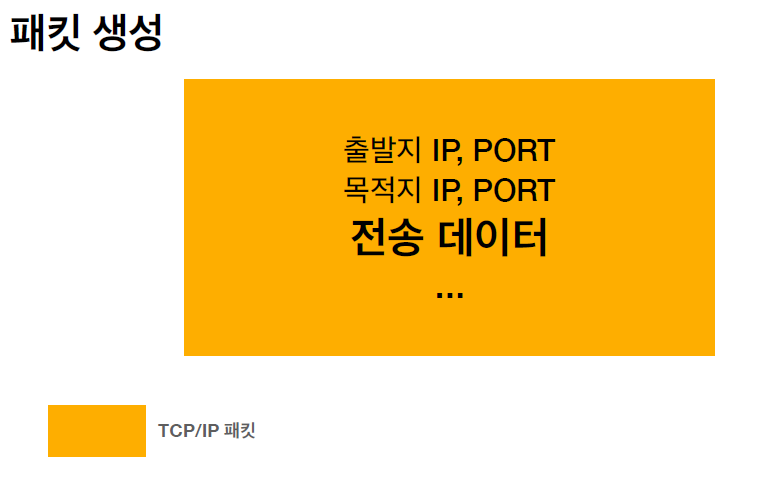     
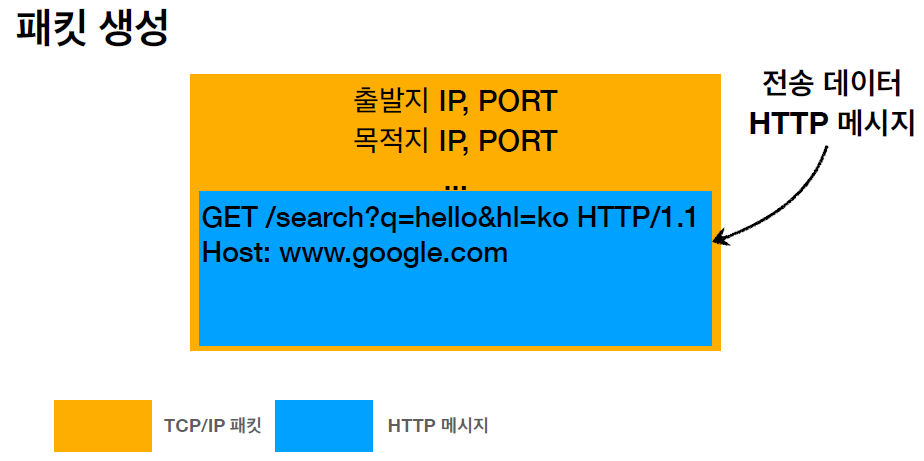     
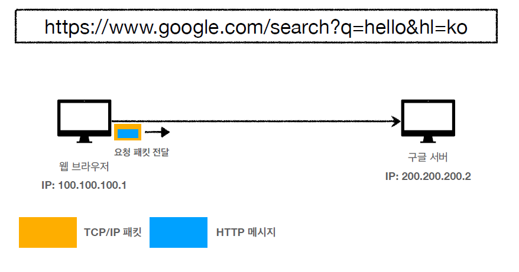
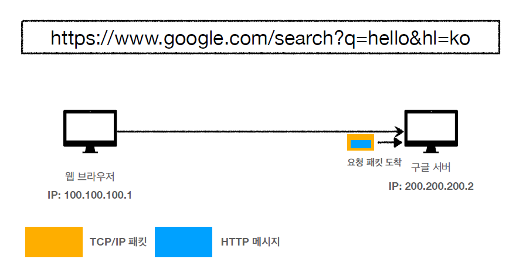     
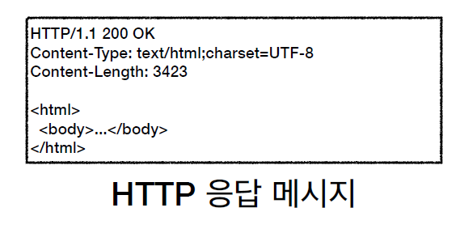     
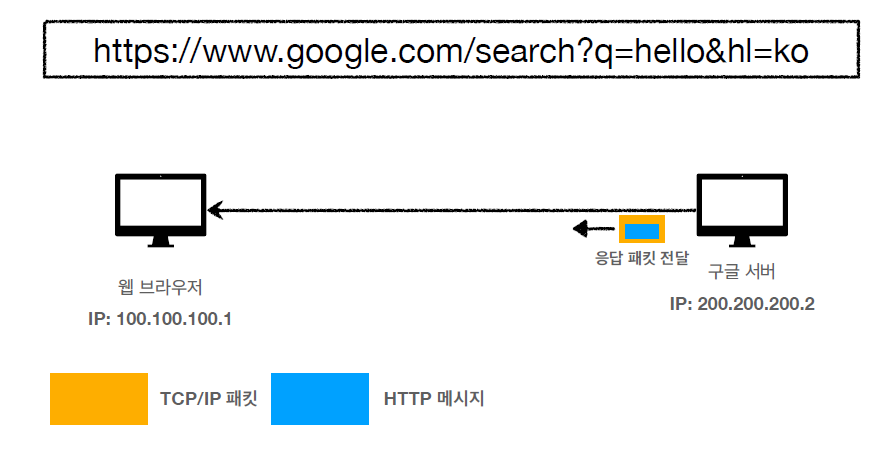
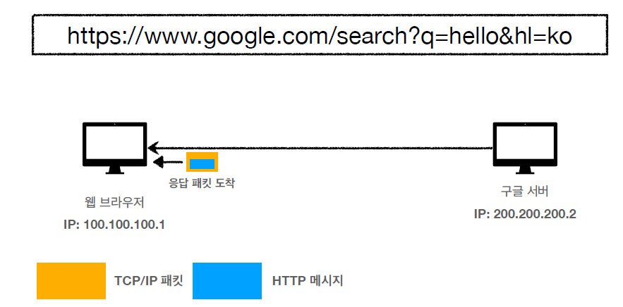     
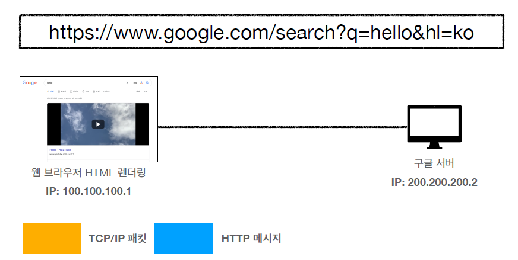     
