# HTTP 기본

## 모든 것이 HTTP

- HTTP (HyperText Transfer Protocol)       
- 거의 모든 형태의 데이터 전송 가능       
 

- HTTP/1.1 1997년: 가장 많이 사용, 우리에게 가장 중요한 버전       
 

- 기반 프로토콜       
　- TCP: HTTP/1.1, HTTP/2       
　- UDP: HTTP/3       
 

✅ HTTP 특징       
- 클라이언트 서버 구조       
- 무상태 프로토콜(스테이스리스), 비연결성       
- HTTP 메시지       
- 단순함, 확장 가능       

 

## 클라이언트 서버 구조

- Request Response 구조       
- 클라이언트는 서버에 요청을 보내고, 응답을 대기       
- 서버가 요청에 대한 결과를 만들어서 응답       

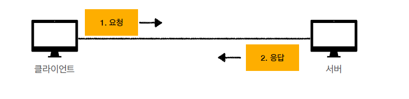     

 

## Stateful, Stateless

✅ 무상태 프로토콜     
스테이스리스(Stateless)     
- 서버가 클라이언트의 상태를 보존X     
- 장점: 서버 확장성 높음(스케일 아웃)     
- 단점: 클라이언트가 추가 데이터 전송     
 

✅ Stateful, Stateless 차이     
- 상태 유지 - Stateful, 정리     
고객: 이 **노트북** 얼마인가요?     
점원: 100만원 입니다. **(노트북 상태 유지)**     
고객: **2개** 구매하겠습니다.     
점원: 200만원 입니다. **신용카드, 현금중**에 어떤 걸로 구매 하시겠어요?     
**(노트북, 2개 상태 유지)**     
고객: 신용카드로 구매하겠습니다.     
점원: 200만원 결제 완료되었습니다. (**노트북, 2개, 신용카드 상태 유지)**     
 

- 무상태 - Stateless     
고객: 이 **노트북** 얼마인가요?     
점원: 100만원 입니다.     
고객: **노트북 2개** 구매하겠습니다.     
점원: 노트북 2개는 200만원 입니다. **신용카드, 현금중**에 어떤 걸로 구매 하시겠어요?     
고객: **노트북 2개를 신용카드**로 구매하겠습니다.     
점원: 200만원 결제 완료되었습니다.     
 

✅ 정리     
- **상태 유지**: 중간에 다른 점원으로 바뀌면 안된다.     
(중간에 다른 점원으로 바뀔 때 상태 정보를 다른 점원에게 미리 알려줘야 한다.)     
- **무상태**: 중간에 다른 점원으로 바뀌어도 된다.     
　- 갑자기 고객이 증가해도 점원을 대거 투입할 수 있다.     
　- 갑자기 클라이언트 요청이 증가해도 서버를 대거 투입할 수 있다.     
- 무상태는 응답 서버를 쉽게 바꿀 수 있다. -> **무한한 서버 증설 가능**     

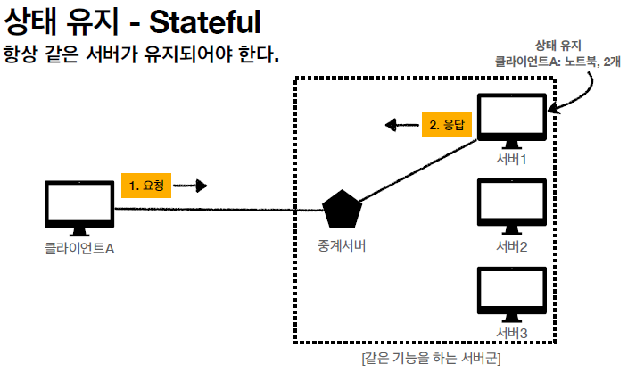
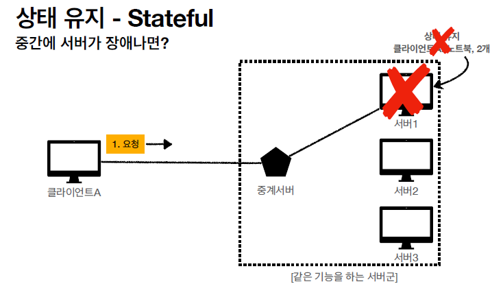     
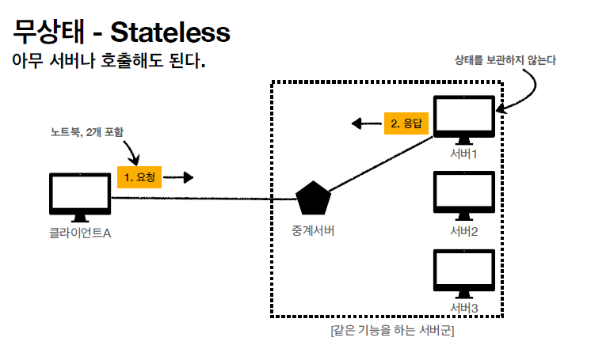
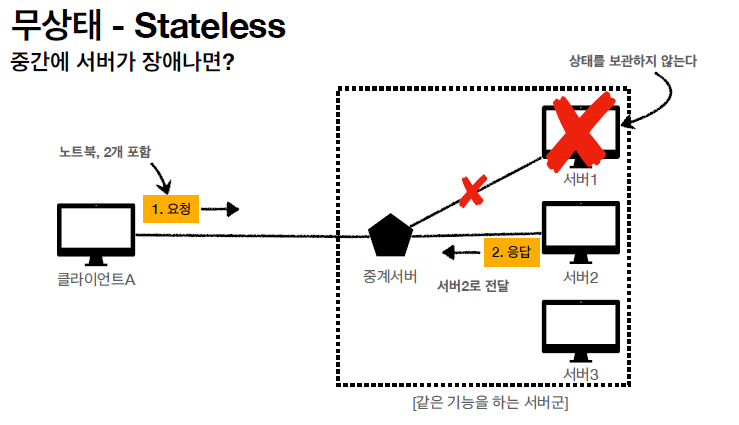     
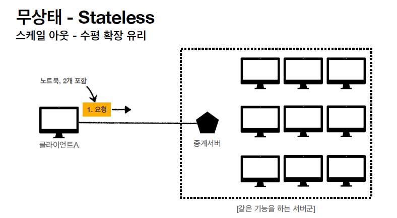     

✅ Stateless 실무 한계     
- 모든 것을 무상태로 설계 할 수 있는 경우도 있고 없는 경우도 있다.     
- 무상태     
　- 예) 로그인이 필요 없는 단순한 서비스 소개 화면     
- 상태 유지     
　- 예) 로그인     
- 로그인한 사용자의 경우 로그인 했다는 상태를 서버에 유지     
- 일반적으로 브라우저 쿠키와 서버 세션등을 사용해서 상태 유지     
- 상태 유지는 최소한만 사용     

 

## 비 연결성(connectionless)

     
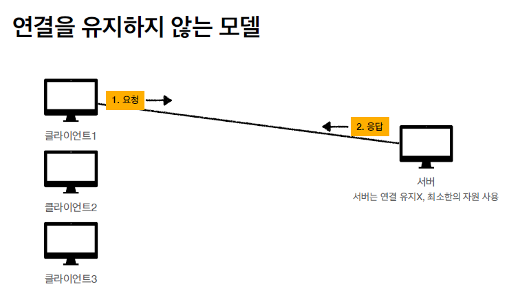     

✅ 비 연결성     
- HTTP는 기본이 연결을 유지하지 않는 모델     
- 일반적으로 초 단위의 이하의 빠른 속도로 응답     
- 1시간 동안 수천명이 서비스를 사용해도 실제 서버에서 동시에 처리하는 요청은 수십개 이하로 매우 작음     
　- 예) 웹 브라우저에서 계속 연속해서 검색 버튼을 누르지는 않는다.     
- 서버 자원을 매우 효율적으로 사용할 수 있음     
 

✅ 비 연결성 한계와 극복     
- TCP/IP 연결을 새로 맺어야 함 - 3 way handshake 시간 추가     
- 웹 브라우저로 사이트를 요청하면 HTML 뿐만 아니라 자바스크립트, css, 추가 이미지 등등 수 많은 자원이 함께 다운로드     
- 지금은 HTTP 지속 연결(Persistent Connections)로 문제 해결     
- HTTP/2, HTTP/3에서 더 많은 최적화     

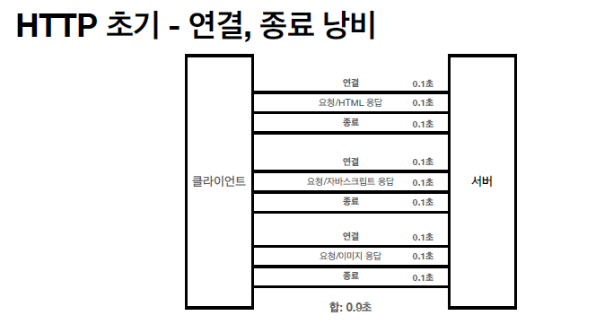     
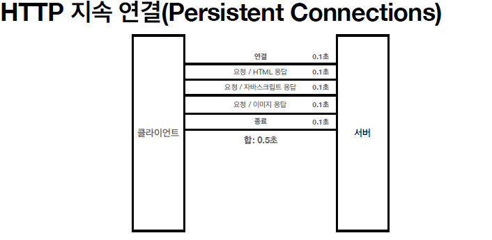     

## HTTP 메시지

     
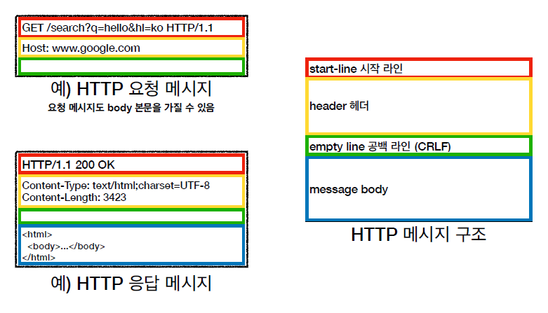     

✅ 시작 라인 (요청 메시지)     
GET /search?q=hello&hl=ko HTTP/1.1     
Host: [www.google.com](http://www.google.com/)     
- start-line = **request-line** / status-line     
- **request-line** = method SP(공백) request-target SP HTTP-version CRLF(엔터)     
- HTTP 메서드 (GET: 조회)     
- 요청 대상 (/search?q=hello&hl=ko)     
- HTTP Version     

✅ 시작 라인 (요청 메시지 - HTTP 메서드)     
- 종류: GET, POST, PUT, DELETE...     
- 서버가 수행해야 할 동작 지정     
- GET: 리소스 조회     
- POST: 요청 내역 처리     

✅ 시작 라인 (요청 메시지 - 요청 대상)     
- absolute-path[?query] (절대경로[?쿼리])     
- 절대경로= "/" 로 시작하는 경로     
- 참고: *, http://...?x=y 와 같이 다른 유형의 경로지정 방법도 있다.     

✅ 시작 라인 (응답 메시지)     

- start-line = request-line / **status-line**     
- **status-line** = HTTP-version SP status-code SP reason-phrase CRLF     
- HTTP 버전     
- HTTP 상태 코드: 요청 성공, 실패를 나타냄     
　- 200: 성공     
　- 400: 클라이언트 요청 오류     
　- 500: 서버 내부 오류     
- 이유 문구: 사람이 이해할 수 있는 짧은 상태 코드 설명 글     

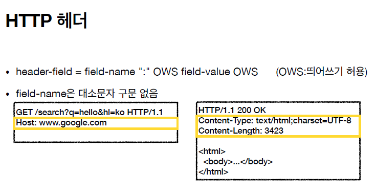     

✅ HTTP 헤더 용도     
- HTTP 전송에 필요한 모든 부가정보     
- 예) 메시지 바디의 내용, 메시지 바디의 크기, 압축, 인증, 요청 클라이언트(브라우저) 정보, 서버 애플리케이션 정보, 캐시 관리 정보...     
- 표준 헤더가 너무 많음     
　- [https://en.wikipedia.org/wiki/List_of_HTTP_header_fields](https://en.wikipedia.org/wiki/List_of_HTTP_header_fields)     

- 필요시 임의의 헤더 추가 가능     
　- helloworld: hihi     
 

✅ HTTP 메시지 바디 용도     
- 실제 전송할 데이터     
- HTML 문서, 이미지, 영상, JSON 등등 byte로 표현할 수 있는 모든 데이터 전송 가능     
 

🎯 HTTP 정리     
- HTTP 메시지에 모든 것을 전송     
- HTTP 역사 HTTP/1.1을 기준으로 학습     
- 클라이언트 서버 구조     
- 무상태 프로토콜(스테이스리스)     
- HTTP 메시지     
- 단순함, 확장 가능     
- 지금은 HTTP 시대     