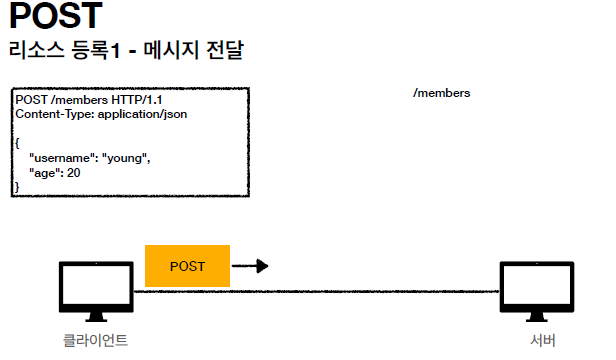
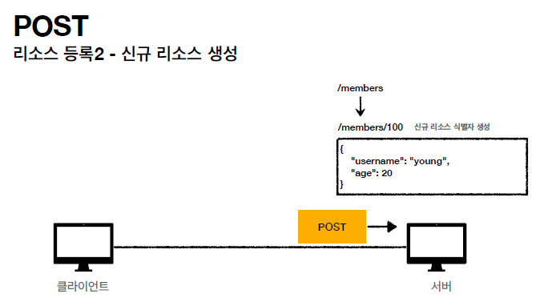
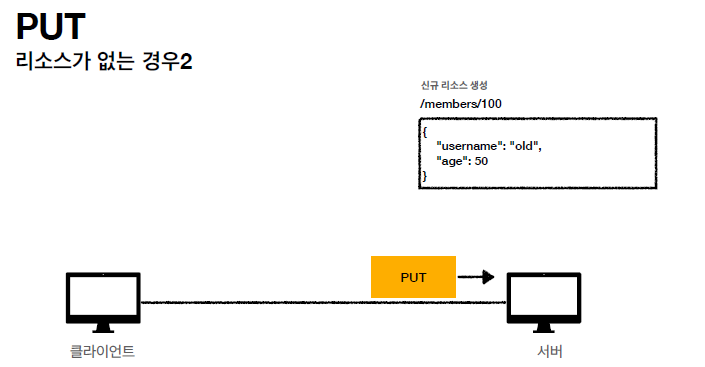

# HTTP 메서드

## HTTP API를 만들어보자

✅ API URI 설계       
URI(Uniform Resource Identifier)       
- 회원 목록 조회 /read-member-list       
- 회원 조회 /read-member-by-id       
- 회원 등록 /create-member       
- 회원 수정 /update-member       
- 회원 삭제 /delete-member       
 

→ 회원이라는 개념 자체가 바로 리소스다.       
→ 회원이라는 리소스만 식별하면 된다. -> 회원 리소스를 URI에 매핑       
 

✅ API URI 설계       
리소스 식별, URI 계층 구조 활용       
- 회원 목록 조회 /members       
- 회원 조회 /members/{id} → 어떻게 구분하지?       
- 회원 등록 /members/{id} → 어떻게 구분하지?       
- 회원 수정 /members/{id} → 어떻게 구분하지?       
- 회원 삭제 /members/{id} → 어떻게 구분하지?       
- 참고: 계층 구조상 상위를 컬렉션으로 보고 복수단어 사용 권장(member -> members)       
 

✅ 리소스와 행위을 분리       
가장 중요한 것은 리소스를 식별하는 것       
- URI는 리소스만 식별!       
- 리소스와 해당 리소스를 대상으로 하는 행위을 분리       
　- 리소스: 회원       
　- 행위: 조회, 등록, 삭제, 변경       
- 리소스는 명사, 행위는 동사 (미네랄을 캐라)       
- 행위(메서드)는 어떻게 구분?       

 

## HTTP 메서드 - GET, POST

✅ HTTP 메서드 종류       
주요 메서드       
- GET: 리소스 조회       
- POST: 요청 데이터 처리, 주로 등록에 사용       
- PUT: 리소스를 대체, 해당 리소스가 없으면 생성       
- PATCH: 리소스 부분 변경       
- DELETE: 리소스 삭제       
 

✅ GET       
- 리소스 조회       
- 서버에 전달하고 싶은 데이터는 query(쿼리 파라미터, 쿼리 스트링)를 통해서 전달       
- 메시지 바디를 사용해서 데이터를 전달할 수 있지만, 지원하지 않는 곳이 많아서 권장하지 않음       

     
     
     

✅ POST     
- 요청 데이터 처리     
- **메시지 바디를 통해 서버로 요청 데이터 전달**     
- 서버는 요청 데이터를 **처리**     
- 메시지 바디를 통해 들어온 데이터를 처리하는 모든 기능을 수행한다.     
- 주로 전달된 데이터로 신규 리소스 등록, 프로세스 처리에 사용     

     
     
     

✅ POST 정리     
**1. 새 리소스 생성(등록)**     
• 서버가 아직 식별하지 않은 새 리소스 생성     
**2. 요청 데이터 처리**     
• 단순히 데이터를 생성하거나, 변경하는 것을 넘어서 프로세스를 처리해야 하는 경우     
• 예) 주문에서 결제완료 -> 배달시작 -> 배달완료 처럼 단순히 값 변경을 넘어 프로세스의 상태가 변경되는 경우     
• POST의 결과로 새로운 리소스가 생성되지 않을 수도 있음     
• 예) POST /orders/{orderId}/start-delivery **(컨트롤 URI)**     
**3. 다른 메서드로 처리하기 애매한 경우**     
• 예) JSON으로 조회 데이터를 넘겨야 하는데, GET 메서드를 사용하기 어려운 경우     
• 애매하면 POST     

 

## HTTP 메서드 - PUT, PATCH, DELETE

✅ PUT     
- **리소스를 대체**     
　- 리소스가 있으면 대체     
　- 리소스가 없으면 생성     
　- 쉽게 이야기해서 덮어버림     
- **중요! 클라이언트가 리소스를 식별**     
　- 클라이언트가 리소스 위치를 알고 URI 지정     
　- POST와 차이점     

     
     
     
     
     
     

✅ PATCH     
• 리소스 부분 변경     

     
     

✅ DELETE     
• 리소스 제거     

     
     

 

## HTTP 메서드의 속성

- 안전(Safe Methods)     
- 멱등(Idempotent Methods)     
- 캐시가능(Cacheable Methods)     

     

✅ 안전 (Safe)     
- 호출해도 리소스를 변경하지 않는다.     
- Q: 그래도 계속 호출해서, 로그 같은게 쌓여서 장애가 발생하면요?     
- A: 안전은 해당 리소스만 고려한다. 그런 부분까지 고려하지 않는다.     
 

✅ 멱등 (Idempotent)     
- f(f(x)) = f(x)     
- 한 번 호출하든 두 번 호출하든 100번 호출하든 결과가 똑같다.     
- 멱등 메서드     
　- **GET**: 한 번 조회하든, 두 번 조회하든 같은 결과가 조회된다.     
　- **PUT**: 결과를 대체한다. 따라서 같은 요청을 여러번 해도 최종 결과는 같다.     
　- **DELETE**: 결과를 삭제한다. 같은 요청을 여러번 해도 삭제된 결과는 똑같다.     
　- POST: 멱등이 아니다! 두 번 호출하면 같은 결제가 중복해서 발생할 수 있다.     
- 활용          
　- 자동 복구 메커니즘     
　- 서버가 TIMEOUT 등으로 정상 응답을 못주었을 때, 클라이언트가 같은 요청을 다시 해도 되는가? 판단 근거     
- 멱등은 외부 요인으로 중간에 리소스가 변경되는 것 까지는 고려하지는 않는다.     

 

✅ 캐시가능 (Cacheable)     
- 응답 결과 리소스를 캐시해서 사용해도 되는가?     
- GET, HEAD, POST, PATCH 캐시가능     
- 실제로는 GET, HEAD 정도만 캐시로 사용     
　- POST, PATCH는 본문 내용까지 캐시 키로 고려해야 하는데, 구현이 쉽지 않음     