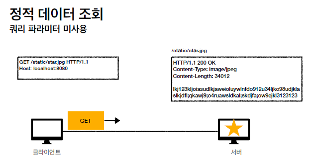
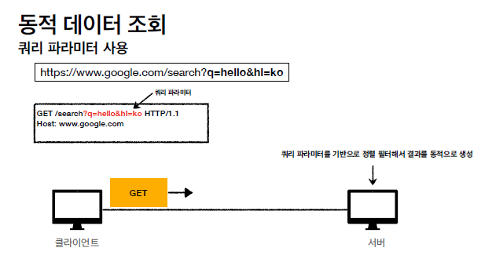
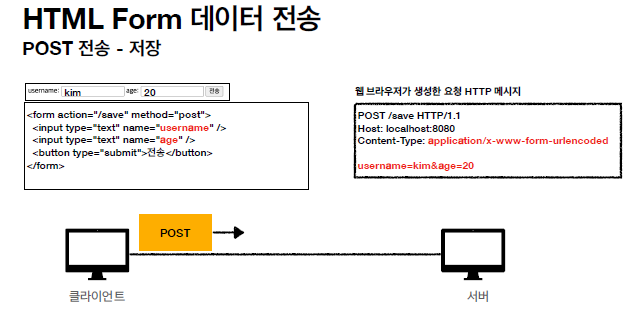
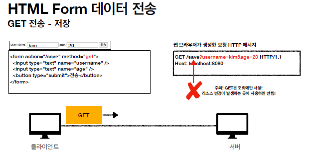
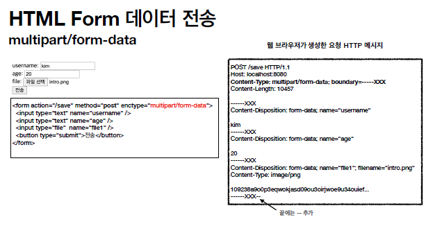
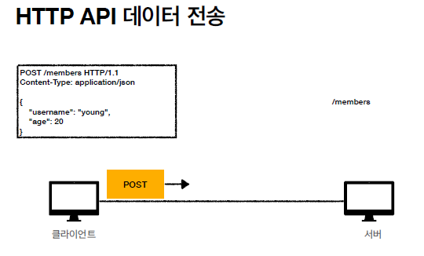
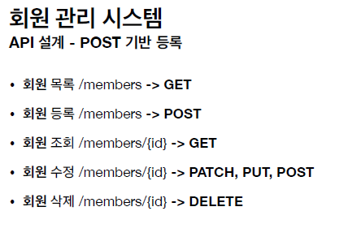
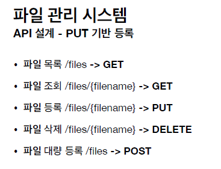
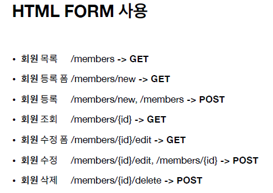

# HTTP 메서드 활용

## 클라이언트에서 서버로 데이터 전송

데이터 전달 방식은 크게 2가지       
- **쿼리 파라미터를 통한 데이터 전송**       
　- GET       
　- 주로 정렬 필터(검색어)       
- **메시지 바디를 통한 데이터 전송**       
　- POST, PUT, PATCH       
　- 회원 가입, 상품 주문, 리소스 등록, 리소스 변경       
 

✅ 정적 데이터 조회       
- 이미지, 정적 텍스트 문서       
- 조회는 GET 사용       
- 정적 데이터는 일반적으로 쿼리 파라미터 없이 리소스 경로로 단순하게 조회 가능       

     

✅ 동적 데이터 조회     
- 주로 검색, 게시판 목록에서 정렬 필터(검색어)     
- 조회 조건을 줄여주는 필터, 조회 결과를 정렬하는 정렬 조건에 주로 사용     
- 조회는 GET 사용     
- GET은 쿼리 파라미터 사용해서 데이터를 전달     

     

✅ HTML Form 데이터 전송     
- HTML Form submit시 POST 전송     
　- 예) 회원 가입, 상품 주문, 데이터 변경     
- Content-Type: application/x-www-form-urlencoded 사용     
　- form의 내용을 메시지 바디를 통해서 전송(key=value, 쿼리 파라미터 형식)     
　- 전송 데이터를 url encoding 처리     
　　- 예) abc김 -> abc%EA%B9%80     
- HTML Form은 GET 전송도 가능     
- **Content-Type: multipart/form-data**     
　- 파일 업로드 같은 바이너리 데이터 전송시 사용     
　- 다른 종류의 여러 파일과 폼의 내용 함께 전송 가능(그래서 이름이 multipart)     
- 참고: HTML Form 전송은 **GET, POST만** 지원     

     
     
     

✅ HTTP API 데이터 전송     
- 서버 to 서버     
　- 백엔드 시스템 통신     
- 앱 클라이언트     
　- 아이폰, 안드로이드     
- 웹 클라이언트     
　- HTML에서 Form 전송 대신 자바 스크립트를 통한 통신에 사용(AJAX)     
　- 예) React, VueJs 같은 웹 클라이언트와 API 통신     
- POST, PUT, PATCH: 메시지 바디를 통해 데이터 전송     
- GET: 조회, 쿼리 파라미터로 데이터 전달     
- Content-Type: application/json을 주로 사용 (사실상 표준)     
　- TEXT, XML, JSON 등등     

     

 

## HTTP API 설계 예시

- **HTTP API - 컬렉션**     
　**- POST 기반 등록 (서버가 리소스 URI 결정)**     
　- 예) 회원 관리 API 제공     
- **HTTP API - 스토어**     
　**- PUT 기반 등록 (클라이언트가 리소스 URI 결정)**     
　- 예) 정적 컨텐츠 관리, 원격 파일 관리     
- **HTML FORM 사용**     
　- 웹 페이지 회원 관리     
　- GET, POST만 지원     

     

✅ 회원 관리 시스템     
POST - 신규 자원 등록 특징     
- 클라이언트는 등록될 리소스의 URI를 모른다.     
　- 회원 등록 /members -> POST     
　- POST /members     
- 서버가 새로 등록된 리소스 URI를 생성해준다.     
　- HTTP/1.1 201 Created      
　Location: **/members/100**     
- 컬렉션(Collection)     
　- 서버가 관리하는 리소스 디렉토리     
　- 서버가 리소스의 URI를 생성하고 관리     
　- 여기서 컬렉션은 /members     

     

✅ 파일 관리 시스템     
PUT - 신규 자원 등록 특징     
- 클라이언트가 리소스 URI를 알고 있어야 한다.     
　- 파일 등록 /files/{filename} -> PUT     
　- PUT /files/star.jpg     
- 클라이언트가 직접 리소스의 URI를 지정한다.     
- 스토어(Store)     
　- 클라이언트가 관리하는 리소스 저장소     
　- 클라이언트가 리소스의 URI를 알고 관리     
　- 여기서 스토어는 /files     
 

✅ HTML FORM 사용     
- HTML FORM은 **GET, POST만** 지원     
- AJAX 같은 기술을 사용해서 해결 가능 -> 회원 API 참고     
- 여기서는 순수 HTML, HTML FORM 이야기     
- GET, POST만 지원하므로 제약이 있음     
- 컨트롤 URI     
　- GET, POST만 지원하므로 제약이 있음     
　- 이런 제약을 해결하기 위해 동사로 된 리소스 경로 사용     
　- POST의 /new, /edit, /delete가 컨트롤 URI     
　- HTTP 메서드로 해결하기 애매한 경우 사용(HTTP API 포함)     

     

🌟 참고하면 좋은 URI 설계 개념     
- 문서(document)     
　- 단일 개념(파일 하나, 객체 인스턴스, 데이터베이스 row)     
　- 예) /members/100, /files/star.jpg     
- 컬렉션(collection)     
　- 서버가 관리하는 리소스 디렉터리     
　- 서버가 리소스의 URI를 생성하고 관리     
　- 예) /members     
- 스토어(store)     
　- 클라이언트가 관리하는 자원 저장소     
　- 클라이언트가 리소스의 URI를 알고 관리     
　- 예) /files     
- 컨트롤러(controller), 컨트롤 URI     
　- 문서, 컬렉션, 스토어로 해결하기 어려운 추가 프로세스 실행     
　- 동사를 직접 사용     
　- 예) /members/{id}/delete     
[https://restfulapi.net/resource-naming](https://restfulapi.net/resource-naming)