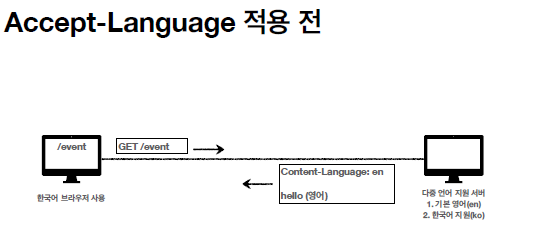

# HTTP 헤더1 - 일반 헤더

## HTTP 헤더 개요

      

✅ HTTP 헤더 용도      
- HTTP 전송에 필요한 모든 부가정보      
- 예) 메시지 바디의 내용, 메시지 바디의 크기, 압축, 인증, 요청 클라이언트, 서버 정보, 캐시 관리 정보...      
- 표준 헤더가 너무 많음      
- [https://en.wikipedia.org/wiki/List_of_HTTP_header_fields](https://en.wikipedia.org/wiki/List_of_HTTP_header_fields)      
- 필요시 임의의 헤더 추가 가능      

     

✅ RFC723x 변화     
- 엔티티(Entity) -> 표현(Representation)     
- Representation = representation Metadata + Representation Data     
- 표현 = 표현 메타데이터 + 표현 데이터     
 

✅ HTTP BODY     
**message body - RFC7230(최신)**     

     

- 메시지 본문(message body)을 통해 표현 데이터 전달     
- 메시지 본문 = 페이로드(payload)     
- **표현**은 요청이나 응답에서 전달할 실제 데이터     
- **표현 헤더는 표현 데이터**를 해석할 수 있는 정보 제공     
    - 데이터 유형(html, json), 데이터 길이, 압축 정보 등등     
- 참고: 표현 헤더는 표현 메타데이터와, 페이로드 메시지를 구분해야 하지만, 여기서는 생략      
 

## 표현

✅ Content-Type: 표현 데이터의 형식        

     

- 미디어 타입, 문자 인코딩     
- 예)     
    - text/html; charset=utf-8     
    - application/json     
    - image/png     

✅ Content-Encoding: 표현 데이터의 압축 방식     
 
     
     
     
     
     
          
