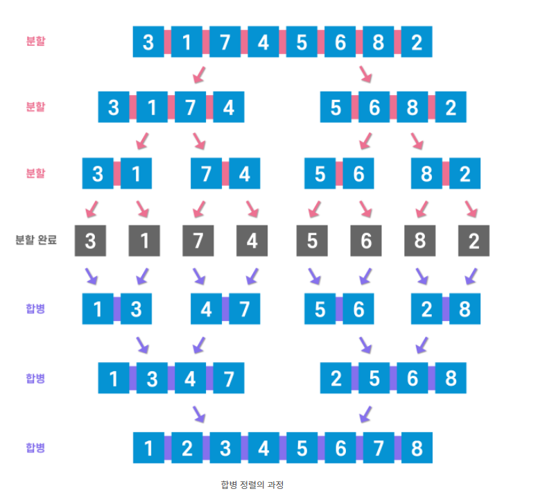
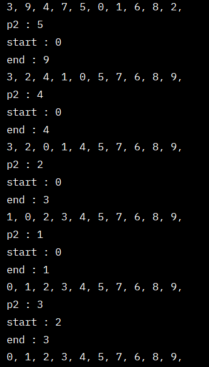
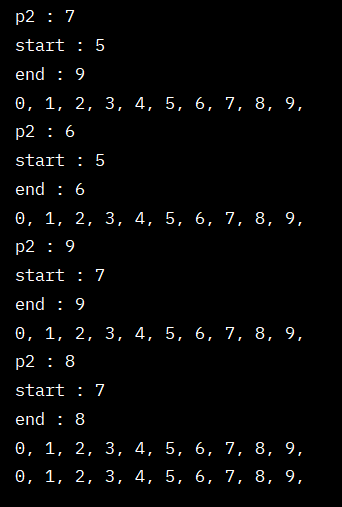

# 정렬 알고리즘

## 정렬 알고리즘이란?

- 번호순이나 사전 순서와 같이 일정한 순서대로 열거하는 알고리즘       
✅ Why Important?       
　→ 컴퓨터 분야에서 중요시되는 문제 중 하나       
　→ 탐색에 용이하다.       
　→ 프로그래밍과 알고리즘 이해에 많은 도움이 된다.       
<br/>

## 버블정렬

- 가장 기초적인 알고리즘       
- 인접한 두 개의 요소를 비교해가면서 정렬을 진행하는 방식       
- 한 번 돌 때마다 마지막 요소가 정렬되는 것이 거품이 올라오는 것 처럼 보여 버블 정렬이라고 한다.       

```java
private static void bubbleSort(int[] arr) {
        int size = arr.length;

        for (int i = 0; i < size - 1; i++) {
            for (int j = 0; j < size - i - 1; j++){
                if (arr[j] > arr[j + 1]){
                    int tmp = arr[j + 1];
                    arr[j + 1] = arr[j];
                    arr[j] = tmp;
                }// if
            }// for
        }// for
    }// bubbleSort
```

✅ 장점       
- 구현이 매우 간단하다       
✅ 단점       
- 순서에 맞지 않는 요소들의 교환이 자주 일어난다.       
<br/>

## 선택정렬

- 가장 기초적인 알고리즘       
- 전체 범위에서 차례대로 가장 작은 숫자를 탐색하고, 가장 왼쪽부터 차례대로 교환하는 방식       
- 전체 범위를 돌며 작은 숫자를 선택하여 정렬하는 것이라 선택 정렬이라고 한다.       

```java
public void selectionSort(int[] arr){
        int size = arr.length;
        int min;    // 최소값을 가진 데이터의 인덱스 저장 변수
        int tmp;

        for (int i = 0; i < size-1; i++) {    // size-1 : 마지막 요소는 자연스럽게 정렬된다.
            min = i;
            for (int j = i + 1; j < size; j++) {
                if (arr[min] > arr[j]) {
                    min = j;
                }// if
            }// for
            tmp = arr[min];
            arr[min] = arr[i];
            arr[i] = tmp;
        }// for
    }// selectionSort
```

✅ 장점       
- 자료 이동 횟수가 미리 결정된다.       
✅ 단점       
- 값이 같은 요소가 있다면 상대적인 위치가 변경될 수 있다.       
<br/>

## 삽입 정렬

- 가장 기초적인 알고리즘.       
- 모든 요소를 앞에서부터 차례대로 이미 정렬된 배열 부분과 비교하여, 자신의 위치를 찾아 삽입하는 방식.       
- 이미 정렬된 배열에서 자기 자신의 위치를 찾아 삽인된다고 하여 삽입 정렬이라고 한다.       

```java
public void insertSort(int[] arr) {
        int size = arr.length;

        for (int i = 1; i < size; i++){
            int current = arr[i];
            int tobeInsertedIdx = i - 1;

            while (tobeInsertedIdx >= 0 && arr[tobeInsertedIdx] > current) {
                arr[tobeInsertedIdx + 1] = arr[tobeInsertedIdx];
                tobeInsertedIdx--;
            }// while
            arr[tobeInsertedIdx + 1] = current;
        }// for
    }// insertSort
```

✅ 장점       
- 최선의 경우 O(n)       
✅ 단점       
- 요소가 너무 많으면 비교적 많은 이동을 해야하므로 성능이 좋지 않다.       
<br/>

## 병합 정렬(=합병 정렬)

- 복잡하지만 효율적인 알고리즘       
- ‘분할 정복’ 이라는 알고리즘 디자인 기법에 근거하여 복잡한 문제를 복잡하지 않는 문제로 ‘분할’ 하여 ‘정복’하는 방식       
- 병합정렬은 분할보다는 병합과정에서 정렬이 이루어진다. 그래서 병합정렬이다.       

     

```java
public class Main5 {
    public static int[] src;
    public static int[] tmp;

    public static void main(String[] args) {
        src = new int[]{1, 9, 8, 5, 4, 2, 3, 7, 6};
        tmp = new int[src.length];
        printArray(src);
        mergeSort(0, src.length - 1);
        printArray(src);
    }

    public static void mergeSort(int start, int end) {
        if (start < end) {
            
            int mid = (start + end) / 2;
            mergeSort(start, mid);
            mergeSort(mid + 1, end);
            
            int part1  = start;
            int part2 = mid + 1;
            int idx = part1;
            
            while (part1 <= mid || part2 <= end) {
                if (part2 > end || (part1 <= mid && src[part1] < src[part2])) {
                    tmp[idx++] = src[part1++];
                } else {
                    tmp[idx++] = src[part2++];
                }
            }
            for (int i = start; i <= end; i++) {
                src[i] = tmp[i];
            }
        }
    }

    public static void printArray(int[] a) {
        for (int i = 0; i < a.length; i++) System.out.print(a[i] + " ");
        System.out.println();
    }

}// end class
```

✅ 장점     
- 데이터 분포의 영향을 덜 받는다.     

✅ 단점     
- 요소를 배열로 구성하면, 임시 배열이 필요하다.     

<br/>

## 퀵 정렬

- 복잡하지만 효율적인 알고리즘     
- 특정 요소를 기준점으로 잡고, 기준점보다 작은 요소는 왼쪽, 기준점보다 큰 요소는 오른쪽으로 두고, 왼쪽과 오른쪽을 각각 정복하는 방식     
- 다른 정렬 알고리즘 보다 효율적이고 빨라서 퀵 정렬이라고 한다.     

```java
public class Main5 {
    private static void quickSort(int[] arr) {
        quickSort(arr, 0, arr.length - 1);
    }// quickSort

    private static void quickSort(int[] arr, int start, int end) {
        int part2 = partition(arr, start, end);
        System.out.println("p2 : " + part2);
        System.out.println("start : " + start);
        System.out.println("end : " + end);
        printArray(arr);

        if (start < part2 - 1) {
            quickSort(arr, start, part2 - 1);
        }// if

        if (part2 < end) {
            quickSort(arr, part2, end);
        }// if

    }// quickSort

    private static int partition(int[] arr, int start, int end) {
        int pivot = arr[(start + end) / 2]; // 중간 기준점
        while (start <= end) {
            // start 값은 기준점보다 작으면 다음으로 넘어감
            while (arr[start] < pivot) start++;
            // 반대로 end 값이 기준점보다 크면 전으로
            while (arr[end] > pivot) end--;

            if (start <= end) {
                swap(arr, start, end);
                start++;
                end--;
            }// if
        }// while
        return start;
    }// partition

    private static void swap(int[] arr, int start, int end) {
        int tmp = arr[start];
        arr[start] = arr[end];
        arr[end] = tmp;
    }// swap

    private static void printArray(int[] arr) {
        for (int data : arr) {
            System.out.print(data + ", ");
        }// for
        System.out.println();
    }// printArray

    public static void main(String[] args) {
        int[] arr = {3, 9, 4, 7, 5, 0, 1, 6, 8, 2};
        printArray(arr);
        quickSort(arr);
        printArray(arr);
    }// main

}// end class
```

     
     

✅ 장점     
- 평균 실행시간이 다른 알고리즘보다 빠른 편이다     

✅ 단점     
- Pivot의 따라서 성능차이가 심하다     
- pivot이 중간에 가까운 값을 찾을 수록 성능이 좋다.     