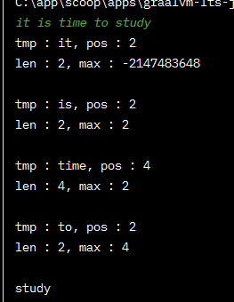
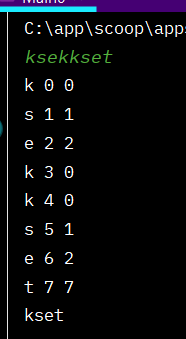

# String

## 1. 문자 찾기

✅`toCharArray()`       
→ 자바 toCharArray() 메소드는 문자열을 char형 배열로 바꿔준다. 반환되는 배열의 길이는 문자열의 길이와 같다.      
✅ `Character.toUpperCase(t)`       
→ char를 대문자로 변경      

<br/>

```java
import java.util.Scanner;

public class Main {
    public int solution(String str, char t){
        int answer = 0;

        // 모두 대문자로
        str = str.toUpperCase();
        t = Character.toUpperCase(t);
//        System.out.println(str + " " + t);

/*

        for (int i = 0; i < str.length(); i++) {
            if (str.charAt(i) == t) {
                answer++;
            }// if
        }// for
*/

        /**
         * 향상된 for문
         */
        for (char x : str.toCharArray()) {
            if (x == t) {
                answer++;
            }// if
        }// for


        return answer;
    }// solution

    public static void main(String[] args) {
        Main t = new Main();
        Scanner kb = new Scanner(System.in);
        //첫 줄에 문자열이 주어지고
        String str = kb.next();
        //두 번째 줄에 문자가 주어진다.
        char c = kb.next().charAt(0);

        System.out.print(t.solution(str, c));

    }// main
}// end class
```

<br/>

## 2. 대소문자 변환

✅ `Character.isLowerCase(x)`      
- x가 소문자냐? 소문자면 true, 대문자면 false      
✅ 아스키 코드      
대문자 : 65(A) - 90      
소문자 : 97(a) - 122      
→ 소문자 - 32 = 대문자 코드      

```java
import java.util.Scanner;

public class Main2 {
    public String solution(String str){
        String answer = "";

        for (char x : str.toCharArray()){
            if (Character.isLowerCase(x)){
                answer += Character.toUpperCase(x);
            }else {
                answer += Character.toLowerCase(x);
            }// if-else
        }// for

        /**
         * 아스키 코드
         */
/*
        for (char x : str.toCharArray()) {
            if (x >= 97 && x <= 122){    // 소문자
                answer += (char)(x - 32);
            } else {
                answer += (char)(x + 32);
            }// if-else
        }// for
*/

        return answer;
    }// solution

    public static void main(String[] args) {
        Main2 T = new Main2();

        Scanner sc = new Scanner(System.in);
        String str = sc.next();

        System.out.print(T.solution(str));
    }// main
}// end class
```

<br/>

## **3. 문장 속 단어(indexOf(), substring())**

✅ `Integer.MAX_VALUE` → 2147483647      
✅ `Integer.MIN_VALUE` → -2147483647      
<br/>

✅ `indexOf()`      
→ 특정 문자나 문자열이 앞에서부터 처음 발견되는 인덱스를 반환하며       
만약 찾지 못했을 경우 "-1"을 반환합니다.      

```java
import java.util.Scanner;

public class Main3 {
    public String solution(String str) {
        String answer = "";

/*
        int max = Integer.MIN_VALUE; // 가장 작은 값으로 초기화
        String[] strArray = str.split(" ");

        for (String x : strArray) {
//            System.out.println(x);

            // 길이 구하기
            int len = x.length();
            System.out.println("len : " + len + ", max : " + max);

            if (len > max){
                max = len;
                answer = x;
            }// if
        }// for
*/

        /**
         * indexOf , substring
         */
        int max = Integer.MIN_VALUE, pos;
        while ((pos = str.indexOf(' ')) != -1) {    // 띄어쓰기를 발견 못했다면 -1 리턴, 발견하면 인덱스 번호를 리턴
            String tmp = str.substring(0, pos); // 0부터 pos 까지 잘라내기
            System.out.println("tmp : " + tmp +", pos : " + pos);

            int len = tmp.length();
            System.out.println("len : " + len + ", max : " + max);
            System.out.println();

            if (len > max) {
                max = len;
                answer = tmp;
            }// if

            str = str.substring(pos + 1);
            // 마지막 단어가 들어가지 않음
            if (str.length() > max){
                answer = str;
            }// if

        }// while

        return answer;
    }// solution

    public static void main(String[] args) {
        Main3 main = new Main3();
        Scanner sc = new Scanner(System.in);
        String str = sc.nextLine(); // 한줄을 입력받아야함

        System.out.print(main.solution(str));

    }// main

}// end class
```

     

<br/>

## 4. 단어 뒤집기(StringBuilder이용법 또는 직접뒤집기)

✅ `StringBuilder()`     
→ String은 **불변(immutable)**하기 때문에 값을 변경할 수 없다     
→ **StringBuffer**와 **StringBuilder**는 **변하기 때문에(mutable)** `.append()`, `.delete()` 등을 통해서 값을 변경할 수 있다.     


```java
import java.util.ArrayList;
import java.util.Scanner;

public class Main4 {

    public ArrayList<String> solution(int n , String[] str){
        ArrayList<String> answer = new ArrayList<>();

        /**
         * StringBuilder().reverse
         */
/*
        for (String x : str) {
            String tmp = new StringBuilder(x).reverse().toString();
            answer.add(tmp);    // 배열에 담기
        }// for
*/

        /**
         *****  직접 뒤집기 *****
         */
        for (String x : str) {
            char[] ch = x.toCharArray();    // 단어가 char 배열에 들어감
            int lt = 0, rt = x.length()-1;

            while (lt < rt) {
                char tmp = ch[lt];
                ch[lt] = ch[rt];
                ch[rt] = tmp;
                lt++;
                rt--;
            }// while

            // String으로 타입 변환
            String tmp = String.valueOf(ch);
            answer.add(tmp);

        }// for

        return answer;
    }// solution

    public static void main(String[] args) {
        Main4 main = new Main4();
        Scanner sc = new Scanner(System.in);
        int number = sc.nextInt();
        String[] str = new String[number];

        for (int i = 0; i < number; i++) {
            str[i] = sc.next();
        }// for

        for (String x : main.solution(number, str)) {
            System.out.println(x);
        }// for

    }// main

} // end class
```
<br/>

## 5. 특정 문자 뒤집기(toCharArray())      

✅`Character.isAlphabetic()`      
→ ()가 알파벳이면 true, 아니면 false      
✅ `.toCharArray()`      
→ String(문자열)을 char형 배열로 바꿔준다      
✅ `String.valueOf()`      
→ String(문자열)로 변환      

```java
import java.util.Scanner;

public class Main5 {
    public String solution(String str) {
        String answer;
        char[] ch = str.toCharArray();  // String을 char형 배열로 바꾼다
        int lt = 0, rt = str.length() - 1;

        while (lt < rt) {
            if (!Character.isAlphabetic(ch[lt]))    lt++;   // lt가 알파벳이 아니면 증가
            else if (!Character.isAlphabetic(ch[rt]))  rt--;
            else {
                char tmp = ch[lt];
                ch[lt] = ch[rt];
                ch[rt] = tmp;
                lt++;
                rt--;
            }// if-else
        }// while

        answer = String.valueOf(ch);    // String으로 변환

        return answer;
    }// solution

    public static void main(String[] args) {
        Main5 main = new Main5();
        Scanner sc = new Scanner(System.in);
        String str = sc.next();

        System.out.println(main.solution(str));

    }// main
}// end class
```

<br/>

## 6. 중복문자제거

✅ `.charAt(0)`      
→ 인덱스 (0)번째 문자를 반환      
✅ `indexOf()`      

```java
import java.util.Scanner;

public class Main6 {
    public String solution(String str) {
        String answer = "";

        for (int i = 0; i < str.length(); i++) {
            System.out.println(str.charAt(i) + " " + i + " " + str.indexOf(str.charAt(i)));

            if (str.indexOf(str.charAt(i)) == i)    answer += str.charAt(i);
        }// for

        return answer;
    }// solution

    public static void main(String[] args) {
        Main6 main = new Main6();
        Scanner sc = new Scanner(System.in);
        String str = sc.next();

        System.out.println(main.solution(str));
    }// main
}// end class
```

     

<br/>

## 7. 회문문자열(StringBuilder)

✅`.equalsIgnoreCase()`      
→ 대소문자 구분 X      

```java
import java.util.Scanner;

public class Main7 {
    public String solution(String str) {
        String answer = "YES";

/*
        str = str.toUpperCase();
        int len = str.length();

        for (int i = 0; i < len / 2; i++) {
            if (str.charAt(i) != str.charAt(len - i - 1)) answer = "NO";
        }// for
*/

        /**
         * StringBuilder
         */
        String tmp = new StringBuilder(str).reverse().toString();
        if (!str.equalsIgnoreCase(tmp)) answer = "NO";

        return answer;
    }// solution

    public static void main(String[] args) {
        Main7 main = new Main7();
        Scanner sc = new Scanner(System.in);
        String str = sc.next();

        System.out.println(main.solution(str));
    }// main
}// end class
```