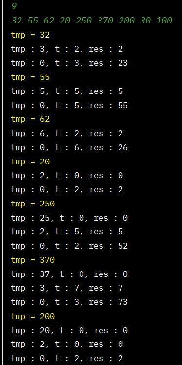
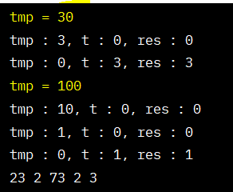
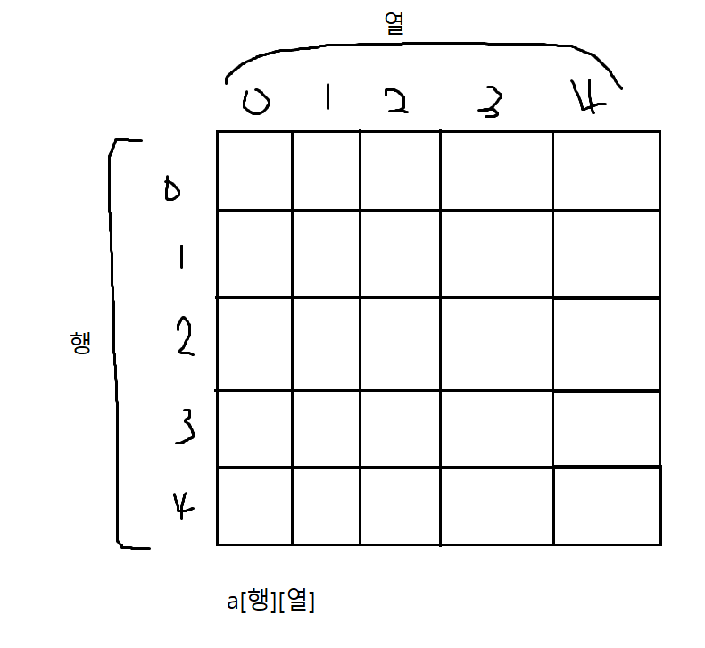
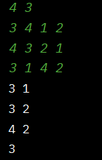

# Array (1,2차원 배열)

## 1. 큰 수 출력하기

```java
import java.util.ArrayList;
import java.util.Scanner;

public class Main01 {
    public ArrayList<Integer> solution(int input, int[] arr) {
        ArrayList<Integer> answer = new ArrayList<>();

        answer.add(arr[0]);

        for (int i = 1; i < input; i++) {
            if (arr[i] > arr[i - 1]) {
                answer.add(arr[i]);
            }// if
        }// for

        return answer;
    }// solution

    public static void main(String[] args) {
        Main01 main = new Main01();
        Scanner sc = new Scanner(System.in);

        int input = sc.nextInt();
        int[] arr = new int[input];

        for (int i = 0; i < input; i++) {
            arr[i] = sc.nextInt();
        }// for

        for (int x : main.solution(input, arr)) {
            System.out.println(x + " ");
        }// for
    }// main
}// end class
```

## 2. 보이는 학생

```java
import java.util.Scanner;

public class Main02 {
    public int solution(int input, int[] arr) {
        int answer = 1;
        int max = arr[0];

        for (int i = 1; i < input; i++) {
            if (arr[i] > max) {
                answer++;
                max = arr[i];
            }// if
        }// for

        return answer;
    }// solution

    public static void main(String[] args) {
        Main02 main = new Main02();
        Scanner sc = new Scanner(System.in);

        int input = sc.nextInt();
        int[] arr = new int[input];

        for (int i = 0; i < input; i++) {
            arr[i] = sc.nextInt();
        }// for

        System.out.println(main.solution(input, arr));

    }// main
}// end class
```

## 3. 가위바위보

```java
import java.util.ArrayList;
import java.util.Scanner;

public class Main03 {
    public ArrayList<String> solution(int input, int[] arrA, int[] arrB) {
        ArrayList<String> answer = new ArrayList<>();

        // 1.가위 2.바위 3.보
        for (int i = 0; i < input; i++) {
            if (arrA[i] == arrB[i]) {
                answer.add("D");
            } else if (arrA[i] == 1 && arrB[i] == 3) {
                answer.add("A");
            } else if (arrA[i] == 2 && arrB[i] == 1) {
                answer.add("A");
            } else if (arrA[i] == 3 && arrB[i] == 2) {
                answer.add("A");
            } else {
                answer.add("B");
            } // if-else
        }// for

        return answer;
    }// solution

    public static void main(String[] args) {
        Main03 main = new Main03();
        Scanner sc = new Scanner(System.in);

        int input = sc.nextInt();
        int[] arrA = new int[input];
        int[] arrB = new int[input];

        for (int i = 0; i < input; i++) {
            arrA[i] = sc.nextInt();
        }// for

        for (int i = 0; i < input; i++) {
            arrB[i] = sc.nextInt();
        }// for

        for (String s : main.solution(input, arrA, arrB)) {
            System.out.println(s);
        }// for

    }// main
}// end class
```

## 4. 피보나치 수열

```java
import java.util.Scanner;

public class Main04 {
    public int[] solution(int num) {
        int[] answer = new int[num];

        answer[0] = 1;
        answer[1] = 1;

        for (int i = 2; i < num; i++) {
            answer[i] = answer[i - 2] + answer[i - 1];
        }// for
        
        return answer;
    }// solution

    public static void main(String[] args) {
        Main04 main = new Main04();
        Scanner sc = new Scanner(System.in);

        int num = sc.nextInt();

        for (int x : main.solution(num)) {
            System.out.print(x + " ");
        }// for
    }// main
}// end class
```

```java
/**
     *  손코딩
     */
    public void solution(int num) {
        int a = 1, b = 1, c;
        System.out.print(a + " " + b + " ");

        for (int i = 2; i < num; i++) {
            c = a + b;
            System.out.print(c + " ");
            // 1, 1, 2
            // a, b, c

            a = b;
            b = c;
        }// for

    }// solution

    public static void main(String[] args) {
        Main04 main = new Main04();
        Scanner sc = new Scanner(System.in);
        int num = sc.nextInt();
        main.solution(num);
    }// main
```

## 5. 소수(에라토스테네스 체)

```java
import java.text.FieldPosition;
import java.util.Scanner;

public class Main05 {
    public int solution(int num) {
        int answer = 0;
        int[] ch = new int[num + 1];    // 인덱스가 num 번까지 생성

        for (int i = 2; i <= num; i++) {
            if (ch[i] == 0) {
                answer++;
                for (int j = i; j <= num; j = j + i) {  // j가 i의 배수로 돌아야함
                    ch[j] = 1;
                }// for
            }// if
        }// for

        return answer;
    }// solution

    public static void main(String[] args) {
        Main05 main = new Main05();
        Scanner sc = new Scanner(System.in);
        int num = sc.nextInt();

        System.out.println(main.solution(num));
    }// main
}// end classz
```

## 6. 뒤집은 소수 (숫자 뒤집기)

```java
import java.util.ArrayList;
import java.util.Scanner;

public class Main06 {
    // 소수인지?
    public boolean isPrime(int num) {
        if (num == 1) return false;
        for (int i = 2; i < num; i++) {
            if (num % i == 0) return false;
        }// for
        return true;

    }// isPrime

    public ArrayList<Integer> solution(int num, int[] arr) {
        ArrayList<Integer> answer = new ArrayList<>();

        // 숫자 하나씩 돌면서 뒤집기
        for (int i = 0; i < num; i++) {
            int tmp = arr[i];
            // tmp = 1230
            // t = tmp % 10 -> 1의 자리
            // res = res * 10 + t
            // 0 = 0 * 10 + 0
            // tmp = tmp / 10 -> 몫  -> tmp = 123

            int res = 0;
            while (tmp > 0) {
                int t = tmp % 10;
                res = res * 10 + t;
                tmp = tmp / 10;
            }// while

            if (isPrime(res)) {
                answer.add(res);
            }// if

        }// for

        return answer;
    }// solution

    public static void main(String[] args) {
        Main06 main = new Main06();
        Scanner sc = new Scanner(System.in);

        int num = sc.nextInt();
        int[] arr = new int[num];

        for (int i = 0; i < num; i++) {
            arr[i] = sc.nextInt();
        }// for

        for (int x : main.solution(num, arr)) {
            System.out.print(x + " ");
        }// for

    }// main
}// end class
```

     
     


## 7. 점수계산

```java
import java.util.Scanner;

public class Main07 {
    public int solution(int num, int[] arr) {
        int answer = 0;
        int cnt = 0;

        for (int i = 0; i < num; i++) {
            System.out.println("cnt : " + cnt);
            if (arr[i] == 1) {
                cnt++;
                answer += cnt;
            } else {
                cnt = 0;
            }// if-else
        }// for

        return answer;
    }// solution

    public static void main(String[] args) {
        Main07 main = new Main07();
        Scanner sc = new Scanner(System.in);

        int num = sc.nextInt();
        int[] arr = new int[num];
        for (int i = 0; i < num; i++) {
            arr[i] = sc.nextInt();
        }// for

        System.out.println(main.solution(num, arr));

    }// main
}// end class
```

## 8. 등수구하기

```java
import java.util.Scanner;

public class Main08 {
    public int[] solution(int num, int[] arr){
        int[] answer = new int[num];

        for (int i = 0; i < num; i++) {
            int cnt = 1;
            for (int j = 0; j < num; j++) {
                if (arr[j] > arr[i]) {
                    cnt++;
                }// if
                answer[i] = cnt;
            }// for
        }// for

        return answer;
    }//solution

    public static void main(String[] args) {
        Main08 main = new Main08();
        Scanner sc = new Scanner(System.in);

        int num = sc.nextInt();
        int[] arr = new int[num];
        for (int i = 0; i < num; i++) {
            arr[i] = sc.nextInt();
        }// for

        for (int x : main.solution(num, arr)) {
            System.out.print(x + " ");
        }// for
    }// main
}// end class
```

## 9. 격자판 최대합 (2차원 배열)

     

```java
import java.util.Scanner;

public class Main09 {
    public int solution(int num, int[][] arr){
        int answer = Integer.MIN_VALUE; // 최대값을 찾아야하니까 가장 작은 값으로 초기화
        int sum1;   // 행의 합
        int sum2;   // 열의 합

        for (int i = 0; i < num; i++) {
            sum1 = sum2 = 0;
            for (int j = 0; j < num; j++) {
                // i = 0 일때, sum1 0행의 합 , sum2 0 열의 합
                sum1 += arr[i][j];
                sum2 += arr[j][i];
            }// for
            answer = Math.max(answer, sum1);
            answer = Math.max(answer, sum2);
        }// for
        
        // 대각선
        sum1 = sum2 = 0;
        for (int i = 0; i < num; i++) {
            sum1 += arr[i][i];
            sum2 += arr[i][num - i - 1];
        }// for

        answer = Math.max(answer, sum1);
        answer = Math.max(answer, sum2);

        return answer;
    }// solution

    public static void main(String[] args) {
        Main09 main = new Main09();
        Scanner sc = new Scanner(System.in);

        int num = sc.nextInt();
        int[][] arr = new int[num][num];

        for (int i = 0; i < num; i++) {
            for (int j = 0; j < num; j++) {
                arr[i][j] = sc.nextInt();
            }// for
        }// for

        System.out.println(main.solution(num, arr));
    }// main
}// end class
```

## 10. 봉우리 (상하좌우 4방향)

```java
import java.util.Scanner;

public class Main10 {
    // 12, 3, 6, 9 시 방향
    int[] dx = {-1, 0, 1, 0};
    int[] dy = {0, 1, 0, -1};

    public int solution(int num, int[][] arr) {
        int answer = 0;

        for (int i = 0; i < num; i++) {
            for (int j = 0; j < num; j++) {
                // 봉우리인지 아닌지 판별
                boolean flag = true;
                // 4방향 탐색
                for (int k = 0; k < 4; k++) {
                    int nx = i + dx[k];
                    int ny = j + dy[k];

                    if (nx >= 0 && nx < num && ny >= 0 && ny < num && arr[nx][ny] >= arr[i][j]) {
                        flag = false;
                        break;  // 한방향을 봤을 때 false 면 다른 방향을 볼 필요 없기때문
                    }// if
                }// for

                if (flag) answer++;

            }// for
        }// for

        return answer;
    }// solution

    public static void main(String[] args) {
        Main10 main = new Main10();
        Scanner sc = new Scanner(System.in);

        int num = sc.nextInt();
        int[][] arr = new int[num][num];

        for (int i = 0; i < num; i++) {
            for (int j = 0; j < num; j++) {
                arr[i][j] = sc.nextInt();
            }// for
        }// for

        System.out.println(main.solution(num, arr));
    }// main
}// end class
```

## 11. 임시반장정하기 (3중 for문)

```java
import java.util.Scanner;

public class Main11 {
    public int solution(int num, int[][] arr) {
        int answer = 0, max = Integer.MIN_VALUE;

        for (int i = 1; i <= num; i++) {
            int cnt = 0;    // i번 학생과 같은 반이였던 j번 학생은 몇명인지 count
            for (int j = 1; j <= num; j++) {
                for (int k = 1; k <= 5; k++) {  // 학년
                    if (arr[i][k] == arr[j][k]) {
                        cnt++;
                        break;  // j라는 학생을 한번만 카운팅해야하기 때문에
                    }// if
                }// for
            }// for

            if (cnt > max) {
                max = cnt;
                answer = i;
            }// if

        }// for

        return answer;
    }// solution

    public static void main(String[] args) {
        Main11 main = new Main11();
        Scanner sc = new Scanner(System.in);

        int num = sc.nextInt();
        int[][] arr = new int[num + 1][6];  // 1부터 사용

        for (int i = 1; i <= num; i++) {    // 학생 번호
            for (int j = 1; j <= num; j++) {
                arr[i][j] = sc.nextInt();
            }// for
        }// for

        System.out.println(main.solution(num, arr));

    }// main
}// end class
```

## 12. 멘토링

```java
import java.util.Scanner;

public class Main12 {
    public int solution(int n, int m, int[][] arr){
        int answer=0;
        for(int i=1; i<=n; i++){
            for(int j=1; j<=n; j++){
                int cnt=0;
                for(int k=0; k<m; k++){
                    int pi=0, pj=0;
                    for(int s=0; s<n; s++){
                        if(arr[k][s]==i) pi=s;
                        if(arr[k][s]==j) pj=s;
                    }// s for
                    if(pi<pj) cnt++;
                }// k for
                if(cnt==m){
                    answer++;
                    System.out.println(i+" "+j);
                }// if
            }// j for
        }// i for
        return answer;
    }// solution

    public static void main(String[] args){
        Main12 main = new Main12();
        Scanner kb = new Scanner(System.in);

        int n=kb.nextInt();
        int m=kb.nextInt();
        int[][] arr=new int[m][n];

        for(int i=0; i<m; i++){
            for(int j=0; j<n; j++){
                arr[i][j]=kb.nextInt();
            }// for
        }// for
        System.out.print(main.solution(n, m, arr));
    }// main
}// end class
```

     
