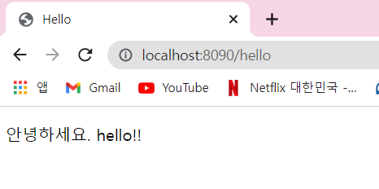
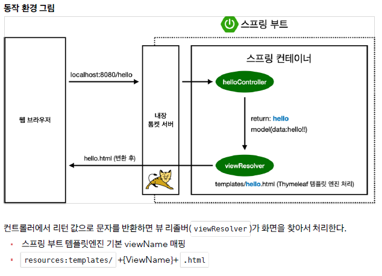
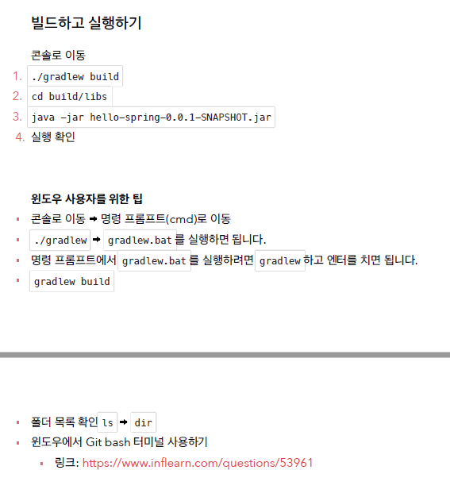

# 프로젝트 환경설정

## 프로젝트 생성

https://start.spring.io/
에서 설정 후 Genereate 하고 build.gradle 오픈

★ port 바꾸기 <br>
src-main-resources-application.properties에 server.port=8090 작성

## Welcome page

<thymeleaf 템플릿 엔진>
- thymeleaf 공식 사이트: https://www.thymeleaf.org/
- 스프링 공식 튜토리얼: https://spring.io/guides/gs/serving-web-content/
- 스프링부트 메뉴얼: https://docs.spring.io/spring-boot/docs/2.3.1.RELEASE/reference/html/spring-boot-features.html#boot-features-spring-mvc-template-engines
<br>

```html
<html xmlns:th="http://www.thymeleaf.org">
  ```
→ thymeleaf 사용 시 작성
  
<br>
  
```html
<p th:text="'안녕하세요. ' + ${data}" >안녕하세요. 손님</p>  
```
→ ${data}  ==  hello!!   
   
   

## 빌드하고 실행

   


