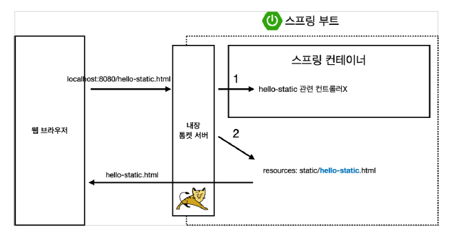
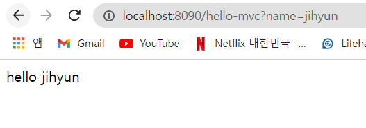
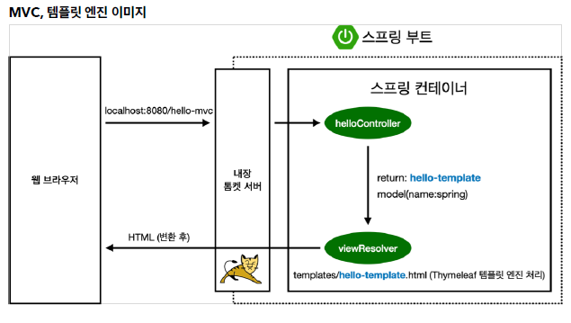
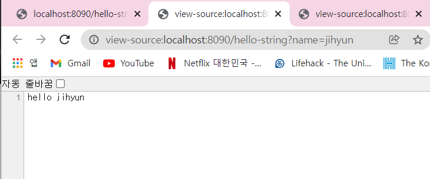
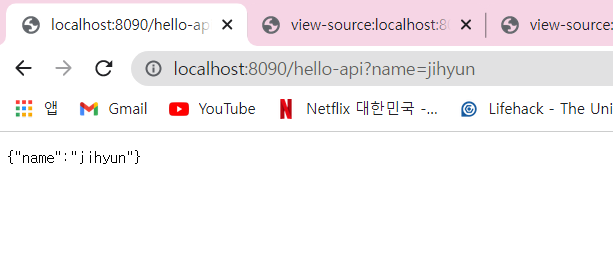
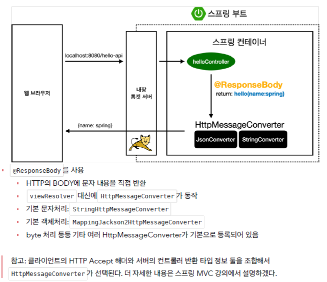

# 스프링 웹 개발 기초

## 정적 컨텐츠

   
→ controller를 먼저 확인하고 없으면 .. → 내부에 있는 resources를 확인함   
<br>
## MVC와 템플릿 엔진

```java
    @GetMapping("hello-mvc")
    public String helloMvc(@RequestParam(value = "name", required = false) String name, Model model){
        model.addAttribute("name", name);
        return "hello-template";
    } // end helloMvc
```   
→ required = true (default) / required = false로 하면 안넘겨줘도 오류 X   <br>
   
    
<br>
## API

```java
    @GetMapping("hello-string")
    @ResponseBody
    public String helloString(@RequestParam("name") String name){
        return "hello " + name; // "hello Spring"
    } // end helloString
```   
    
- JSON 형식   
```java
    @GetMapping("hello-api")
    @ResponseBody
    public Hello helloApi(@RequestParam("name") String name){
        Hello hello = new Hello();
        hello.setName(name);
        return hello;
    }

    static class Hello{
        private String name;

        public String getName() {
            return name;
        }

        public void setName(String name) {
            this.name = name;
        }
    }
```  
    

<br>  
✅@Responsebody 
@Responsebody 어노테이션을 사용하면 http요청 body를 자바 객체로 전달받을 수 있다.

✅@RequestBody
클라이언트에서 서버로 필요한 데이터를 요청하기 위해 JSON 데이터를 요청 본문에 담아서 서버로 보내면, 서버에서는 @RequestBody 어노테이션을 사용하여 HTTP 요청 본문에 담긴 값들을 자바객체로 변환시켜, 객체에 저장한다.
