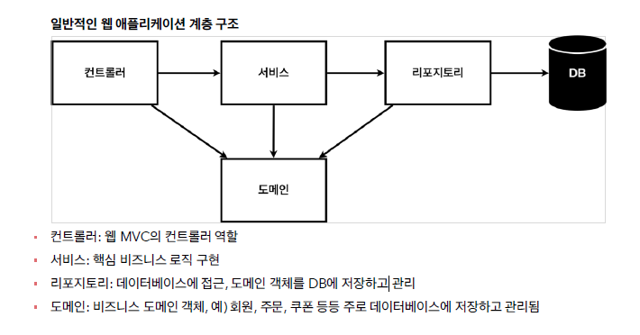
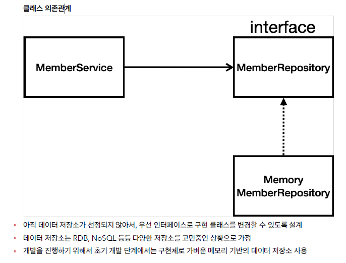

# 회원관리 예제(백엔드 개발)

## 비즈니스 요구사항

- 데이터: 회원ID, 이름
- 기능: 회원 등록, 조회
- 아직 데이터 저장소가 선정되지 않음(가상의 시나리오)   

   
   
<br>
## domain & repository

```java
package hello.hellospring.domain;

public class Member {

    private Long id;
    private String name;

    public Long getId() {
        return id;
    }

    public void setId(Long id) {
        this.id = id;
    }

    public String getName() {
        return name;
    }

    public void setName(String name) {
        this.name = name;
    }

} // end class
```
```java
package hello.hellospring.repository;

import hello.hellospring.domain.Member;

import java.util.List;
import java.util.Optional;

public interface MemberRepository {
    Member save(Member member); // 회원이 저장소에 저장
    Optional<Member> findById(Long id);
    Optional<Member> findByName(String name);
    List<Member> findAll(); // 모든 회원리스트를 반환

} // end interface
```
```java
package hello.hellospring.repository;

import hello.hellospring.domain.Member;

import java.util.*;

public class MemoryMemberRepository implements MemberRepository {

    private static Map<Long, Member> store = new HashMap<>();
    private static long sequence = 0L;

    @Override
    public Member save(Member member) {
        member.setId(++sequence);
        store.put(member.getId(), member);
        return member;
    } // save

    @Override
    public Optional<Member> findById(Long id) {
        // null 이 반환될 가능성이 있으면 optional로 감싸준다.
        return Optional.ofNullable(store.get(id));
    } // findById

    @Override
    public Optional<Member> findByName(String name) {
        return store.values().stream()
                .filter(member -> member.getName().equals(name))
                .findAny(); // Optional로 반환된다.
    } // findByName

    @Override
    public List<Member> findAll() {
        return new ArrayList<>(store.values());
    } // findAll
} // end class
```
<br>

## repository test 

```java
package hello.hellospring.repository;

import hello.hellospring.domain.Member;
import org.assertj.core.api.Assertions;
import org.junit.jupiter.api.AfterEach;
import org.junit.jupiter.api.Test;

import java.util.List;

import static org.assertj.core.api.Assertions.*;

public class MemoryMemberRepositoryTest {

    MemoryMemberRepository repository = new MemoryMemberRepository();

    // 메소드 하나가 끝날때마다 저장소를 지워줌
    @AfterEach
    public void afterEach(){
        repository.clearStore();
    } // afterEach

    @Test
    public void save(){
        Member member = new Member();
        member.setName("spring");

        repository.save(member);

        Member result = repository.findById(member.getId()).get();
//        System.out.println("result = " + (result == member)); // reuslt = true
//        Assertions.assertEquals(member, result); // 같지 않으면 오류
        assertThat(member).isEqualTo(result);

    } // save

    @Test
    public void findByName(){
        Member member1 = new Member();
        member1.setName("spring1");
        repository.save(member1);

        Member member2 = new Member();
        member2.setName("spring2");
        repository.save(member2);

        Member result = repository.findByName("spring1").get();

        assertThat(result).isEqualTo(member1);

    } // findByName

    @Test
    public void findAll(){
        Member member1 = new Member();
        member1.setName("spring1");
        repository.save(member1);

        Member member2 = new Member();
        member2.setName("spring2");
        repository.save(member2);

        List<Member> result = repository.findAll();

        assertThat(result.size()).isEqualTo(2);

    } // findAll

} // end class
```
<br>
※ 테스트 메소드가 끝날 때마다 저장소를 지워주는 메소드(테스트는 순서가 상관없이 돌아감)

1. `MemoryMemberRepository.java` 에 추가
```java
public void clearStore(){
        store.clear();
    } // clearStore
```
2. test 에 추가
```java
// 메소드 하나가 끝날때마다 저장소를 지워줌
    @AfterEach
    public void afterEach(){
        repository.clearStore();
    } // afterEach
```
<br>

## service

```java
package hello.hellospring.service;

import hello.hellospring.domain.Member;
import hello.hellospring.repository.MemberRepository;
import hello.hellospring.repository.MemoryMemberRepository;

import java.util.List;
import java.util.Optional;

public class MemberService {

    private final MemberRepository memberRepository = new MemoryMemberRepository();

    /*
     *  회원 가입
     */
    public Long join(Member member) {
        
        validateDuplicateMember(member); // 같은 이름이 있는 중복 회원 검증
        memberRepository.save(member);
        return member.getId();
    } // join

    private void validateDuplicateMember(Member member) {
        //        Optional<Member> result =
        memberRepository.findByName(member.getName())
                .ifPresent(m -> { // ifPresent -> 값이 있으면 .. 해줘라 >> optional 이라 가능하다
                    throw new IllegalStateException("이미 존재하는 회원입니다.");
                });
    } // validateDuplicateMember


    /*
     *  전체 회원 조회
     */
    public List<Member> findMembers() {
        return memberRepository.findAll();
    } // findMembers

    public Optional<Member> findOne(Long memberId){
        return memberRepository.findById(memberId);
    } // findOne

} // end class
```
<br>

## service test
✨ 새로운 테스트 클래스를 만들어줌 ✨    
→ 클래스 잡고 alt+shift+t

```java
package hello.hellospring.service;

import hello.hellospring.domain.Member;
import hello.hellospring.repository.MemoryMemberRepository;
import org.junit.jupiter.api.AfterEach;
import org.junit.jupiter.api.BeforeEach;
import org.junit.jupiter.api.Test;

import static org.assertj.core.api.Assertions.assertThat;
import static org.junit.jupiter.api.Assertions.assertThrows;

class MemberServiceTest {

    MemberService memberService;
    MemoryMemberRepository memberRepository;

    @BeforeEach
    public void beforeEach(){
        memberRepository = new MemoryMemberRepository();
        memberService = new MemberService(memberRepository);
    } // beforeEach

    // 메소드 하나가 끝날때마다 저장소를 지워줌
    @AfterEach
    public void afterEach() {
        memberRepository.clearStore();
    } // afterEach

    @Test
    void 회원가입() {
        // given
        Member member = new Member();
        member.setName("hello");

        // when
        Long saveId = memberService.join(member);

        // then
        Member findMember = memberService.findOne(saveId).get();
        assertThat(member.getName()).isEqualTo(findMember.getName());

    } // join

    @Test
    public void 중복_회원_예외() {
        // given
        Member member1 = new Member();
        member1.setName("spring");

        Member member2 = new Member();
        member2.setName("spring");

        // when
        memberService.join(member1);
        IllegalStateException e = assertThrows(IllegalStateException.class, () -> memberService.join(member2));

        assertThat(e.getMessage()).isEqualTo("이미 존재하는 회원입니다.");

/*
        try {
            memberService.join(member2);
            fail("예외발생");
        } catch (IllegalStateException e) {
            assertThat(e.getMessage()).isEqualTo("이미 존재하는 회원입니다.");
        } // try-catch
*/

        // then


    } // 중복_회원_예외

    @Test
    void findMembers() {

    } // findMembers

    @Test
    void findOne() {

    } // findOne
} // end class
```
<br>
※ MemberService 에서도 memoryMemberRepository 를 new 해주고 test 에서도 new .. 다른 객체<br>
→ @BeforeEach : 각 테스트 실행 전에 호출된다. 테스트가 서로 영향이 없도록 항상 새로운 객체를 생성하고, 의존관계도 새로 맺어준다.

- MemberService
```java
    private final MemberRepository memberRepository;

    public MemberService(MemberRepository memberRepository) {
        this.memberRepository = memberRepository;
    }
```

- MemberServiceTest
```java
    MemberService memberService;
    MemoryMemberRepository memberRepository;

    @BeforeEach
    public void beforeEach(){
        memberRepository = new MemoryMemberRepository();
        memberService = new
```
