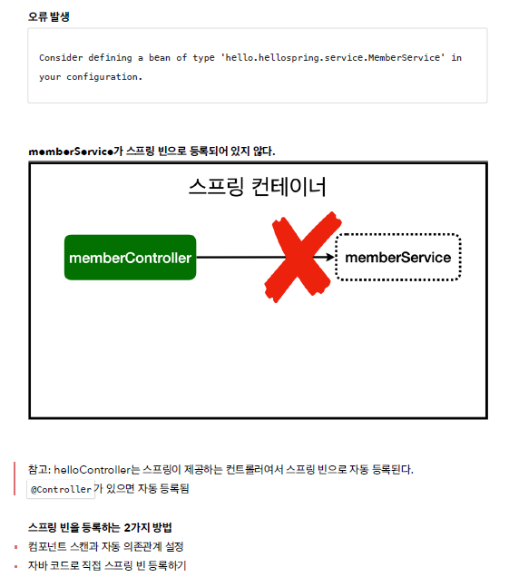
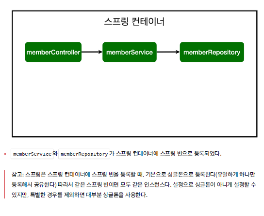

# 스프링 빈과 의존관계

※ 스프링 빈을 등록하는 2가지 방법

1. 컴포넌트 스캔과 자동 의존관계 설정
    
    → @Component 가 있으면 스프링 빈으로 자동 등록 된다.
    
    → @Controller, @Service, @Repository 에 @Component 가 포함되어 있음
    
2. 자바 코드로 직접 스프링 빈 등록하기

## 컴포넌트 스캔과 자동 의존관계 설정

- @Controller 라는 어노테이션이 있으면  스프링 컨테이너가 관리하게 된다.
▶️ @Autowired
```java
package hello.hellospring.controller;

import hello.hellospring.service.MemberService;
import org.springframework.beans.factory.annotation.Autowired;
import org.springframework.stereotype.Controller;


@Controller
public class MemeberController {

    private final MemberService memberService;

    // 스프링 컨테이너에 등록하고 써라

    @Autowired
    //생성자에 @Autowired 가 있으면 스프링이 연관된 객체를 스프링 컨테이너에서 찾아서 넣어준다. 이렇게
    //객체 의존관계를 외부에서 넣어주는 것을 DI (Dependency Injection), 의존성 주입이라 한다.
    //이전 테스트에서는 개발자가 직접 주입했고, 여기서는 @Autowired에 의해 스프링이 주입해준다.
    public MemeberController(MemberService memberService) {
        this.memberService = memberService;
    } // MemeberController

} // end class
```
   
→ @Controller @Service @Repository 어노테이션으로 스프링 빈으로 자동 등록 됨
<br>
   

## 자바코드로 직접 스프링 빈 등록

```java
package hello.hellospring;

import hello.hellospring.repository.MemberRepository;
import hello.hellospring.repository.MemoryMemberRepository;
import hello.hellospring.service.MemberService;
import org.springframework.context.annotation.Bean;
import org.springframework.context.annotation.Configuration;


@Configuration
public class SpringConfig {

    @Bean
    public MemberService memberService(){
        return new MemberService(memberRepository());
    } // memberService

    @Bean
    public MemberRepository memberRepository(){
        return new MemoryMemberRepository();
    } // memberRepository

} // end class
```
<br>

☑️ 참고: DI에는 필드 주입, setter 주입, 생성자 주입 이렇게 3가지 방법이 있다. 의존관계가 실행중에
동적으로 변하는 경우는 거의 없으므로 생성자 주입을 권장한다.