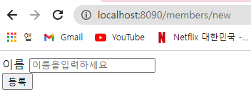
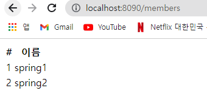
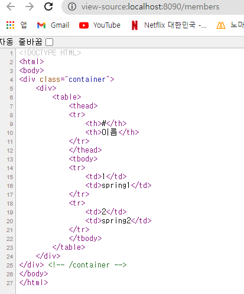

# 웹 MVC 개발

## 홈 화면

※index.html , HomeController    
controller " / " 매핑이 되어 있는 곳으로 이동되고     
없으면 static(정적) index.html 으로 이동

<br>

## 등록

- `MemberController.java`
```java
@GetMapping("/members/new")
    public String createForm(){
        return "members/createMemberForm";
    } // createForm
```
```html
<!DOCTYPE HTML>
<html xmlns:th="http://www.thymeleaf.org">
<body>
<div class="container">
    <form action="/members/new" method="post">
        <div class="form-group">
            <label for="name">이름</label>
            <input type="text" id="name" name="name" placeholder="이름을
입력하세요">
        </div>
        <button type="submit">등록</button>
    </form>
</div> <!-- /container -->
</body>
</html>
```
    
<br>
- data 보내는 controller
```java
package hello.hellospring.controller;

public class MemberForm {
    private String name;

    public String getName() {
        return name;
    }

    public void setName(String name) {
        this.name = name;
    }

} // end class
```
```java
@PostMapping("/members/new")
    public String create(MemberForm form) {
        Member member = new Member();
        member.setName(form.getName());

        memberService.join(member);

        return "redirect:/";
    } // create
```
post : data를 폼에 넣어서 전달할 때    
form 안에 있는 name="name" → 를 보고 MemberForm 에 데이터를 전달하고 getName으로 데이터를 불러옴

<br>

## 조회

- controller
```java
@GetMapping("/members")
    public String list(Model model) {
        List<Member> members = memberService.findMembers();
        model.addAttribute("members", members);
        return "members/memberList";
    } // list
```
```html
<!DOCTYPE HTML>
<html xmlns:th="http://www.thymeleaf.org">
<body>
<div class="container">
    <div>
        <table>
            <thead>
            <tr>
                <th>#</th>
                <th>이름</th>
            </tr>
            </thead>
            <tbody>
            <tr th:each="member : ${members}">
                <td th:text="${member.id}"></td>
                <td th:text="${member.name}"></td>
            </tr>
            </tbody>
        </table>
    </div>
</div> <!-- /container -->
</body>
</html>
```
  
  