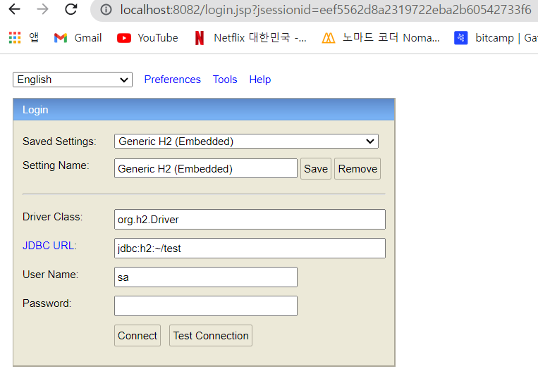
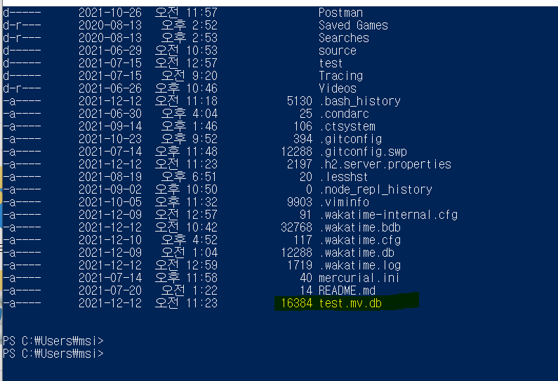
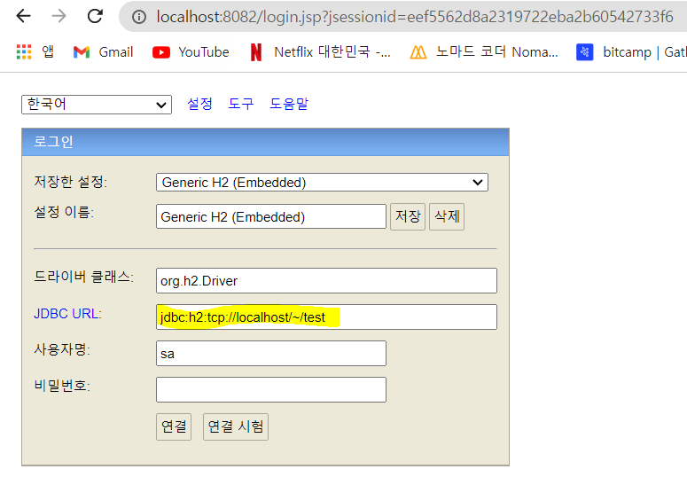
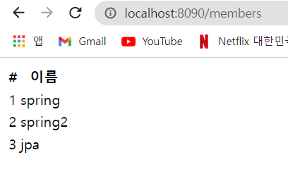
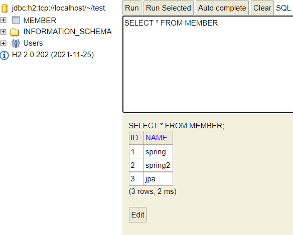
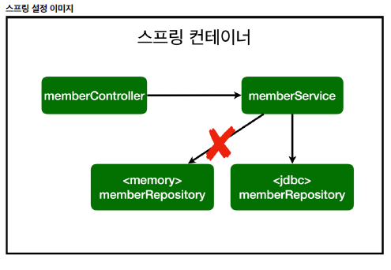
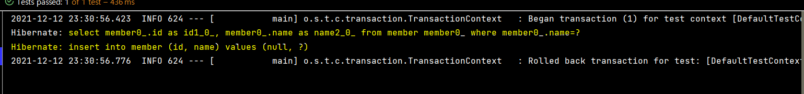
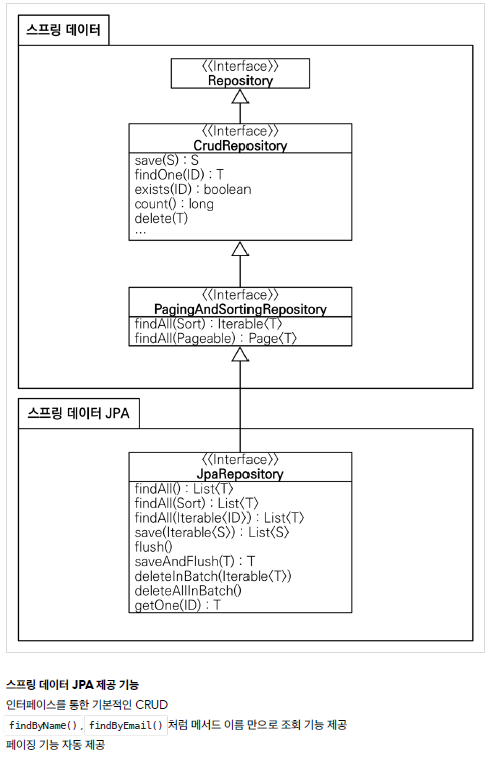

✨ ctrl + alt + v : 리턴값에 맞는 변수 자동 생성 ✨     
✨ ctrl + alt + n : inline 한줄로 만들기 ✨   

# 스프링 DB 접근 기술   

JPA를 사용하면 객체를 바로 쿼리없이 DB에 저장   

## H2 데이터베이스 설치   

- 개발이나 테스트용도로 가볍고 편리한 DB, 웹 화면 제공     
- https://www.h2database.com/html/main.html
1. 다운로드 후 압축 풀기 
2. cmd : bin 폴더에 가서 h2.bat (맥: ./h2.sh)   
   
→ connect 후, 홈 디렉토리에 test.mv.db 파일 생성 확인   
   
✨ 이후부터는 jdbc:h2:tcp://localhost/~/test 으로 접속   
   

<br> 

- 테이블 생성   
```java
drop table if exists member CASCADE;
create table member
(
id bigint generated by default as identity,
name varchar(255),
primary key (id)
);
```

<br>

##  순수 JDBC ( ‼️참고만‼️ )

- build.gradle 파일에 jdbc, h2 관련 라이브러리 추가   
```java
implementation 'org.springframework.boot:spring-boot-starter-jdbc'
runtimeOnly 'com.h2database:h2'
```   

- 스프링 부투 데이터베이스 연결 설정 추가 (resources/application.properties)
```java
spring.datasource.url=jdbc:h2:tcp://localhost/~/test
spring.datasource.driver-class-name=org.h2.Driver
spring.datasource.username=sa
```

- Jdbc 리포지토리 구현
```java
package hello.hellospring.repository;

import hello.hellospring.domain.Member;
import org.springframework.jdbc.datasource.DataSourceUtils;

import javax.sql.DataSource;
import java.sql.*;
import java.util.ArrayList;
import java.util.List;
import java.util.Optional;

public class JdbcMemberRepository implements MemberRepository {
    private final DataSource dataSource;

    public JdbcMemberRepository(DataSource dataSource) {
        this.dataSource = dataSource;
    } // constructor

    @Override
    public Member save(Member member) {
        String sql = "insert into member(name) values(?)";

        Connection conn = null;
        PreparedStatement pstmt = null;
        ResultSet rs = null; // 결과를 받는 것

        try {
            conn = getConnection();
            pstmt = conn.prepareStatement(sql, Statement.RETURN_GENERATED_KEYS);

            pstmt.setString(1, member.getName());

            pstmt.executeUpdate();
            rs = pstmt.getGeneratedKeys();

            if (rs.next()) { // 값이 있으면
                member.setId(rs.getLong(1));
            } else {
                throw new SQLException("id 조회 실패");
            } // if-else

            return member;

        } catch (Exception e) {
            throw new IllegalStateException(e);
        } finally {
            close(conn, pstmt, rs);
        } // try-catch-finally
    } // save

    @Override
    public Optional<Member> findById(Long id) {

        String sql = "select * from member where id = ?";

        Connection conn = null;
        PreparedStatement pstmt = null;
        ResultSet rs = null;

        try {
            conn = getConnection();
            pstmt = conn.prepareStatement(sql);
            pstmt.setLong(1, id);

            rs = pstmt.executeQuery(); // 조회는 executeQuery

            if (rs.next()) {
                Member member = new Member();
                member.setId(rs.getLong("id"));
                member.setName(rs.getString("name"));
                return Optional.of(member);
            } else {
                return Optional.empty();
            } // if-else

        } catch (Exception e) {
            throw new IllegalStateException(e);
        } finally {
            close(conn, pstmt, rs);
        } // try-catch-finally

    } // findById

    @Override
    public List<Member> findAll() {
        String sql = "select * from member";

        Connection conn = null;
        PreparedStatement pstmt = null;
        ResultSet rs = null;

        try {
            conn = getConnection();
            pstmt = conn.prepareStatement(sql);

            rs = pstmt.executeQuery();

            List<Member> members = new ArrayList<>();

            while (rs.next()) {
                Member member = new Member();
                member.setId(rs.getLong("id"));
                member.setName(rs.getString("name"));
                members.add(member);
            } // while

            return members;

        } catch (Exception e) {
            throw new IllegalStateException(e);
        } finally {
            close(conn, pstmt, rs);
        } // try-catch-finally
    } // findAll

    @Override
    public Optional<Member> findByName(String name) {
        String sql = "select * from member where name = ?";

        Connection conn = null;
        PreparedStatement pstmt = null;
        ResultSet rs = null;

        try {
            conn = getConnection();
            pstmt = conn.prepareStatement(sql);
            pstmt.setString(1, name);

            rs = pstmt.executeQuery();

            if (rs.next()) {
                Member member = new Member();
                member.setId(rs.getLong("id"));
                member.setName(rs.getString("name"));
                return Optional.of(member);
            } // if

            return Optional.empty();

        } catch (Exception e) {
            throw new IllegalStateException(e);
        } finally {
            close(conn, pstmt, rs);
        } // try-catch-finally
    } // findByName

    private Connection getConnection() {
        return DataSourceUtils.getConnection(dataSource);
    }

    private void close(Connection conn, PreparedStatement pstmt, ResultSet rs) {
        try {
            if (rs != null) {
                rs.close();
            }
        } catch (SQLException e) {
            e.printStackTrace();
        }
        try {
            if (pstmt != null) {
                pstmt.close();
            }
        } catch (SQLException e) {
            e.printStackTrace();
        }
        try {
            if (conn != null) {
                close(conn);
            }
        } catch (SQLException e) {
            e.printStackTrace();
        }
    } // close

    private void close(Connection conn) throws SQLException {
        DataSourceUtils.releaseConnection(conn, dataSource);
    }
}
```

- 스프링 설정 변경(SpringConfig.java)
```java
package hello.hellospring;

import hello.hellospring.repository.JdbcMemberRepository;
import hello.hellospring.repository.MemberRepository;
import hello.hellospring.service.MemberService;
import org.springframework.beans.factory.annotation.Autowired;
import org.springframework.context.annotation.Bean;
import org.springframework.context.annotation.Configuration;

import javax.sql.DataSource;


@Configuration
public class SpringConfig {

    DataSource dataSource;

    @Autowired
    public SpringConfig(DataSource dataSource) {
        this.dataSource = dataSource;
    } // constructor

    @Bean
    public MemberService memberService() {
        return new MemberService(memberRepository());
    } // memberService

    @Bean
    public MemberRepository memberRepository() {
//        return new MemoryMemberRepository();
        return new JdbcMemberRepository(dataSource);
    } // memberRepository

} // end class
```

   
      
     
     

→ 개방-폐쇄 원칙(OCP, Open-Closed Principle)     
　→ 확장에는 열려있고, 수정, 변경에는 닫혀있다.    
→ 스프링의 DI (Dependencies Injection)을 사용하면 **기존 코드를 전혀 손대지 않고, 설정만으로 구현
클래스를 변경할 수 있다.**    
→ 회원을 등록하고 DB에 결과가 잘 입력되는지 확인하자.    
→ 데이터를 DB에 저장하므로 스프링 서버를 다시 실행해도 데이터가 안전하게 저장된다.    

<br/>

## 스프링 통합 테스트

```java
package hello.hellospring.service;

import hello.hellospring.domain.Member;
import hello.hellospring.repository.MemberRepository;
import hello.hellospring.repository.MemoryMemberRepository;
import org.junit.jupiter.api.AfterEach;
import org.junit.jupiter.api.BeforeEach;
import org.junit.jupiter.api.Test;
import org.springframework.beans.factory.annotation.Autowired;
import org.springframework.boot.test.context.SpringBootTest;
import org.springframework.transaction.annotation.Transactional;

import static org.assertj.core.api.Assertions.assertThat;
import static org.junit.jupiter.api.Assertions.assertThrows;

@SpringBootTest
@Transactional
// test 실행할 때 transaction을 먼저 실행하고 DB에 데이터를 넣은 다음에 롤백을 해준다.
// 즉, DB 에 실제 데이터가 안들어간다 (test를 계속 할 수 있다.)
class MemberServiceIntegrationTest {

    @Autowired
    MemberService memberService;
    @Autowired
    MemberRepository memberRepository;

    @Test
    void 회원가입() {
        // given
        Member member = new Member();
        member.setName("spring");

        // when
        Long saveId = memberService.join(member);

        // then
        Member findMember = memberService.findOne(saveId).get();
        assertThat(member.getName()).isEqualTo(findMember.getName());

    } // join

    @Test
    public void 중복_회원_예외() {
        // given
        Member member1 = new Member();
        member1.setName("spring");

        Member member2 = new Member();
        member2.setName("spring");

        // when
        memberService.join(member1);
        IllegalStateException e = assertThrows(IllegalStateException.class, () -> memberService.join(member2));

        assertThat(e.getMessage()).isEqualTo("이미 존재하는 회원입니다.");


    } // 중복_회원_예외

    @Test
    void findMembers() {

    } // findMembers

    @Test
    void findOne() {

    } // findOne
} // end class
```
→ @SpringBootTest : 스프링 컨테이너와 테스트를 함께 실행한다       
→ @Transactional : 테스트 시작 전에 transaction을 시작하고, 테스트 완료 후에 항상 롤백한다.       
　즉, DB 에 실제 데이터가 안들어간다 (다음 테스트에 영향을 주지 않는다)    
　@AfterEach     
　public void afterEach() { memberRepository.clearStore(); } 필요 없다.    

<br>

## 스프링 Jdbc Template

- 순수 Jdbc 와 동일한 환경설정    
- 스프링 JdbcTemplate과 MyBatis 같은 라이브러리는 JDBC API에서 본 반복 코드를 대부분
제거해준다. 하지만 SQL은 직접 작성해야 한다.    

<br>

- 스프링 JdbcTemplate 리포지토리 

```java
package hello.hellospring.repository;

import hello.hellospring.domain.Member;
import org.springframework.beans.factory.annotation.Autowired;
import org.springframework.jdbc.core.JdbcTemplate;
import org.springframework.jdbc.core.RowMapper;
import org.springframework.jdbc.core.namedparam.MapSqlParameterSource;
import org.springframework.jdbc.core.simple.SimpleJdbcInsert;

import javax.sql.DataSource;
import java.sql.ResultSet;
import java.sql.SQLException;
import java.util.HashMap;
import java.util.List;
import java.util.Map;
import java.util.Optional;

public class JdbcTemplateMemberRepository implements MemberRepository{

    private final JdbcTemplate jdbcTemplate;

//    @Autowired
    // 생성자가 하나일 때만 @Autowired 생략 가능
    public JdbcTemplateMemberRepository(DataSource dataSource) {
        jdbcTemplate = new JdbcTemplate(dataSource);
    } // constructor

    @Override
    public Member save(Member member) {
        SimpleJdbcInsert jdbcInsert = new SimpleJdbcInsert(jdbcTemplate);
        jdbcInsert.withTableName("member").usingGeneratedKeyColumns("id");

        Map<String, Object> parameters = new HashMap<>();
        parameters.put("name", member.getName());

        Number key = jdbcInsert.executeAndReturnKey(new MapSqlParameterSource(parameters));
        member.setId(key.longValue());
        return member;
    } // save

    @Override
    public Optional<Member> findById(Long id) {
        List<Member> result = jdbcTemplate.query("select * from member where id = ?", memberRowMapper(), id);
        return result.stream().findAny();
    } // findById

    @Override
    public Optional<Member> findByName(String name) {
        List<Member> result = jdbcTemplate.query("select * from member where name = ?", memberRowMapper(), name);
        return result.stream().findAny();
    } // findByName

    @Override
    public List<Member> findAll() {
        return jdbcTemplate.query("select * from member", memberRowMapper());
    } // findAll

    private RowMapper<Member> memberRowMapper(){
//        return new RowMapper<Member>() {
//            @Override
//            public Member mapRow(ResultSet rs, int rowNum) throws SQLException {
        return (rs, rowNum) -> {

                Member member = new Member();
                member.setId(rs.getLong("id"));
                member.setName(rs.getString("name"));
                return member;

        }; // return
    } // memberRowMapper

} // end class
```

- JdbcTemplate을 사용하도록 스프링 설정 변경 (SpringConfig)   

```java
package hello.hellospring;

import hello.hellospring.repository.JdbcMemberRepository;
import hello.hellospring.repository.JdbcTemplateMemberRepository;
import hello.hellospring.repository.MemberRepository;
import hello.hellospring.service.MemberService;
import org.springframework.beans.factory.annotation.Autowired;
import org.springframework.context.annotation.Bean;
import org.springframework.context.annotation.Configuration;

import javax.sql.DataSource;


@Configuration
public class SpringConfig {

    DataSource dataSource;

    @Autowired
    public SpringConfig(DataSource dataSource) {
        this.dataSource = dataSource;
    } // constructor

    @Bean
    public MemberService memberService() {
        return new MemberService(memberRepository());
    } // memberService

    @Bean
    public MemberRepository memberRepository() {
//        return new MemoryMemberRepository();
//        return new JdbcMemberRepository(dataSource);
        return new JdbcTemplateMemberRepository(dataSource);
    } // memberRepository

} // end class
```
→ `MemberServiceIntegrationTest`  테스트

<br>

## JPA

- JPA는 기존의 반복 코드는 물론이고, 기본적인 SQL도 JPA가 직접 만들어서 실행해준다.    
- JPA를 사용하면, SQL과 데이터 중심의 설계에서 **객체 중심**의 설계로 패러다임을 전환을 할 수 있다.    
- JPA를 사용하면 개발 생산성을 크게 높일 수 있다    
- ORM (object, relational , mapping)    

<br>

- build.gradle 에 JPA, h2 데이터 베이스 관련 라이브러리 추가   

```java
dependencies {
implementation 'org.springframework.boot:spring-boot-starter-thymeleaf'
implementation 'org.springframework.boot:spring-boot-starter-web'
//implementation 'org.springframework.boot:spring-boot-starter-jdbc'
implementation 'org.springframework.boot:spring-boot-starter-data-jpa'
runtimeOnly 'com.h2database:h2'
testImplementation('org.springframework.boot:spring-boot-starter-test') {
exclude group: 'org.junit.vintage', module: 'junit-vintage-engine'
}
}
```

<br>

- 스프링 부트에 JPA 설정 추가 (resources/application.properties)   
```java
spring.datasource.url=jdbc:h2:tcp://localhost/~/test
spring.datasource.driver-class-name=org.h2.Driver
spring.datasource.username=sa

spring.jpa.show-sql=true
spring.jpa.hibernate.ddl-auto=none
```
→ show-sql : JPA가 생성하는 SQL을 출력한다.    
→ ddl-auto : JPA는 테이블을 자동으로 생성하는 기능을 제공하는데 none 를 사용하면 해당 기능을 끈다. (create 를 사용하면 엔티티 정보를 바탕으로 테이블도 직접 생성해준다. )    

<br>

- JPA 엔티티 매핑
```java
package hello.hellospring.domain;

import javax.persistence.*;

@Entity
public class Member {

    @Id @GeneratedValue(strategy = GenerationType.IDENTITY) // DB가 알아서 생성해주는 것을 IDENTITY
    private Long id;
    private String name;

    public Long getId() {
        return id;
    }

    public void setId(Long id) {
        this.id = id;
    }

    public String getName() {
        return name;
    }

    public void setName(String name) {
        this.name = name;
    }

} // end class
```

<br>

- JPA 회원 리포지토리
```java
package hello.hellospring.repository;

import hello.hellospring.domain.Member;

import javax.persistence.EntityManager;
import java.util.List;
import java.util.Optional;

public class JpaMemberRepository implements MemberRepository {

    private final EntityManager em;
    // Jpa 는 대부분 EntityManager로 동작

    public JpaMemberRepository(EntityManager em) {
        this.em = em;
    } // constructor

    @Override
    public Member save(Member member) {
        em.persist(member);
        return member;
    } // save

    @Override
    public Optional<Member> findById(Long id) {
        Member member = em.find(Member.class, id);
        return Optional.ofNullable(member);
    } // findById

    @Override
    public Optional<Member> findByName(String name) {
        List<Member> result = em.createQuery("select m from Member m where m.name = :name", Member.class)
                .setParameter("name", name)
                .getResultList();

        return result.stream().findAny();
    } // findByName

    @Override
    public List<Member> findAll() {
        return em.createQuery("select m from Member m", Member.class).getResultList();
                                    // * X 객체 자체를 select
    } // findAll

} // end class
```

<br>

- service 계층에 transaction 추가
```java
import org.springframework.transaction.annotation.Transactional

@Transactional
public class MemberService {}
```
→ JPA를 통한 모든 데이터 변경은 트랜잭션 안에서 실행해야 한다   
<br>
- JPA를 사용하도록 스프링 설정 변경 (SpringConfig)
```java
package hello.hellospring;

import hello.hellospring.repository.JdbcMemberRepository;
import hello.hellospring.repository.JdbcTemplateMemberRepository;
import hello.hellospring.repository.JpaMemberRepository;
import hello.hellospring.repository.MemberRepository;
import hello.hellospring.service.MemberService;
import org.springframework.beans.factory.annotation.Autowired;
import org.springframework.context.annotation.Bean;
import org.springframework.context.annotation.Configuration;

import javax.persistence.EntityManager;
import javax.sql.DataSource;


@Configuration
public class SpringConfig {
    
    private EntityManager em;

    @Autowired
    public SpringConfig(EntityManager em) {
        this.em = em;
    } // constructor

    @Bean
    public MemberService memberService() {
        return new MemberService(memberRepository());
    } // memberService

    @Bean
    public MemberRepository memberRepository() {
//        return new MemoryMemberRepository();
//        return new JdbcMemberRepository(dataSource);
//        return new JdbcTemplateMemberRepository(dataSource);
        return new JpaMemberRepository(em);
    } // memberRepository

} // end class
```
→ `MemberServiceIntegrationTest` 테스트   

 

```java
	@Test
    @Commit // 써주면 @transactional(롤백)이 안되고 DB에 저장된다
    void 회원가입() {}
```

<br>

## 스프링 데이터 JPA

- 스프링 부트와 JPA + 여기에 스프링 데이터 JPA를 사용하면, 기존의 한계를 넘어, 리포지토리에 구현 클래스 없이 인터페이스만으로 개발을 할 수 있다.    
- 반복 개발해온 기본 CRUD 기능도 스프링 데이터 JPA가 모두 제공한다.    
- 실무에서 관계형 데이터베이스를 사용한다면 스프링 데이터 JPA는 이제 선택이 아니라 필수!    
<br>

- 스프링 데이터 JPA 회원 레포지토리    
```java
package hello.hellospring.repository;

import hello.hellospring.domain.Member;
import org.springframework.data.jpa.repository.JpaRepository;

import java.util.Optional;

public interface SpringDataJapMemberRepository extends JpaRepository<Member, Long>, MemberRepository {

    @Override
    Optional<Member> findByName(String name);
    
} // end class
```
→ SpringDataJpaMemberRepository가 JpaRepository를 받고 있으면 자동으로 스프링빈에 등록된다.    
→ SpringDataJpaMemberRepository가 구현체를 만들어서 등록을 해준다.    
<br>
- 스프링 데이터 JPA 회원 리포지토리를 사용하도록 스프링 설정 변경(SpringConfig)

```java
package hello.hellospring;

import hello.hellospring.repository.MemberRepository;
import hello.hellospring.service.MemberService;
import org.springframework.beans.factory.annotation.Autowired;
import org.springframework.context.annotation.Bean;
import org.springframework.context.annotation.Configuration;

@Configuration
public class SpringConfig {

    private final MemberRepository memberRepository;

    @Autowired
    public SpringConfig(MemberRepository memberRepository) {
        this.memberRepository = memberRepository; 
    } // constructor

    @Bean
    public MemberService memberService() {
        return new MemberService(memberRepository);
    }
    
/*
    @Bean
    public MemberRepository memberRepository() {
    // return new MemoryMemberRepository();
    // return new JdbcMemberRepository(dataSource);
    // return new JdbcTemplateMemberRepository(dataSource);
    // return new JpaMemberRepository(em);

    }
*/
    
}
```
→ 스프링 데이터 JPA가 SpringDataJpaMemberRepository 를 스프링 빈으로 자동 등록해준다.

 
