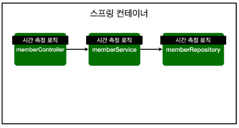
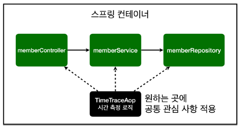
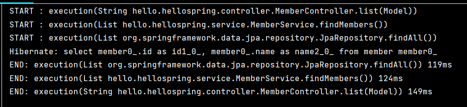
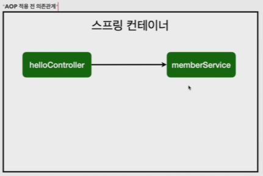
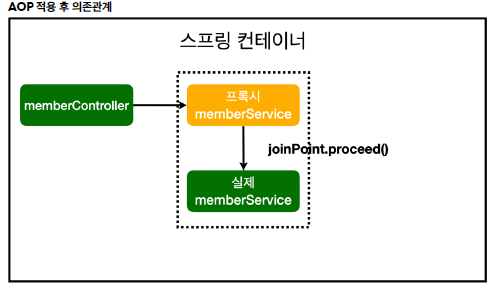
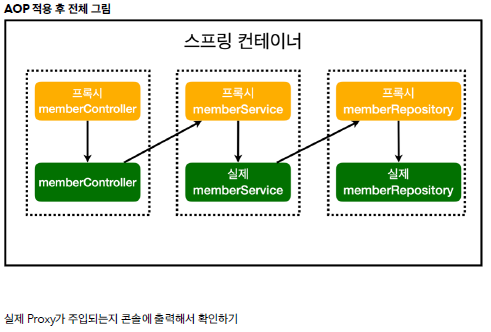
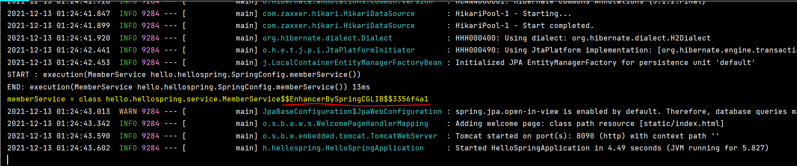

# AOP

- 모든 메소드의 호출 시간을 측정하고 싶을 때    
- 공통 관심 사항(cross-cutting concern) vs 핵심 관심 사항(core concern)     
- 회원 가입 시간, 회원 조회 시간을 측정하고 싶을 때    
   

<br>

- MemberService 에 회원 조회 시간 측정 추가
```java
package hello.hellospring.service;

import hello.hellospring.domain.Member;
import hello.hellospring.repository.MemberRepository;
import org.springframework.transaction.annotation.Transactional;

import java.util.List;
import java.util.Optional;

@Transactional
public class MemberService {

    private final MemberRepository memberRepository;

    public MemberService(MemberRepository memberRepository) {
        this.memberRepository = memberRepository;
    }


    /*
     *  회원 가입
     */
    public Long join(Member member) {

        long start = System.currentTimeMillis();

        try {
            validateDuplicateMember(member); // 같은 이름이 있는 중복 회원 검증
            memberRepository.save(member);
            return member.getId();
        } finally {
            long finish = System.currentTimeMillis();
            long timeMs = finish - start;
            System.out.println("join = " + timeMs + "ms");
        } // try-finally
    } // join

    private void validateDuplicateMember(Member member) {
        //        Optional<Member> result =
        memberRepository.findByName(member.getName())
                .ifPresent(m -> { // ifPresent -> 값이 있으면 .. 해줘라 >> optional 이라 가능하다
                    throw new IllegalStateException("이미 존재하는 회원입니다.");
                });
    } // validateDuplicateMember


    /*
     *  전체 회원 조회
     */
    public List<Member> findMembers() {
        long start = System.currentTimeMillis();

        try {
            return memberRepository.findAll();
        } finally {
            long finish = System.currentTimeMillis();
            long timeMs = finish - start;
            System.out.println("findMembers " + timeMs + "ms");
        } // try-finally
    } // findMembers

    public Optional<Member> findOne(Long memberId){
        return memberRepository.findById(memberId);
    } // findOne

} // end class
```

▶️ 문제..    
→ 시간을 측정하는 로직은 공통 관심 사항이다.    
→ 시간을 측정하는 로직과 핵심 비즈니스의 로직이 섞여서 유지보수가 어렵다.    
→ 시간을 측정하는 로직을 별도의 공통 로직으로 만들기 매우 어렵다.    
→ 시간을 측정하는 로직을 변경할 때 모든 로직을 찾아가면서 변경해야 한다.    

<br>

## AOP 적용

- AOP : Aspect Oriented Programming (관점지향프로그래밍)    
- 공통 관심 사항(cross-cutting concern) vs 핵심 관심 사항(core concern) 분리    

 

- 시간 측정 AOP 등록
```java
package hello.hellospring.aop;

import org.aspectj.lang.ProceedingJoinPoint;
import org.aspectj.lang.annotation.Around;
import org.aspectj.lang.annotation.Aspect;

@Aspect
//@Component
public class TimeTraceAop {
    
    // 적용하고 싶은 곳..
    @Around("execution(* hello.hellospring..*(..))")
    public Object execute(ProceedingJoinPoint joinPoint) throws Throwable {
        long start = System.currentTimeMillis();
        System.out.println("START : " + joinPoint.toString());

        try {
            return joinPoint.proceed();
        } finally {
            long finish = System.currentTimeMillis();
            long timeMs = finish - start;
            System.out.println("END: " + joinPoint.toString() + " " + timeMs + "ms");
        }
    } // execute
} // end class
```

<br>

- 스프링 빈에 등록
```java
@Component
@Aspect
public class TimeTraceAop {}
```
→ @Component 사용해도 되고     
OR    
```java
@Bean
    public TimeTraceAop timeTraceAop(){
        return new TimeTraceAop();
    } // timeTraceAop
```
→ SpringConfig 에 직접 등록 해도 된다 ( ✅선호)    

 <br>

📎 해결 (AOP 장점)    
회원가입, 회원 조회등 핵심 관심사항과 시간을 측정하는 공통 관심 사항을 분리한다.    
시간을 측정하는 로직을 별도의 공통 로직으로 만들었다.    
핵심 관심 사항을 깔끔하게 유지할 수 있다.     
변경이 필요하면 이 로직만 변경하면 된다.    
원하는 적용 대상을 선택할 수 있다.  

<br>

- AOP 동작 방식     



→ 스프링 빈에 등록할때 실제 스프링빈 말고 프록시(가짜) 스프링빈을 먼저 앞에 세움




→ memberService 복제해서 코드를 조작
