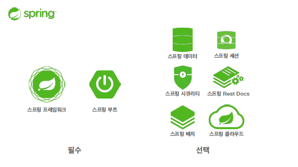
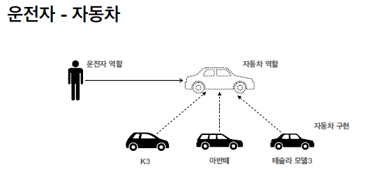
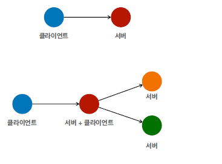
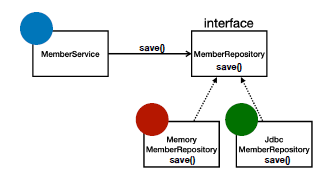
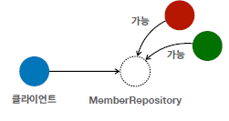
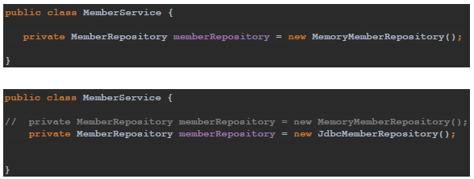

# 객체 지향 설계와 스프링

EJB(Enterprise Java Beans) 지옥...    

## 스프링이란?   

    

✅ 스프링 프레임워크     
- 핵심 기술: 스프링 DI 컨테이너, AOP, 이벤트, 기타     
- 웹 기술: 스프링 MVC, 스프링 WebFlux     
- 데이터 접근 기술: 트랜잭션, JDBC, ORM 지원, XML 지원     
- 기술 통합: 캐시, 이메일, 원격접근, 스케줄링     
- 테스트: 스프링 기반 테스트 지원     
- 언어: 코틀린, 그루비     
- 최근에는 스프링 부트를 통해서 스프링 프레임워크의 기술들을 편리하게 사용      

✅ 스프링 부트     
- 스프링을 편리하게 사용할 수 있도록 지원, 최근에는 기본으로 사용     
- 단독으로 실행할 수 있는 스프링 애플리케이션을 쉽게 생성     
- Tomcat 같은 웹 서버를 내장해서 별도의 웹 서버를 설치하지 않아도 됨     
- 손쉬운 빌드 구성을 위한 starter 종속성 제공 (편하게 하나만 당겨서 쓸 수 있다)     
- 스프링과 3rd parth(외부) 라이브러리 자동 구성     
- 메트릭, 상태 확인, 외부 구성 같은 프로덕션 준비 기능 제공     
- 관례에 의한 간결한 설정    

 

✅ 스프링의 핵심     
- 스프링은 자바 언어 기반의 프레임워크    
- 자바 언어의 가장 큰 특징 - **객체 지향 언어**      
- 스프링은 객체 지향 언어가 가진 강력한 특징을 살려내는 프레임워크     
- 스프링은 좋은 객체 지향 애플리케이션을 개발할 수 있게 도와주는 프레임워크     

 

## 좋은 객체지향 프로그래밍?

✅ 객체 지향 프로그래밍     
- 여개의 독립된 단위, 즉 "객체"들의 모임으로 파악하고자 하는 것이다. 각각의 객체는 메시지를 주고받고, 데이터를 처리할 수 있다. (협력)     
- 객체 지향 프로그래밍은 프로그램을 **유연하고 변경이 용이**하게 만들기 때문에 대규모 소프트웨어 개발에 많이 사용된다.     

   

✅ 역할과 구현을 분리     
- **역할**과 **구현**으로 구분하면 세상이 **단순해지고, 유연해지며 변경도 편리**해진다.     
- 장점     
　• 클라이언트는 대상의 역할(인터페이스)만 알면 된다.      
　• 클라이언트는 구현 대상의 **내부 구조를 몰라도** 된다.     
　• 클라이언트는 구현 대상의 **내부 구조가 변경**되어도 영향을 받지 않는다.     
　• 클라이언트는 구현 **대상 자체를 변경**해도 영향을 받지 않는다.     

 

- 자바 언어의 다형성을 활용     
　• 역할 = 인터페이스     
　• 구현 = 인터페이스를 구현한 클래스, 구현 객체     
- 객체를 설계할 때 역할과 구현을 명확히 분리     
- 객체 설계시 역할(인터페이스)을 먼저 부여하고, 그 역할을 수행하는 구현 객체 만들기     
- 인터페이스를 안정적으로 잘 설계하는 것이 중요❗      

   

→ 혼자 있는 객체는 없다.     
→ 클라이언트: 요청, 서버: 응답     
→ 수 많은 객체 클라이언트와 객체 서버는 서로 협력 관계를 가진다.     

 

✅ 자바 언어의 다형성

 

→ 오버라이딩      
→ 다형성으로 인터페이스를 구현한 객체를 **실행 시점에 유연하게 변경**할 수 있다.     
→ **클라이언트를 변경하지 않고, 서버의 구현 기능을 유연하게 변경할 수 있다.**      

    
 

✅ Spring & OOP(Object Oriented Programming)     
- 스프링은 다형성을 극대화해서 이용할 수 있게 도와준다.     
- 스프링에서 이야기하는 제어의 역전(IoC), 의존관계 주입(DI)은 다형성을 활용해서 역할과 구현을 편리하게 다룰 수 있도록 지원     

 

## 좋은 객체지향 설계의 5가치 원칙 (SOLID)

✅ SOLID     
클린코드로 유명한 로버트 마틴이 좋은 객체 지향 설계의 5가지 원칙을 정리     
• SRP: 단일 책임 원칙(single responsibility principle)     
• OCP: 개방-폐쇄 원칙 (Open/closed principle)     
• LSP: 리스코프 치환 원칙 (Liskov substitution principle)      
• ISP: 인터페이스 분리 원칙 (Interface segregation principle)     
• DIP: 의존관계 역전 원칙 (Dependency inversion principle)     

 

✅ SRP(Single responsibility principle) 단일 책임 원칙     
• 한 클래스는 하나의 책임만 가져야 한다.     
• 하나의 책임이라는 것은 모호하다.     
• 클 수 있고, 작을 수 있다.     
• 문맥과 상황에 따라 다르다.     
• **중요한 기준은 변경**이다. 변경이 있을 때 파급 효과가 적으면 단일 책임 원칙을 잘 따른 것     
• 예) UI 변경, 객체의 생성과 사용을 분리     

 

✅ OCP (Open/closed principle) 개방-폐쇄 원칙     
• 소프트웨어 요소는 **확장에는 열려** 있으나 **변경에는 닫혀** 있어야 한다     
• 다형성을 활용해보자     
• 인터페이스를 구현한 새로운 클래스를 하나 만들어서 새로운 기능을 구현     
• 지금까지 배운 역할과 구현의 분리를 생각해보자     

     

→ 문제점 ..      
- 구현 객체를 변경하려면 클라이언트 코드를 변경해야 한다.     
- 분명 다형성을 사용했지만 OCP 원칙을 지킬 수 없다.     
　→ 객체를 생성하고, 연관관계를 맺어주는 별도의 조립, 설정자가 필요하다. (스프링으로 가능)     

 

✅ LSP (Liskov substitution principle) 리스코프 치환 원칙     
• 프로그램의 객체는 프로그램의 정확성을 깨뜨리지 않으면서 하위 타입의 인스턴스로 바꿀
수 있어야 한다      
• 다형성에서 하위 클래스는 인터페이스 규약을 다 지켜야 한다는 것, 다형성을 지원하기 위한 원칙, 인터페이스를 구현한 구현체는 믿고 사용하려면, 이 원칙이 필요하다.     
• 단순히 컴파일에 성공하는 것을 넘어서는 이야기     
• 예) 자동차 인터페이스의 엑셀은 앞으로 가라는 기능, 뒤로 가게 구현하면 LSP 위반, 느리더라도 앞으로 가야함     

 

✅ ISP (Interface segregation principle) 인터페이스 분리 원칙     
• 특정 클라이언트를 위한 인터페이스 여러 개가 범용 인터페이스 하나보다 낫다     
• 자동차 인터페이스 -> 운전 인터페이스, 정비 인터페이스로 분리     
• 사용자 클라이언트 -> 운전자 클라이언트, 정비사 클라이언트로 분리     
• 분리하면 정비 인터페이스 자체가 변해도 운전자 클라이언트에 영향을 주지 않음      
• 인터페이스가 명확해지고, 대체 가능성이 높아진다.     

 

✅ DIP (Dependency inversion principle) 의존관계 역전 원칙     
• 프로그래머는 “추상화에 의존해야지, 구체화에 의존하면 안된다.”      
• 쉽게 이야기해서 구현 클래스에 의존하지 말고, 인터페이스에 의존하라는 뜻      
• 앞에서 이야기한 **역할(Role)에 의존하게 해야 한다는 것과 같다.** 객체 세상도 클라이언트가 인터페이스에 의존해야 유연하게 구현체를 변경할 수 있다! 구현체에 의존하게 되면 변경이 아주 어려워진다.      
 
→ 문제.. (DIP 위반)     
그런데 OCP에서 설명한 MemberService는 인터페이스에 의존하지만, 구현 클래스도
동시에 의존한다.     
• MemberService 클라이언트가 구현 클래스를 직접 선택     
　• MemberRepository m = new MemoryMemberRepository();