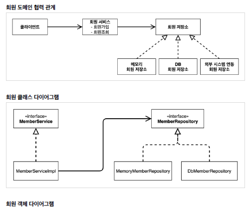
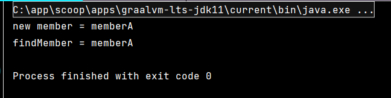
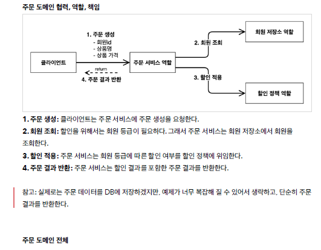
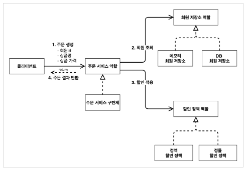
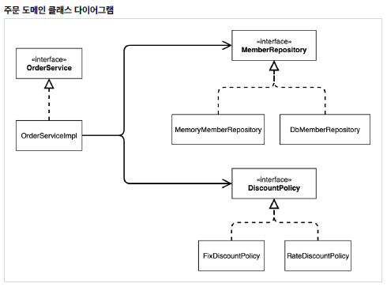
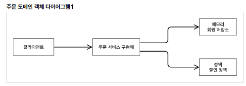
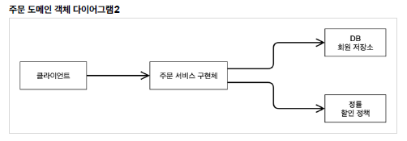
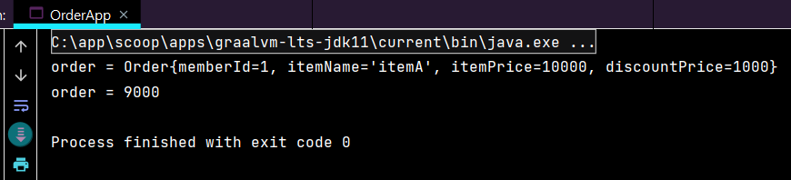

# 스프링 핵심 원리 이해1 (예제 만들기)

## 프로젝트 생성

https://start.spring.io/ →     
- 프로젝트 선택     
　Project: Gradle Project     
　Spring Boot: 2.3.x     
　Language: Java     
　Packaging: Jar     
　Java: 11     
- Project Metadata     
　groupId: hello     
　artifactId: core     
- Dependencies: 선택하지 않는다.     

<br/>

## 비즈니스 요구사항과 설계

인터페이스를 만들고 구현체를 언제든지 갈아끼울 수 있도록 설계하면 된다.     

<br/>

## 회원 도메인 설계

- 회원 도메인 요구사항     
　- 회원을 가입하고 조회할 수 있다.     
　- 회원은 일반과 VIP 두 가지 등급이 있다.     
　- 회원 데이터는 자체 DB를 구축할 수 있고, 외부 시스템과 연동할 수 있다. (미확정)     

   
      

💡 객체 다이어그램은 클래스 다이어그램과 다르게 new 해서 생성해서 동적으로 연관관계가 연결되는..    

<br/>

## 회원 도메인 개발

- 회원 등급     
```java
package hello.core.member;

public enum Grade {
    BASIC,
    VIP
} // end enum
```

- 회원 엔티티
```java
package hello.core.member;

public class Member {
    
    private Long id;
    private String name;
    private Grade grade;

    public Member(Long id, String name, Grade grade) {
        this.id = id;
        this.name = name;
        this.grade = grade;
    } // constructor

    public Long getId() {
        return id;
    }

    public void setId(Long id) {
        this.id = id;
    }

    public String getName() {
        return name;
    }

    public void setName(String name) {
        this.name = name;
    }

    public Grade getGrade() {
        return grade;
    }

    public void setGrade(Grade grade) {
        this.grade = grade;
    }
    
} // end class
```

- 회원 저장소 인터페이스
```java
package hello.core.member;

public interface MemberRepository {

    void save(Member member);

    Member findById(Long memberId);
    
} // end interface
```

- 메모리 회원 저장소 구현체
```java
package hello.core.member;

import java.util.HashMap;
import java.util.Map;

public class MemoryMemberRepository implements MemberRepository{

    private static Map<Long, Member> store = new HashMap<>();
    // HashMap은 동시성 이슈가 발생할 수 있다. -> ConcurrentHashMap을 사용!

    @Override
    public void save(Member member) {
        store.put(member.getId(), member);
    } // save

    @Override
    public Member findById(Long memberId) {
        return store.get(memberId);
    } // findById

} // end class
```

- 회원 서비스 인터페이스
```java
package hello.core.member;

public interface MemberService {

    void join(Member member);

    Member findMember(Long memberId);
    
} // end interface
```

- 회원 서비스 구현체
```java
package hello.core.member;

public class MemberServiceImpl implements MemberService{

    private final MemberRepository memberRepository = new MemoryMemberRepository();
    // 구현객체를 선택하지 않으면 nullPointException 뜨기 때문에 구현객체를 선택해주어야함.

    @Override
    public void join(Member member) {
        memberRepository.save(member);
    } // join

    @Override
    public Member findMember(Long memberId) {
        return memberRepository.findById(memberId);
    } // findMember
    
} // end class
```

<br/>

## 회원 도메인 실행과 테스트

- 회원가입 main
```java
package hello.core;

import hello.core.member.Grade;
import hello.core.member.Member;
import hello.core.member.MemberService;
import hello.core.member.MemberServiceImpl;

public class MemberApp {

    public static void main(String[] args) {
        MemberService memberService = new MemberServiceImpl();
        Member member = new Member(1L, "memberA", Grade.VIP);
        memberService.join(member);

        Member findMember = memberService.findMember(1L);
        System.out.println("new member = " + member.getName());
        System.out.println("findMember = " + findMember.getName());
        
    } // main

} // end class
```
→ 순수한 자바로만 ..    
      

- 회원가입 테스트 (Junit 테스트로 하는게 좋다)   
```java
package hello.core.member;

import org.assertj.core.api.Assertions;
import org.junit.jupiter.api.Test;

public class MemberServiceTest {

    MemberService memberService = new MemberServiceImpl();

    @Test
    void join(){
        // given (이런게 주어졌을 때)
        Member member = new Member(1L, "memberA", Grade.VIP);

        // when (이렇게 했을 때)
        memberService.join(member);
        Member findMember = memberService.findMember(1L);

        // then (이렇게 된다)
        Assertions.assertThat(member).isEqualTo(findMember);

    } // join
} // end class
```
→ 의존관계가 인터페이스 뿐만 아니라 구현까지 모두 의존하는 문제점이 있음.     
　→ 주문까지 만들고나서 문제점과 해결 방안을 설명     

<br/>

## 주문과 할인 도메인 설계

- 주문과 할인 정책     
　- 회원은 상품을 주문할 수 있다.     
　- 회원 등급에 따라 할인 정책을 적용할 수 있다.          
　- 할인 정책은 모든 VIP는 1000원을 할인해주는 고정 금액 할인을 적용해달라. (나중에 변경 될 수 있다.)     
　- 할인 정책은 변경 가능성이 높다. 회사의 기본 할인 정책을 아직 정하지 못했고, 오픈 직전까지 고민을 미루고 싶다. 최악의 경우 할인을 적용하지 않을 수 도 있다. (미확정)     

 <br/>
→ 역할과 구현을 분리해서 설계했다 ⇒ 회원 저장소는 물론이고, 할인 정책도 유연하게 변경 가능     





→ 역할들의 협력 관계를 그대로 재사용 가능 ⇒ 메모리 회원저장소가 DB로 바껴도, 정액 할인 정책이 정률 할인 정책으로 바껴도 주문 서비스 구현체는 그대로 사용 가능하다.

<br/>

## 주문과 할인 도메인 개발

- 할인 정책 인터페이스
```java
package hello.core.discount;

import hello.core.member.Member;

public interface DiscountPolicy {

    /*
     * @return 할인 대상 금액
     */
    int discount(Member member, int price);

} // end interface
```

- 정액 할인 정책 구현체 (VIP면 1000원 할인 아니면 할인 X)
```java
package hello.core.discount;

import hello.core.member.Grade;
import hello.core.member.Member;

public class FixDiscountPolicy implements DiscountPolicy {

    private int discountFixAmount = 1000; // 1000원 할인

    @Override
    public int discount(Member member, int price) {
        if (member.getGrade() == Grade.VIP) {
            return discountFixAmount;
        } else {
            return 0;
        } // if-else

    } // discount

} // end class
```

- 주문 엔티티
```java
package hello.core.order;

public class Order {

    private Long memberId;
    private String itemName;
    private int itemPrice;
    private int discountPrice;

    public Order(Long memberId, String itemName, int itemPrice, int discountPrice) {
        this.memberId = memberId;
        this.itemName = itemName;
        this.itemPrice = itemPrice;
        this.discountPrice = discountPrice;
    } // constructor

    public int calculatePrice(){
        // 할인된 가격
        return itemPrice - discountPrice;
    } // calculatePrice

    public Long getMemberId() {
        return memberId;
    }

    public void setMemberId(Long memberId) {
        this.memberId = memberId;
    }

    public String getItemName() {
        return itemName;
    }

    public void setItemName(String itemName) {
        this.itemName = itemName;
    }

    public int getItemPrice() {
        return itemPrice;
    }

    public void setItemPrice(int itemPrice) {
        this.itemPrice = itemPrice;
    }

    public int getDiscountPrice() {
        return discountPrice;
    }

    public void setDiscountPrice(int discountPrice) {
        this.discountPrice = discountPrice;
    }

    @Override
    public String toString() {
        return "Order{" +
                "memberId=" + memberId +
                ", itemName='" + itemName + '\'' +
                ", itemPrice=" + itemPrice +
                ", discountPrice=" + discountPrice +
                '}';
    }

} // end class
```

- 주문 서비스 인터페이스
```java
package hello.core.order;

public interface OrderService {
    Order createOrder(Long memberId, String itemName, int itemPrice);
} // end interface
```

- 주문 서비스 구현체
```java
package hello.core.order;

import hello.core.discount.DiscountPolicy;
import hello.core.discount.FixDiscountPolicy;
import hello.core.member.Member;
import hello.core.member.MemberRepository;
import hello.core.member.MemoryMemberRepository;

public class OrderServiceImpl implements OrderService{

    private final MemberRepository memberRepository = new MemoryMemberRepository();
    private final DiscountPolicy discountPolicy = new FixDiscountPolicy();

    @Override
    public Order createOrder(Long memberId, String itemName, int itemPrice) {
        Member member = memberRepository.findById(memberId);
        int discountPrice = discountPolicy.discount(member, itemPrice);

        return new Order(memberId, itemName, itemPrice, discountPrice);
    } // createOrder
} // end class
```
→ 주문 생성 요청이 오면, 회원 정보를 조회하고, 할인 정책을 적용한 다음 주문 객체를 생성해서 반환한다.     
메모리 회원 리포지토리와, 고정 금액 할인 정책을 구현체로 생성한다.

<br/>

## 주문과 할인 도메인 실행과 테스트

- 주문과 할인 정책 실행 (main)
```java
package hello.core;

import hello.core.member.Grade;
import hello.core.member.Member;
import hello.core.member.MemberService;
import hello.core.member.MemberServiceImpl;
import hello.core.order.Order;
import hello.core.order.OrderService;
import hello.core.order.OrderServiceImpl;

public class OrderApp {

    public static void main(String[] args) {
        MemberService memberService = new MemberServiceImpl();
        OrderService orderService = new OrderServiceImpl();

        Long memberId = 1L;
        Member member = new Member(memberId, "memberA", Grade.VIP);
        memberService.join(member);

        Order order = orderService.createOrder(memberId, "itemA", 10000);

        System.out.println("order = " + order);
        System.out.println("order = " + order.calculatePrice());
        
    } // main
} // end class
```


- 주문과 할인 정책 테스트 (웬만하면 Junit 테스트로 하자)
```java
package hello.core.order;

import hello.core.member.Grade;
import hello.core.member.Member;
import hello.core.member.MemberService;
import hello.core.member.MemberServiceImpl;
import org.assertj.core.api.Assertions;
import org.junit.jupiter.api.Test;

public class OrderServiceTest {

    MemberService memberService = new MemberServiceImpl();
    OrderService orderService = new OrderServiceImpl();

    @Test
    void createOrder(){
        Long memberId = 1L;
        Member member = new Member(memberId, "memberA", Grade.VIP);
        memberService.join(member);

        Order order = orderService.createOrder(memberId, "itemA", 10000);
        Assertions.assertThat(order.getDiscountPrice()).isEqualTo(1000);

    } // createOrder

} // end class
```
