# 스프링 핵심 원리 이해2 (객체 지향 원리 적용)

## 새로운 할인 정책 개발

- 새로운 할인 정책을 확장해보자.    
악덕 기획자: 서비스 오픈 직전에 할인 정책을 지금처럼 고정 금액 할인이 아니라 좀 더 합리적인 주문 금액당 할인하는 정률% 할인으로 변경하고 싶어요. 예를 들어서 기존 정책은 VIP가 10000원을 주문하든 20000원을 주문하든 항상 1000원을 할인했는데, 이번에 새로 나온 정책은 10%로 지정해두면 고객이 10000원 주문시 1000원을 할인해주고, 20000원 주문시에 2000원을 할인해주는 거에요!     
- 순진 개발자가 정말 객체지향 설계 원칙을 잘 준수 했는지 확인해보자. 이번에는 주문한 금액의 %를 할인해주는 새로운 정률 할인 정책을 추가하자.

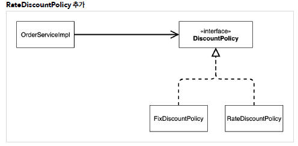  

- RateDisountPolicy 추가
```java
package hello.core.discount;

import hello.core.member.Grade;
import hello.core.member.Member;

public class RateDiscountPolicy implements DiscountPolicy {

    private int discountPercent = 10;

    @Override
    public int discount(Member member, int price) {
        if (member.getGrade() == Grade.VIP) {
            return price * discountPercent / 100;
        } else {
            return 0;
        } // if-else
    } // discount

} // end class
```

- test
```java
package hello.core.discount;

import hello.core.member.Grade;
import hello.core.member.Member;
import org.assertj.core.api.Assertions;
import org.junit.jupiter.api.DisplayName;
import org.junit.jupiter.api.Test;

import static org.junit.jupiter.api.Assertions.*;

class RateDiscountPolicyTest {

    RateDiscountPolicy discountPolicy = new RateDiscountPolicy();

    @Test
    @DisplayName("VIP는 10% 할인이 적용되어야 한다")
    void vip_o() {
        //given
        Member member = new Member(1L, "memberVIP", Grade.VIP);

        //when
        int discount = discountPolicy.discount(member, 10000);

        //then
        Assertions.assertThat(discount).isEqualTo(1000);

    } // vip_o

    @Test
    @DisplayName("VIP가 아니면 할인이 적용되지 않아야 한다")
    void vip_x() {
        //given
        Member member = new Member(2L, "memberBASIC", Grade.BASIC);

        //when
        int discount = discountPolicy.discount(member, 10000);

        //then
        Assertions.assertThat(discount).isEqualTo(1000);
    } // vip_x

} // end class
```
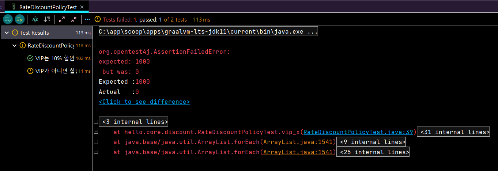  

<br/>

## 새로운 할인 정책 적용과 문제점

- 할인 정책을 변경하려면 클라이언트인 OrderServiceImpl 코드를 고쳐야한다.
```java
public class OrderServiceImpl implements OrderService{

    private final MemberRepository memberRepository = new MemoryMemberRepository();
//    private final DiscountPolicy discountPolicy = new FixDiscountPolicy();
    private final DiscountPolicy discountPolicy = new RateDiscountPolicy();
...

}
```

- OCP, DIP 같은 객체지향 설계 원칙을 준수 X    
- DIP: 주문서비스 클라이언트( OrderServiceImpl )는 DiscountPolicy      인터페이스에 의존하면서 DIP를 지킨 것 같은데?

　→ 클래스 의존관계를 분석해 보자. 추상(인터페이스) 뿐만 아니라 **구체(구현) 클래스에도 의존**하고 있다.
　→ 추상(인터페이스) 의존: DiscountPolicy
　→ 구체(구현) 클래스: FixDiscountPolicy , RateDiscountPolicy     
- OCP: 변경하지 않고 확장할 수 있다고 했는데!
　→ 지금 코드는 기능을 확장해서 변경하면, 클라이언트 코드에 영향을 준다! 따라서 **OCP를 위반**한다.     

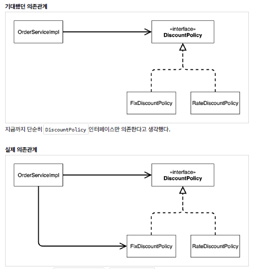  

→ 클라이언트인 OrderServiceImpl 이 DiscountPolicy 인터페이스 뿐만 아니라 FixDiscountPolicy 인 구체 클래스도 함께 의존하고 있다. 실제 코드를 보면 의존하고 있다! **DIP 위반**

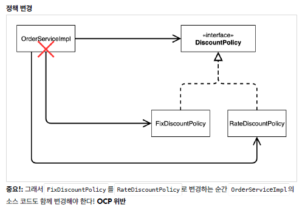  

✅ 어떻게 해결 ...?     
- DIP를 위반하지 않도록 인터페이스에만 의존하도록 의존관계를 변경하면 된다.     
- 인터페이스에만 의존하도록 설계를 변경하자    

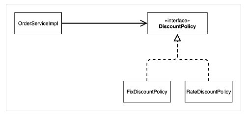 

- 인터페이스에만 의존하도록 코드 변경
```java
public class OrderServiceImpl implements OrderService{

    private final MemberRepository memberRepository = new MemoryMemberRepository();
    // final은 무조건 값이 할당 되어야함.
    private DiscountPolicy discountPolicy;
...

}
```

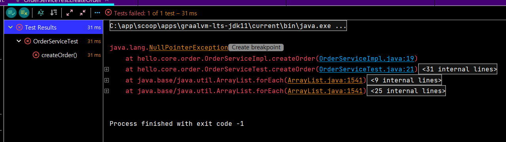 

→ 구현체가 없으니까.. 오류...     

✅ 해결 방안     
- 누군가가 클라이언트인 OrderServiceImpl 에 DiscountPolicy 의 구현 객체를 대신 생성하고 주입해주어야 한다.     

<br/>

## 관심사의 분리

- 로미오와 줄리엣 공연을 하면 로미오 역할을 누가 할지 줄리엣 역할을 누가 할지는 배우들이 정하는게 아니다. 이전 코드는 마치 로미오 역할(인터페이스)을 하는 레오나르도 디카프리오(구현체, 배우)가 줄리엣 역할(인터페이스)을 하는 여자 주인공(구현체, 배우)을 직접 초빙하는 것과 같다.      
⇒ **관심사를 분리하자**     
- 공연을 구성하고, 담당 배우를 섭외하고, 역할에 맞는 배우를 지정하는 책임을 담당하는 별도의 **공연기획자**가 나올시점이다.     
- 공연 기획자를 만들고, 배우와 공연 기획자의 책임을 확실히 분리하자.     
<br/>

- AppConfig     
　→ 애플리케이션의 전체 동작 방식을 구성(config)하기 위해, 구현 객체를 생성하고, 연결하는 책임을 가지는 별도의 설정 클래스를 만들자    

```java
package hello.core;

import hello.core.discount.FixDiscountPolicy;
import hello.core.member.MemberService;
import hello.core.member.MemberServiceImpl;
import hello.core.member.MemoryMemberRepository;
import hello.core.order.Order;
import hello.core.order.OrderService;
import hello.core.order.OrderServiceImpl;

public class AppConfig {

    // 생성자 주입
    public MemberService memberService() {
        return new MemberServiceImpl(new MemoryMemberRepository());
    } // memberService

    public OrderService orderService(){
        return new OrderServiceImpl(new MemoryMemberRepository(), new FixDiscountPolicy());
    } // orderService


} // end class
```

→ AppConfig는 애플리케이션의 실제 동작에 필요한 **구현 객체를 생성한다**.     
　MemberServiceImpl     
　MemoryMemberRepository    
　OrderServiceImpl     
　FixDiscountPolicy     
→ AppConfig는 생성한 객체 인스턴스의 참조(레퍼런스)를 **생성자를 통해서 주입(연결)**해준다.     
　- MemberServiceImpl → MemoryMemberRepository     
　- OrderServiceImpl → MemoryMemberRepository , FixDiscountPolicy     

<br/>

- MemberServiceImpl - 생성자 주입
```java
package hello.core.member;

public class MemberServiceImpl implements MemberService{

    private final MemberRepository memberRepository;
//    private final MemberRepository memberRepository = new MemoryMemberRepository();
    // 구현객체를 선택하지 않으면 nullPointException 뜨기 때문에 구현객체를 선택해주어야함.


    public MemberServiceImpl(MemberRepository memberRepository) {
        this.memberRepository = memberRepository;
    } // constructor

    @Override
    public void join(Member member) {
        memberRepository.save(member);
    } // join

    @Override
    public Member findMember(Long memberId) {
        return memberRepository.findById(memberId);
    } // findMember

} // end class
```

→ MemberServiceImpl 의 생성자를 통해서 어떤 구현 객체를 주입할지는 오직 외부( AppConfig )에서 결정된다.     
→ MemberServiceImpl 은 이제부터 **의존관계에 대한 고민은 외부**에 맡기고 실행에만 집중하면 된다.    

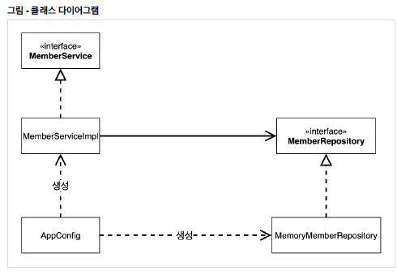 

→ AppConfig : 객체의 생성과 연결을 담당     
그림 - 회원 객체 인스턴스 다이어그램   
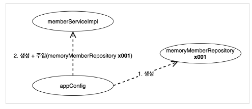 

→ appConfig 객체는 `memoryMemberRepository` 객체를 생성하고 그 참조값을 `memberServiceImpl` 을 생성하면서 생성자로 전달한다.     
→ 클라이언트인 `memberServiceImpl` 입장에서 보면 의존관계를 마치 외부에서 주입해주는 것 같다고 해서 DI(Dependency Injection) 우리말로 의존관계 주입 또는 의존성 주입이라 한다.     

- `OrderServiceImpl` - 생성자 주입
```java
package hello.core.order;

import hello.core.discount.DiscountPolicy;
import hello.core.member.Member;
import hello.core.member.MemberRepository;

public class OrderServiceImpl implements OrderService{

    private final MemberRepository memberRepository;
    private final DiscountPolicy discountPolicy;

    public OrderServiceImpl(MemberRepository memberRepository, DiscountPolicy discountPolicy) {
        this.memberRepository = memberRepository;
        this.discountPolicy = discountPolicy;
    } // constructor

    @Override
    public Order createOrder(Long memberId, String itemName, int itemPrice) {
        Member member = memberRepository.findById(memberId);
        int discountPrice = discountPolicy.discount(member, itemPrice);

        return new Order(memberId, itemName, itemPrice, discountPrice);
    } // createOrder

} // end class
```
→ `OrderServiceImpl` 에는 `MemoryMemberRepository` , `FixDiscountPolicy` 객체의 의존관계가
주입된다.     

<br/>

✅ AppConfig 실행     
- MemberApp
```java
package hello.core;

import hello.core.member.Grade;
import hello.core.member.Member;
import hello.core.member.MemberService;

public class MemberApp {

    public static void main(String[] args) {
        AppConfig appConfig = new AppConfig();
//        MemberService memberService = new MemberServiceImpl();
        MemberService memberService = appConfig.memberService();

        Member member = new Member(1L, "memberA", Grade.VIP);
        memberService.join(member);

        Member findMember = memberService.findMember(1L);
        System.out.println("new member = " + member.getName());
        System.out.println("findMember = " + findMember.getName());

    } // main

} // end class
```

- OrderApp
```java
package hello.core;

import hello.core.member.Grade;
import hello.core.member.Member;
import hello.core.member.MemberService;
import hello.core.order.Order;
import hello.core.order.OrderService;

public class OrderApp {

    public static void main(String[] args) {

        AppConfig appConfig = new AppConfig();
//        MemberService memberService = new MemberServiceImpl();
//        OrderService orderService = new OrderServiceImpl();
        MemberService memberService = appConfig.memberService();
        OrderService orderService = appConfig.orderService();

        Long memberId = 1L;
        Member member = new Member(memberId, "memberA", Grade.VIP);
        memberService.join(member);

        Order order = orderService.createOrder(memberId, "itemA", 10000);

        System.out.println("order = " + order);
        System.out.println("order = " + order.calculatePrice());

    } // main
} // end class
```

- 테스트 코드 오류 수정 (MemberServiceTest)
package hello.core.member;

import hello.core.AppConfig;
import org.assertj.core.api.Assertions;
import org.junit.jupiter.api.BeforeEach;
import org.junit.jupiter.api.Test;

public class MemberServiceTest {

//    MemberService memberService = new MemberServiceImpl();
    MemberService memberService;

    @BeforeEach
    public void beforeEach(){
        AppConfig appConfig = new AppConfig();
        memberService = appConfig.memberService();
    } // beforeEach

    @Test
    void join(){
        // given (이런게 주어졌을 때)
        Member member = new Member(1L, "memberA", Grade.VIP);

        // when (이렇게 했을 때)
        memberService.join(member);
        Member findMember = memberService.findMember(1L);

        // then (이렇게 된다)
        Assertions.assertThat(member).isEqualTo(findMember);

    } // join
} // end class
```

- 테스트 코드 오류 수정 (OrderServiceTest)
```java
package hello.core.order;

import hello.core.AppConfig;
import hello.core.member.Grade;
import hello.core.member.Member;
import hello.core.member.MemberService;
import hello.core.member.MemberServiceImpl;
import org.assertj.core.api.Assertions;
import org.junit.jupiter.api.BeforeEach;
import org.junit.jupiter.api.Test;

public class OrderServiceTest {

//    MemberService memberService = new MemberServiceImpl();
//    OrderService orderService = new OrderServiceImpl();
    MemberService memberService;
    OrderService orderService;

    @BeforeEach
    public void beforeEach() {
        AppConfig appConfig = new AppConfig();
        memberService = appConfig.memberService();
        orderService = appConfig.orderService();
    } // beforeEach

    @Test
    void createOrder(){
        Long memberId = 1L;
        Member member = new Member(memberId, "memberA", Grade.VIP);
        memberService.join(member);

        Order order = orderService.createOrder(memberId, "itemA", 10000);
        Assertions.assertThat(order.getDiscountPrice()).isEqualTo(1000);

    } // createOrder

} // end class
```

<br/>

## AppConfig 리팩터링

- 현재 AppConfig를 보면 **중복**이 있고, **역할에 따른 구현이 잘 안보인다.**    

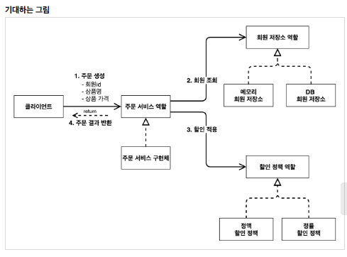 

- Before 리팩터링
```java
package hello.core;
import hello.core.discount.FixDiscountPolicy;
import hello.core.member.MemberService;
import hello.core.member.MemberServiceImpl;
import hello.core.member.MemoryMemberRepository;
import hello.core.order.OrderService;
import hello.core.order.OrderServiceImpl;


public class AppConfig {

	public MemberService memberService() {
		return new MemberServiceImpl(new MemoryMemberRepository());
	} // memberService

	public OrderService orderService() {
		return new OrderServiceImpl(new MemoryMemberRepository(), new FixDiscountPolicy());
	} // orderService
} // end class
```

- After
```java
package hello.core;

import hello.core.discount.DiscountPolicy;
import hello.core.discount.FixDiscountPolicy;
import hello.core.member.MemberService;
import hello.core.member.MemberServiceImpl;
import hello.core.member.MemoryMemberRepository;
import hello.core.order.Order;
import hello.core.order.OrderService;
import hello.core.order.OrderServiceImpl;

public class AppConfig {

    // 생성자 주입
    public MemberService memberService() {
        return new MemberServiceImpl(memberRepository());
    } // memberService

    // shift + alt + M
    private MemoryMemberRepository memberRepository() {
        return new MemoryMemberRepository();
    }

    public OrderService orderService(){
        return new OrderServiceImpl(memberRepository(), discountPolicy());
    } // orderService

    public DiscountPolicy discountPolicy(){
        return new FixDiscountPolicy();
    } // discountPolicy


} // end class
```
✨ Extract Method 단축키 ✨    
→ shift + alt + m     

<br/>

## 새로운 구조와 할인 정책 적용

- `FixDiscountPolicy` → `RateDiscountPolicy`     
- AppConfig의 등장으로 애플리케이션이 크게 사용 영역과, 객체를 생성하고 구성(Configuration)하는 영역으로 분리되었다. (AppConfig 만 변경하면 된다)     

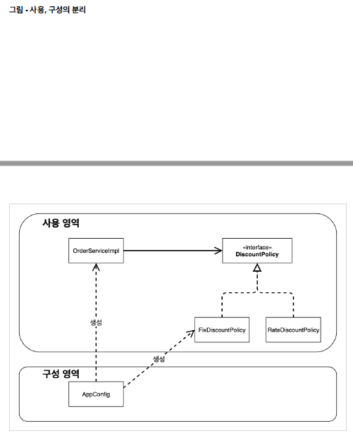

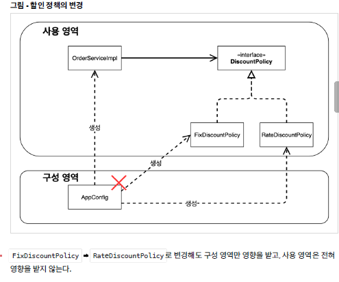 

- 할인 정책 변경 구성 코드 (AppConfig)
```java
public DiscountPolicy discountPolicy(){
//        return new FixDiscountPolicy();
        return new RateDiscountPolicy();
    } // discountPolicy
```

→ **구성 영역**은 당연히 변경된다. 구성 역할을 담당하는 AppConfig를 애플리케이션이라는 공연의 기획자로 생각하자. 공연 기획자는 공연 참여자인 구현 객체들을 모두 알아야 한다.     

<br/>

## 좋은 객체 지향 설계의 5가지 원칙의 적용

여기서 3가지 SRP, DIP, OCP 적용     
<br/>
- SRP 단일 책임 원칙 (한 클래스는 하나의 책임만 가져야 한다)     
　→ 구현 객체를 생성하고 연결하는 책임은 AppConfig가 담당     
　→ 클라이언트 객체는 실행하는 책임만 담당   <br/>

- DIP 의존관계 역전 원칙 ( 프로그래머는 “추상화에 의존해야지, 구체화에 의존하면 안된다.”)     
　→  AppConfig가 FixDiscountPolicy 객체 인스턴스를 클라이언트 코드 대신 생성해서 클라이언트 코드에 의존관계를 주입했다. 이렇게해서 DIP 원칙을 따르면서 문제도 해결했다.     

<br/>

- OCP (소프트웨어 요소는 확장에는 열려 있으나 변경에는 닫혀 있어야 한다.)     
　→ AppConfig가 의존관계를 FixDiscountPolicy RateDiscountPolicy 로 변경해서 클라이언트
코드에 주입하므로 클라이언트 코드는 변경하지 않아도 됨     
　→ 소프트웨어 요소를 새롭게 확장해도 사용 영역의 변경은 닫혀 있다!     

<br/>

## IoC, DI & 컨테이너

✅ 제어의 역전 IoC (Inversion of Control)     
- 기존 :  클라이언트 구현 객체가 스스로 필요한 서버 구현 객체를 생성하고, 연결하고, 실행했다.     
- 현재 :  AppConfig가 등장한 이후에 구현 객체는 자신의 로직을 실행하는 역할만 담당한다.     
- 프로그램에 대한 제어 흐름에 대한 권한은 모두 AppConfig가 가지고 있다. 그리고 AppConfig는 OrderServiceImpl 이 아닌 OrderService 인터페이스의 다른 구현 객체를 생성하고 실행할 수 도 있다     
- 이렇듯 프로그램의 제어 흐름을 직접 제어하는 것이 아니라 **외부에서 관리하는 것**을 **제어의 역전(IoC)**이라 한다.     

<br/>

✅  프레임워크 vs 라이브러리     
- 프레임워크가 내가 작성한 코드를 제어하고, 대신 실행하면 그것은 프레임워크가 맞다. (JUnit)     
- 반면에 내가 작성한 코드가 직접 제어의 흐름을 담당한다면 그것은 프레임워크가 아니라 라이브러리다. (자바 객체를 XML 이나 JSON 으로 바꾸는 것)     

<br/>

✅ 의존관계 주입 DI(Dependency Injection)     
- OrderServiceImpl 은 `DiscountPolicy` 인터페이스에 의존한다. 실제 `FixDiscountPolicy` 가 들어올지 `RateDiscountPolicy` 가 들어올지 모른다.     
- 의존관계는 정적인 클래스 의존 관계와, 실행 시점에 결정되는 동적인 객체(인스턴스) 의존 관계 둘을 분리해서 생각해야 한다.     

<br/>

✅ 정적인 클래스 의존관계     
- 클래스가 사용하는 import 코드만 보고 의존관계를 쉽게 판단할 수 있다.     

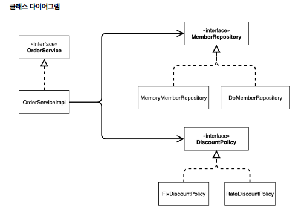 

→ `OrderServiceImpl` 은 `MemberRepository` , `DiscountPolicy` 에 의존한다는 것을 알 수 있다.     
→ 그런데 이러한 클래스 의존관계 만으로는 실제 어떤 객체가 `OrderServiceImpl` 에 주입 될지 알 수 없다.      
<br/>

✅ 동적인 객체 인스턴스 의존 관게     
- 애플리케이션 실행 시점에 실제 생성된 객체 인스턴스의 참조가 연결된 의존 관계다.

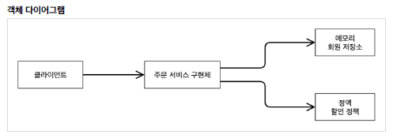 

- 애플리케이션 **실행 시점(런타임)**에 외부에서 실제 구현 객체를 생성하고 클라이언트에 전달해서 클라이언트와 서버의 실제 의존관계가 연결 되는 것을 **의존관계 주입**이라 한다.     
- 의존관계 주입을 사용하면 클라이언트 코드를 변경하지 않고, 클라이언트가 호출하는 대상의 타입 인스턴스를 변경할 수 있다.     
- 의존관계 주입을 사용하면 정적인 클래스 의존관계를 변경하지 않고, 동적인 객체 인스턴스 의존관계를 쉽게 변경할 수 있다.     
<br/>

✅ IoC 컨테이너, DI 컨테이너     
- AppConfig 처럼 객체를 생성하고 관리하면서 의존관계를 연결해 주는 것을     
- IoC 컨테이너 또는 **DI 컨테이너**라 한다.     
- 의존관계 주입에 초점을 맞추어 최근에는 주로 DI 컨테이너라 한다.     
- 또는 어샘블러, 오브젝트 팩토리 등으로 불리기도 한다.      

<br/>

## 스프링으로 전환하기     
- AppConfig 스프링 기반으로 변경     
```java
package hello.core;

import hello.core.discount.DiscountPolicy;
import hello.core.discount.RateDiscountPolicy;
import hello.core.member.MemberService;
import hello.core.member.MemberServiceImpl;
import hello.core.member.MemoryMemberRepository;
import hello.core.order.OrderService;
import hello.core.order.OrderServiceImpl;
import org.springframework.context.annotation.Bean;
import org.springframework.context.annotation.Configuration;


@Configuration
public class AppConfig {

    
    // 생성자 주입
    @Bean
    public MemberService memberService() {
        return new MemberServiceImpl(memberRepository());
    } // memberService

    // shift + alt + M
    @Bean
    public MemoryMemberRepository memberRepository() {
        return new MemoryMemberRepository();
    }

    @Bean
    public OrderService orderService(){
        return new OrderServiceImpl(memberRepository(), discountPolicy());
    } // orderService

    @Bean
    public DiscountPolicy discountPolicy(){
//        return new FixDiscountPolicy();
        return new RateDiscountPolicy();
    } // discountPolicy
    

} // end class
```
→ AppConfig에 설정을 구성한다는 뜻의 `@Configuration` 을 붙여준다.     
→ 각 메서드에 `@Bean` 을 붙여주면 스프링 컨테이너에 스프링 빈으로 등록한다.     
<br/>

- MemberApp에 스프링 컨테이너 적용
```java
package hello.core;

import hello.core.member.Grade;
import hello.core.member.Member;
import hello.core.member.MemberService;
import org.springframework.context.ApplicationContext;
import org.springframework.context.annotation.AnnotationConfigApplicationContext;

public class MemberApp {

    public static void main(String[] args) {
//        AppConfig appConfig = new AppConfig();
//        MemberService memberService = appConfig.memberService();

        ApplicationContext applicationContext = new AnnotationConfigApplicationContext(AppConfig.class);
        // ApplicationContext : 스프링 컨테이너 (객체 모든것을 관리)
        MemberService memberService = applicationContext.getBean("memberService", MemberService.class);

        Member member = new Member(1L, "memberA", Grade.VIP);
        memberService.join(member);

        Member findMember = memberService.findMember(1L);
        System.out.println("new member = " + member.getName());
        System.out.println("findMember = " + findMember.getName());

    } // main

} // end class
```

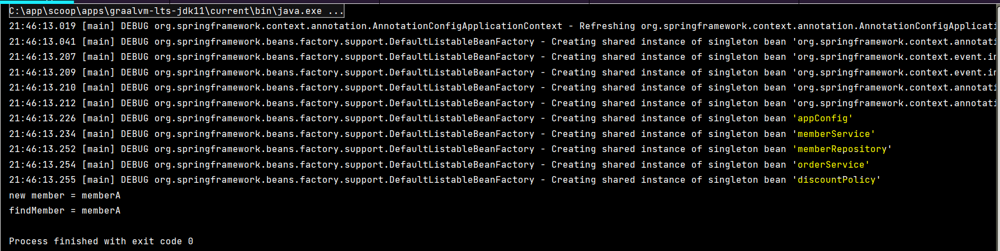 

- OrderApp에 스프링 컨테이너 적용
```java
package hello.core;

import hello.core.member.Grade;
import hello.core.member.Member;
import hello.core.member.MemberService;
import hello.core.order.Order;
import hello.core.order.OrderService;
import org.springframework.context.ApplicationContext;
import org.springframework.context.annotation.AnnotationConfigApplicationContext;

public class OrderApp {

    public static void main(String[] args) {

//        AppConfig appConfig = new AppConfig();
//        MemberService memberService = appConfig.memberService();
//        OrderService orderService = appConfig.orderService();

        ApplicationContext applicationContext = new AnnotationConfigApplicationContext(AppConfig.class);
        MemberService memberService = applicationContext.getBean("memberService", MemberService.class);
        OrderService orderService = applicationContext.getBean("orderService", OrderService.class);

        Long memberId = 1L;
        Member member = new Member(memberId, "memberA", Grade.VIP);
        memberService.join(member);

        Order order = orderService.createOrder(memberId, "itemA", 10000);

        System.out.println("order = " + order);
        System.out.println("order = " + order.calculatePrice());

    } // main
} // end class
```
→ 스프링 컨테이너는 `@Configuration` 이 붙은 AppConfig 를 설정(구성) 정보로 사용한다. 여기서 `@Bean` 이라 적힌 메서드를 모두 호출해서 반환된 객체를 스프링 컨테이너에 등록한다. 이렇게 스프링 컨테이너에 등록된 객체를 스프링 빈이라 한다.     
→ 스프링 빈은 `applicationContext.getBean()` 메서드를 사용해서 찾을 수 있다.