# 스프링 컨테이너와 스프링 빈

## 스프링 컨테이너 생성

```java
//스프링 컨테이너 생성
ApplicationContext applicationContext = new AnnotationConfigApplicationContext(AppConfig.class);
```

→ ApplicationContext 를 스프링 컨테이너라 한다.또한, 인터페이스이다.     
→ new AnnotationConfigApplicationContext(AppConfig.class);      
　→ 이 클래스는 ApplicationContext 인터페이스의 구현체이다.      

<br/>

- 스프링 컨테이너 생성 과정      
1. 스프링 컨테이너 생성

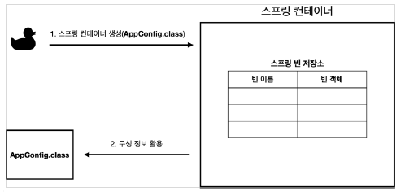     

→ new AnnotationConfigApplicationContext(AppConfig.class)      
→ key : 빈 이름 / value : 빈 객체      
→ 스프링 컨테이너를 생성할 때는 구성 정보(AppConfig.class)를 지정해주어야 한다.      

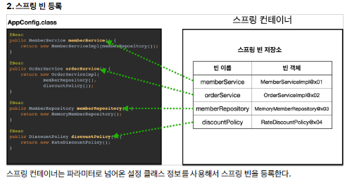     

3. 스프링 빈 의존관계 설정 - 준비     
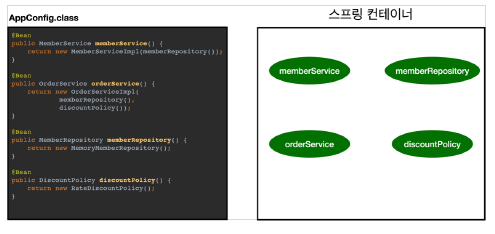      
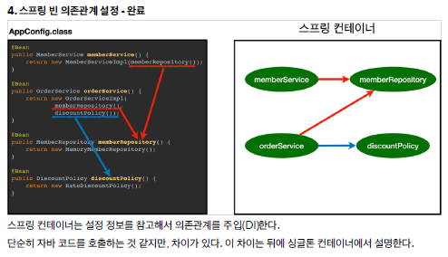      

📎 참고      
스프링은 빈을 생성하고, 의존관계를 주입하는 단계가 나누어져 있다. 그런데 이렇게 자바 코드로 스프링 빈을 등록하면 생성자를 호출하면서 의존관계 주입도 한번에 처리된다.

<br/>

## 컨테이너에 등록된 모든 빈 조회

```java
package hello.core.beanfind;

import hello.core.AppConfig;
import org.junit.jupiter.api.DisplayName;
import org.junit.jupiter.api.Test;
import org.springframework.beans.factory.config.BeanDefinition;
import org.springframework.context.annotation.AnnotationConfigApplicationContext;

public class ApplicationContextInfoTest {

    AnnotationConfigApplicationContext ac = new AnnotationConfigApplicationContext(AppConfig.class);

    @Test
    @DisplayName("모든 빈 출력하기")
    void findAllBean(){
        String[] beanDefinitionNames = ac.getBeanDefinitionNames();
        for (String beanDefinitionName : beanDefinitionNames) {
            Object bean = ac.getBean(beanDefinitionName);
            System.out.println("name = " + beanDefinitionName + " object = " + bean);
        } // for
    } // findAllBean

    @Test
    @DisplayName("애플리케이션 빈 출력하기")
    void findApplicationBean(){
        String[] beanDefinitionNames = ac.getBeanDefinitionNames();
        for (String beanDefinitionName : beanDefinitionNames) {
            BeanDefinition beanDefinition = ac.getBeanDefinition(beanDefinitionName);

            // ROLE_APPLICATION : 일반적으로 사용자가 정의한 빈
            // ROLE_INFRASTRUCTURE : 스프링이 내부에서 사용하는 빈
            if (beanDefinition.getRole() == beanDefinition.ROLE_APPLICATION) {
                Object bean = ac.getBean(beanDefinitionName);
                System.out.println("name = " + beanDefinitionName + " object = " + bean);
            } // if

        } // for
    } // findApplicationBean

} // end class
```

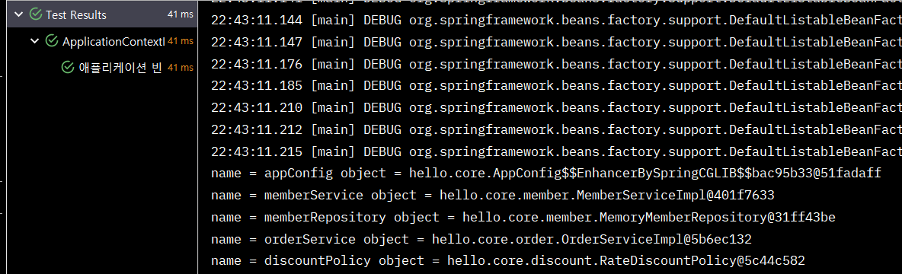    
→ ac.getBeanDefinitionNames() : 스프링에 등록된 모든 빈 이름을 조회한다      
→ ac.getBean() : 빈 이름으로 빈 객체(인스턴스)를 조회한다.      

<br/>

## 스프링 빈 조회 - 기본

- 스프링 컨테이너에서 스프링 빈을 찾는 가장 기본적인 조회 방법     
　→ ac.getBean(빈이름, 타입)      
　→ ac.getBean(타입)      
　→ 조회 대상 스프링 빈이 없으면 예외 발생      

```java
package hello.core.beanfind;

import hello.core.AppConfig;
import hello.core.member.MemberService;
import hello.core.member.MemberServiceImpl;
import org.assertj.core.api.Assertions;
import org.junit.jupiter.api.DisplayName;
import org.junit.jupiter.api.Test;
import org.springframework.beans.factory.NoSuchBeanDefinitionException;
import org.springframework.context.annotation.AnnotationConfigApplicationContext;

import static org.assertj.core.api.Assertions.*;
import static org.junit.jupiter.api.Assertions.*;

public class ApplicationContextBasicFindTest {

    AnnotationConfigApplicationContext ac = new AnnotationConfigApplicationContext(AppConfig.class);

    @Test
    @DisplayName("빈 이름으로 조회")
    void findBeanByName(){
        MemberService memberService = ac.getBean("memberService", MemberService.class);
        System.out.println("memberService = " + memberService);
        System.out.println("memberService.getClass() = " + memberService.getClass());

        assertThat(memberService).isInstanceOf(MemberServiceImpl.class);

    } // findBeanByName

    @Test
    @DisplayName("이름없이 타입으로만 조회")
    void findBeanByType(){
        MemberService memberService = ac.getBean(MemberService.class);
        System.out.println("memberService = " + memberService);
        System.out.println("memberService.getClass() = " + memberService.getClass());

        assertThat(memberService).isInstanceOf(MemberServiceImpl.class);

    } // findBeanByType

    @Test
    @DisplayName("구체 타입으로 조회")
    void findBeanByName2(){
        MemberService memberService = ac.getBean("memberService", MemberServiceImpl.class);
        assertThat(memberService).isInstanceOf(MemberServiceImpl.class);
    } // findBeanByName2

    @Test
    @DisplayName("빈 이름으로 조회X")
    void findBeanByNameX() {
//        MemberService xxxx = ac.getBean("xxxx", MemberService.class); // NoSuchBeanDefinitionException

        assertThrows(NoSuchBeanDefinitionException.class,
                () -> ac.getBean("xxxx", MemberService.class));

        // 성공 : 지정해준 예외가 발생했다.
        
    } // findBeanByNameX


} // end class
```

<br/>

## 스프링 빈 조회 - 동일한 타입이 둘 이상

- 타입으로 조회시 같은 타입의 스프링 빈이 둘 이상이면 오류가 발생한다. 이때는 빈 이름을 지정하자.       
- ac.getBeansOfType() 을 사용하면 해당 타입의 모든 빈을 조회할 수 있다.      

```java
package hello.core.beanfind;

import hello.core.AppConfig;
import hello.core.discount.DiscountPolicy;
import hello.core.member.Member;
import hello.core.member.MemberRepository;
import hello.core.member.MemoryMemberRepository;
import org.junit.jupiter.api.Assertions;
import org.junit.jupiter.api.DisplayName;
import org.junit.jupiter.api.Test;
import org.springframework.beans.factory.NoUniqueBeanDefinitionException;
import org.springframework.context.annotation.AnnotationConfigApplicationContext;
import org.springframework.context.annotation.Bean;
import org.springframework.context.annotation.Configuration;

import java.util.Map;

import static org.assertj.core.api.Assertions.*;
import static org.junit.jupiter.api.Assertions.*;

public class ApplicationContextSameBeanFindTest {

    AnnotationConfigApplicationContext ac = new AnnotationConfigApplicationContext(SameBeanConfig.class);

    @Test
    @DisplayName("타입으로 조회시 같은 타입이 둘 이상 있으면, 중복 오류가 발생")
    void findBeanByTypeDuplicate(){
//        MemberRepository bean = ac.getBean(MemberRepository.class); // NoUniqueBeanDefinitionException
        assertThrows(NoUniqueBeanDefinitionException.class,
                () -> ac.getBean(MemberRepository.class));
    } // findBeanByTypeDuplicate

    @Test
    @DisplayName("타입으로 조회시 같은 타입이 둘 이상 있으면, 빈 이름을 지정하면 된다")
    void findBeanByName(){
        MemberRepository memberRepository = ac.getBean("memberRepository1", MemberRepository.class);
        assertThat(memberRepository).isInstanceOf(MemberRepository.class);
    } // findBeanByName

    @Test
    @DisplayName("특정 타입을 모두 조회하기")
    void findBeanByType(){
        Map<String, MemberRepository> beansOfType = ac.getBeansOfType(MemberRepository.class);
        for (String key : beansOfType.keySet()) {
            System.out.println("key = " + key + " / value = " + beansOfType.get(key));
        } // for

        System.out.println("beansOfType = " + beansOfType);
        assertThat(beansOfType.size()).isEqualTo(2);
        
    } // findBeanByType


    @Configuration
    static class SameBeanConfig {

        @Bean
        public MemberRepository memberRepository1() {
            return new MemoryMemberRepository();
        } // memberRepository1

        @Bean
        public MemberRepository memberRepository2() {
            return new MemoryMemberRepository();
        } // memberRepository1
    } // SameBeanConfig class

} // end class
```

<br/>

## 스프링 빈 조회 - 상속관계

- 부모 타입으로 조회하면, 자식 타입도 함께 조회한다.      
- 그래서 모든 자바 객체의 최고 부모인 Object 타입으로 조회하면, 모든 스프링 빈을 조회한다     

   

```java
package hello.core.beanfind;

import hello.core.discount.DiscountPolicy;
import hello.core.discount.FixDiscountPolicy;
import hello.core.discount.RateDiscountPolicy;
import org.junit.jupiter.api.DisplayName;
import org.junit.jupiter.api.Test;
import org.springframework.beans.factory.NoUniqueBeanDefinitionException;
import org.springframework.context.annotation.AnnotationConfigApplicationContext;
import org.springframework.context.annotation.Bean;
import org.springframework.context.annotation.Configuration;

import java.util.Map;

import static org.assertj.core.api.Assertions.assertThat;
import static org.junit.jupiter.api.Assertions.assertThrows;

public class ApplicationContextExtendsFindTest {

    AnnotationConfigApplicationContext ac = new AnnotationConfigApplicationContext(TestConfig.class);

    @Test
    @DisplayName("부모 타입으로 조회시, 자식이 둘 이상 있으면, 중복 오류가 발생한다")
    void findBeanByParentTypeDuplicate(){
//        DiscountPolicy bean = ac.getBean(DiscountPolicy.class); // NoUniqueBeanDefinitionException
        assertThrows(NoUniqueBeanDefinitionException.class,
                () -> ac.getBean(DiscountPolicy.class));
    } // findBeanByParentTypeDuplicate

    @Test
    @DisplayName("부모 타입으로 조회시, 자식이 둘 이상 있으면, 빈 이름을 지정하면 된다")
    void findBeanByParentTypeBeanName(){
        DiscountPolicy rateDiscountPolicy = ac.getBean("rateDiscountPolicy", DiscountPolicy.class);
        assertThat(rateDiscountPolicy).isInstanceOf(RateDiscountPolicy.class);
    } // findBeanByParentTypeBeanName

    @Test
    @DisplayName("특정 하위 타입으로 조회")
    void findBeanBySubType(){
        RateDiscountPolicy bean = ac.getBean(RateDiscountPolicy.class);
        assertThat(bean).isInstanceOf(RateDiscountPolicy.class);
    } // findBeanBySubType

    @Test
    @DisplayName("부모 타입으로 모두 조회하기")
    void findAllBeanByParentType(){
        Map<String, DiscountPolicy> beansOfType = ac.getBeansOfType(DiscountPolicy.class);
        assertThat(beansOfType.size()).isEqualTo(2);

        for (String key : beansOfType.keySet()) {
            System.out.println("key = " + key + " / value = " + beansOfType.get(key));
        } // for
    } // findAllBeanByParentType

    @Test
    @DisplayName("부모 타입으로 모두 조회하기 - object")
    void findAllBeanByObjectType(){
        Map<String, Object> beansOfType = ac.getBeansOfType(Object.class);

        for (String key : beansOfType.keySet()) {
            System.out.println("key = " + key + " / value = " + beansOfType.get(key));
        } // for
    } // findAllBeanByObjectType


    @Configuration
    static class TestConfig {

        @Bean
        public DiscountPolicy rateDiscountPolicy() {
            return new RateDiscountPolicy();
        } // rateDiscountPolicy

        @Bean
        public DiscountPolicy fixDiscountPolicy() {
            return new FixDiscountPolicy();
        } // fixDiscountPolicy

    } // TestConfig class

} // end class
```

<br/>

## BeanFactory 와 ApplicationContext

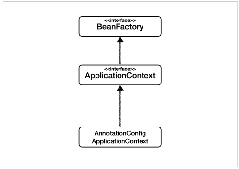   

- BeanFactory      
　-  스프링 컨테이너의 최상위 인터페이스다.      
　- 스프링 빈을 관리하고 조회하는 역할을 담당한다.      
　- getBean() 을 제공한다.      

<br/>

- ApplicationContext     
　- BeanFactory 기능을 모두 상속받아서 제공한다.     
　- 애플리케이션을 개발할 때는 빈은 관리하고 조회하는 기능은 물론이고, 수 많은 부가기능이 필요하다. (빈관리기능 + 편리한 부가기능 제공)       

<br/>

✅ BeanFactory를 직접 사용하기보단 ApplicationContext를 사용한다.      

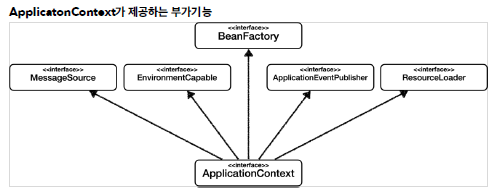   

- 메시지소스를 활용한 국제화 기능      
　- 예를 들어서 한국에서 들어오면 한국어로, 영어권에서 들어오면 영어로 출력     
- 환경변수       
　- 로컬, 개발, 운영등을 구분해서 처리      
- 애플리케이션 이벤트      
　- 이벤트를 발행하고 구독하는 모델을 편리하게 지원     
- 편리한 리소스 조회      
　- 파일, 클래스패스, 외부 등에서 리소스를 편리하게 조회      

<br/>

## 다양한 설정 형식 지원 - 자바코드, XML

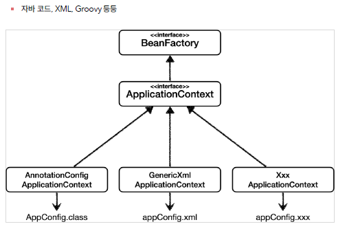   

- Annotation 기반 자바 코드 설정 (지금까지 했던 것)       
　- new AnnotationConfigApplicationContext(AppConfig.class)      
　- AnnotationConfigApplicationContext 클래스를 사용하면서 자바 코드로된 설정 정보를 넘기면 된다.      

<br/>

- XML 설정 사용      
　- 아직 많은 레거시 프로젝트 들이 XML로 되어 있고, 또 XML을 사용하면 컴파일 없이 빈 설정 정보를 변경할 수 있는 장점이 있다.      
　- GenericXmlApplicationContext 를 사용하면서 xml 설정 파일을 넘기면 된다.      

<br/>

- XmlAppConfig 사용 자바 코드

```java
package hello.core.xml;

import hello.core.member.MemberService;
import org.assertj.core.api.Assertions;
import org.junit.jupiter.api.Test;
import org.springframework.context.ApplicationContext;
import org.springframework.context.support.GenericXmlApplicationContext;

import static org.assertj.core.api.Assertions.*;

public class XmlAppContext {

    @Test
    void xmlAppContext(){
        ApplicationContext ac = new GenericXmlApplicationContext("appConfig.xml");
        MemberService memberService = ac.getBean("memberService", MemberService.class);
        assertThat(memberService).isInstanceOf(MemberService.class);
    }// xmlAppContext

} // end class
```

- xml 기반의 스프링 빈 설정 (src/main/resources/appConfig.xml)      

```java
<?xml version="1.0" encoding="UTF-8"?>
<beans xmlns="http://www.springframework.org/schema/beans"
       xmlns:xsi="http://www.w3.org/2001/XMLSchema-instance"
       xsi:schemaLocation="http://www.springframework.org/schema/beans http://www.springframework.org/schema/beans/spring-beans.xsd">

    <bean id="memberService" class="hello.core.member.MemberServiceImpl">
        <constructor-arg name="memberRepository" ref="memberRepository" />
    </bean>

    <bean id="memberRepository" class="hello.core.member.MemoryMemberRepository" />

    <bean id="orderService" class="hello.core.order.OrderServiceImpl">
        <constructor-arg name="memberRepository" ref="memberRepository"/>
        <constructor-arg name="discountPolicy" ref="discountPolicy"/>
    </bean>

    <bean id="discountPolicy" class="hello.core.discount.RateDiscountPolicy"/>

</beans>
```

<br/>

## 스프링 빈 설정 메타 정보 - BeanDefinition

- 스프링은 어떻게 이런 다양한 설정 형식을 지원하는 것일까? 그 중심에는 BeanDefinition 이라는 추상화가 있다.      
- 역할과 구현을 개념적으로 나눈 것이다!      
　- 스프링 컨테이너는 자바 코드인지, XML인지 몰라도 된다. 오직 BeanDefinition만 알면 된다.     
- BeanDefinition 을 빈 설정 메타정보라 한다.      
　- @Bean , <bean> 당 각각 하나씩 메타 정보가 생성된다.      
- 스프링 컨테이너는 이 메타정보를 기반으로 스프링 빈을 생성한다.      

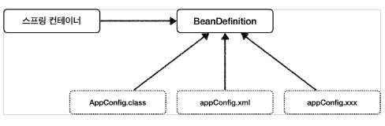   
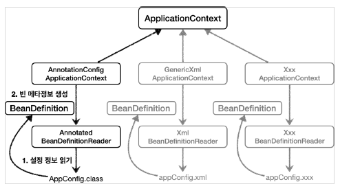   

→ AnnotationConfigApplicationContext 는 AnnotatedBeanDefinitionReader 를 사용해서 AppConfig.class 를 읽고 BeanDefinition 을 생성한다.      

<br/>

✅ BeanDefinition 정보      
- BeanClassName: 생성할 빈의 클래스 명(자바 설정 처럼 팩토리 역할의 빈을 사용하면 없음)      
- factoryBeanName: 팩토리 역할의 빈을 사용할 경우 이름, 예) appConfig      
- factoryMethodName: 빈을 생성할 팩토리 메서드 지정, 예) memberService      
- Scope: 싱글톤(기본값)     
- lazyInit: 스프링 컨테이너를 생성할 때 빈을 생성하는 것이 아니라, 실제 빈을 사용할 때 까지 최대한 생성을 지연처리 하는지 여부     
- InitMethodName: 빈을 생성하고, 의존관계를 적용한 뒤에 호출되는 초기화 메서드 명      
- DestroyMethodName: 빈의 생명주기가 끝나서 제거하기 직전에 호출되는 메서드 명      
- Constructor arguments, Properties: 의존관계 주입에서 사용한다. (자바 설정 처럼 팩토리 역할의 빈을 사용하면 없음)      

```java
package hello.core.beandefinition;

import hello.core.AppConfig;
import org.junit.jupiter.api.DisplayName;
import org.junit.jupiter.api.Test;
import org.springframework.beans.factory.config.BeanDefinition;
import org.springframework.context.annotation.AnnotationConfigApplicationContext;
import org.springframework.context.support.GenericXmlApplicationContext;

public class BeanDefinitionTest {

        AnnotationConfigApplicationContext ac = new AnnotationConfigApplicationContext(AppConfig.class);
//    GenericXmlApplicationContext ac = new GenericXmlApplicationContext("appConfig.xml");

    @Test
    @DisplayName("빈 설정 메타정보 확인")
    void findApplicationBean(){
        String[] beanDefinitionNames = ac.getBeanDefinitionNames();

        for (String beanDefinitionName : beanDefinitionNames) {
            BeanDefinition beanDefinition = ac.getBeanDefinition(beanDefinitionName);

            if (beanDefinition.getRole() == beanDefinition.ROLE_APPLICATION) {
                System.out.println("beanDefinitionName = " + beanDefinitionName + " / beanDefinition = " + beanDefinition);
            } // if

        } // for
    } // findApplicationBean


} // end class
```

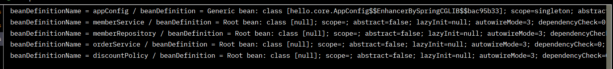   
