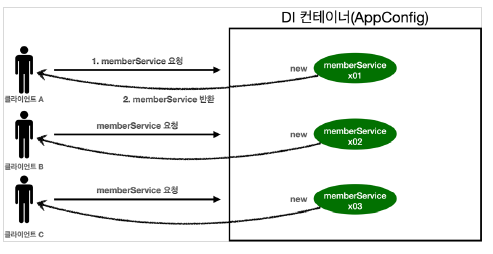
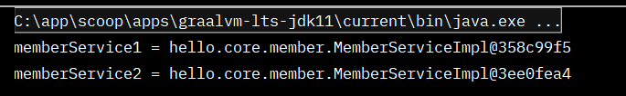
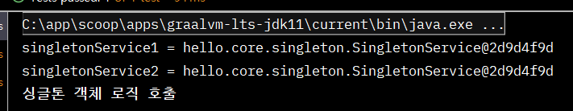
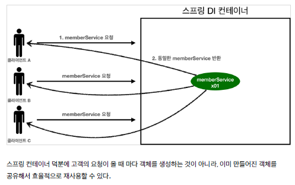
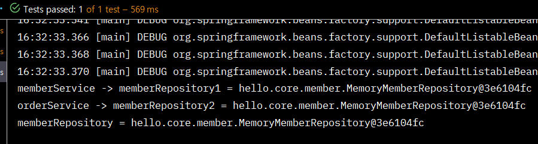
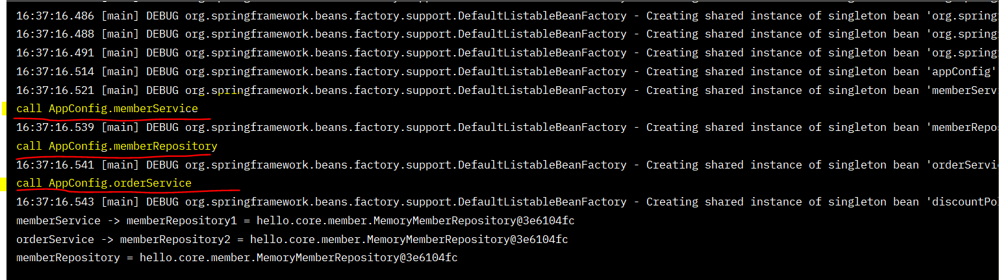
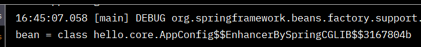
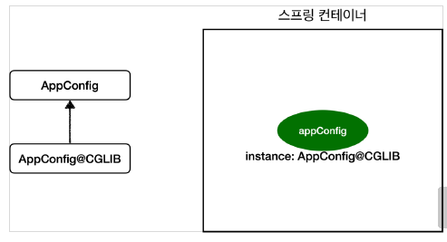
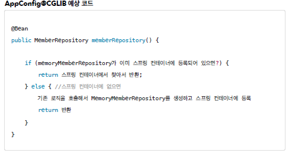
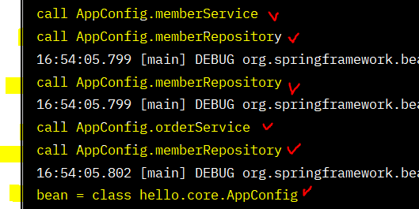

# 싱글톤 컨테이너

## 웹 애플리케이션과 싱글톤



→ 웹 어플리케이션은 보통 여러 고객이 동시에 요청한다. ( 요청을 할 때마다 객체를 새로 생성해야한다..)     

```java
package hello.core.singleton;

import hello.core.AppConfig;
import hello.core.member.MemberService;
import org.assertj.core.api.Assertions;
import org.junit.jupiter.api.DisplayName;
import org.junit.jupiter.api.Test;

public class SingletonTest {

    @Test
    @DisplayName("스프링 없는 순수한 DI 컨테이너")
    void pureContainer() {
        AppConfig appConfig = new AppConfig();
        // 1. 조회 : 호출할 때 마다 객체를 생성
        MemberService memberService1 = appConfig.memberService();

        // 2. 조회 : 호출할 때 마다 객체를 생성
        MemberService memberService2 = appConfig.memberService();

        // 참조 값이 다른 것을 확인
        System.out.println("memberService1 = " + memberService1);
        System.out.println("memberService2 = " + memberService2);

        // memberService1 != memberService2
        Assertions.assertThat(memberService1).isNotSameAs(memberService2);
        
    }// pureContainer
} // end class
```


💡 해결방안은 해당 객체가 딱 1개만 생성되고, 공유하도록 설계하면 된다.      
　→ 싱글톤 패턴          

<br/>

## 싱글톤 패턴

- 클래스의 인스턴스가 딱 1개만 생성되는 것을 보장하는 디자인 패턴이다.      
- private 생성자를 사용해서 외부에서 임의로 new 키워드를 사용하지 못하도록 막아야 한다. (객체 인스턴스를 2개 이상 생성하지 못하게.. )       

<br/>

- test에서..
```java
package hello.core.singleton;

public class SingletonService {

    // 자기 자신을 내부에서 private 으로 가지고..
    // 1. static 영역에 객체를 딱 1개만 생성해둔다
    private static final SingletonService instance = new SingletonService();

    // 2. public 으로 열어서 객체 인스턴스가 필요하면 이 static 매서드를 통해서만 조회하도록 허용한다.
    public static SingletonService getInstance(){
        return instance;
    } // getInstance

    // 3. 생성자를 private 으로 선언해서 외부에서 new 키워드를 사용한 객체 생성을 못하게 막는다.
    private SingletonService(){

    } 

    public void logic(){
        System.out.println("싱글톤 객체 로직 호출");
    }// logic


} // end class
```

```java
		@Test
    @DisplayName("싱글톤 패턴을 적용한 객체 사용")
    void singletonServiceTest(){

        // private 으로 생성자를 막아두었다. 컴파일 오류가 발생
//        new singletonService();

        // 1. 조회: 호출할 때 마다 같은 객체를 반환
        SingletonService singletonService1 = SingletonService.getInstance();
        // 2. 조회: 호출할 때 마다 같은 객체를 반환
        SingletonService singletonService2 = SingletonService.getInstance();

        // 참조값이 같은 것을 반환환
       System.out.println("singletonService1 = " + singletonService1);
        System.out.println("singletonService2 = " + singletonService2);

        // singletonService1 == singletonService2
        assertThat(singletonService1).isSameAs(singletonService2);
        // same ==
        // equal

        singletonService1.logic();

    }// singletonServiceTest
```



<br/>

✅  문제점     
- SingletonService  같은 코드를 많이 만들어야함..     
- DIP, OCP 위반      
⇒ 스프링 컨테이너로 해결 가능..     

<br/>

## 싱글톤 컨테이너

- 스프링 컨테이너는 싱글턴 패턴을 적용하지 않아도, 객체 인스턴스를 싱글톤으로 관리한다     

<br/>

- test
```java
		@Test
    @DisplayName("스프링 컨테이너와 싱글톤")
    void springContainer(){

//        AppConfig appConfig = new AppConfig();
        AnnotationConfigApplicationContext ac = new AnnotationConfigApplicationContext(AppConfig.class);

        // 1. 조회 : 호출할 때 마다 객체를 생성
        MemberService memberService1 = ac.getBean("memberService", MemberService.class);

        // 2. 조회 : 호출할 때 마다 객체를 생성
        MemberService memberService2 = ac.getBean("memberService", MemberService.class);

        // 참조 값이 같은 것을 확인
        System.out.println("memberService1 = " + memberService1);
        System.out.println("memberService2 = " + memberService2);

        // memberService1 == memberService2
        assertThat(memberService1).isSameAs(memberService2);

    } // springContainer
```

- 싱글톤 컨테이너 적용 후


<br/>

## ✨ 싱글톤 방식의 주의점 ✨

- **여러 클라이언트가 하나의 같은 객체 인스턴스를 공유**하기 때문에 싱글톤 객체는 상태를 유지(stateful)하게 설계하면 안된다.     
- **무상태(stateless)로 설계해야 한다** ❗     
　- 특정 클라이언트에 의존적인 필드가 있으면 안된다.     
　- 특정 클라이언트가 값을 변경할 수 있는 필드가 있으면 안된다!     
　- 가급적 읽기만 가능해야 한다.     
　- 필드 대신에 자바에서 공유되지 않는, 지역변수, 파라미터, ThreadLocal 등을 사용해야 한다.     

<br/>

- Ex..

→ StatefulService 의 price 필드는 공유되는 필드인데, 특정 클라이언트가 값을 변경한다.

<br/>

- 문제 해결(**무상태(stateless))**
```java
package hello.core.singleton;

public class StatefulService {
/*
    private int price; // 상태를 유지하는 필드

    public void order(String name, int price) {
        System.out.println("name = " + name + "price = " + price);
        this.price = price; // 여기가 문제!
    }// order

        public int getPrice(){
        return price;
    }// getPrice
*/
    public int order(String name, int price) {
        System.out.println("name = " + name + "price = " + price);
        return price;
    }// order

} // end class
```

<br/>

## @Configuration과 싱글톤

```java
package hello.core;

import hello.core.discount.DiscountPolicy;
import hello.core.discount.RateDiscountPolicy;
import hello.core.member.MemberService;
import hello.core.member.MemberServiceImpl;
import hello.core.member.MemoryMemberRepository;
import hello.core.order.OrderService;
import hello.core.order.OrderServiceImpl;
import org.springframework.context.annotation.Bean;
import org.springframework.context.annotation.Configuration;


@Configuration
public class AppConfig {

    // @Bean memberService -> new MemoryMemberRepository()
    // @Bean orderService -> new MemoryMemberRepository()
    // => new 두번 .. 호출되는게 아닌가..??.. 

    // 생성자 주입
    @Bean
    public MemberService memberService() {
        return new MemberServiceImpl(memberRepository());
    } // memberService

    // shift + alt + M
    @Bean
    public MemoryMemberRepository memberRepository() {
        return new MemoryMemberRepository();
    } // memberRepository

    @Bean
    public OrderService orderService(){
        return new OrderServiceImpl(memberRepository(), discountPolicy());
    } // orderService

    @Bean
    public DiscountPolicy discountPolicy(){
//        return new FixDiscountPolicy();
        return new RateDiscountPolicy();
    } // discountPolicy


} // end class
```
→  @Bean memberService -> new MemoryMemberRepository()     
　@Bean orderService -> new MemoryMemberRepository()     
　　=> new 두번 .. 호출되는게 아닌가..??..      

<br/>

- 테스트 용도 코드 추가
```java
public class MemberServiceImpl implements MemberService {
		private final MemberRepository memberRepository;
		
		//테스트 용도
    public MemberRepository getMemberRepository(){
        return memberRepository;
    }//getMemberRepository
} // MemberServiceImpl 

public class OrderServiceImpl implements OrderService {
		private final MemberRepository memberRepository;

		//테스트 용도
		public MemberRepository getMemberRepository() {
				return memberRepository;
		}// getMemberRepository
}// OrderServiceImpl 
```

```java
public class ConfigurationSingletonTest {

    @Test
    void configurationTest(){
        AnnotationConfigApplicationContext ac = new AnnotationConfigApplicationContext(AppConfig.class);

        MemberServiceImpl memberService = ac.getBean("memberService", MemberServiceImpl.class);
        OrderServiceImpl orderService = ac.getBean("orderService", OrderServiceImpl.class);
        MemberRepository memberRepository = ac.getBean("memberRepository", MemberRepository.class);

        MemberRepository memberRepository1 = memberService.getMemberRepository();
        MemberRepository memberRepository2 = orderService.getMemberRepository();

        System.out.println("memberService -> memberRepository1 = " + memberRepository1 );
        System.out.println("orderService -> memberRepository2 = " + memberRepository2 );
        System.out.println("memberRepository = " + memberRepository);

    }// configurationTest

} // end class
```


→ 모두 같은 인스턴스를 참고하고 있다     
<br/>

- 호출로그를 찍어보자..

→ memberRepository는 3번 호출 되어야 하는게 아닌가...? 

<br/>

## @Configuration과 바이트코드 조작의 마법
```java
@Test
    void configurationDeep(){
        AnnotationConfigApplicationContext ac = new AnnotationConfigApplicationContext(AppConfig.class);

        //AppConfig도 스프링 빈으로 등록된다.
        AppConfig bean = ac.getBean(AppConfig.class);
        System.out.println("bean = " + bean.getClass());
        
    }// configurationDeep
```

→ 원래 class hello.core.AppConfig 이렇게 출력 되어야하는데...     
     
⇒ 이것은 내가 만든 클래스가 아니라 스프링이 CGLIB라는 바이트코드 조작 라이브러리를 사용해서 AppConfig 클래스를 상속받은 임의의 다른 클래스를 만들고, 그 다른 클래스를 스프링 빈으로 등록한 것이다!     

     
→ 그 임의의 다른 클래스가 바로 싱글톤이 보장되도록 해준다.      
     

→ @Bean이 붙은 메서드마다 이미 스프링 빈이 존재하면 존재하는 빈을 반환하고, 스프링 빈이 없으면 생성해서 스프링 빈으로 등록하고 반환하는 코드가 동적으로 만들어진다.      

<br/>

✅ @Configuration 을 적용하지 않고, @Bean 만 적용하면 어떻게 될까?      
     
→ @Bean만 사용해도 스프링 빈으로 등록되지만, 싱글톤을 보장하지 않는다.     
→ 각각 다 다른 MemoryMemberRepository 인스턴스를 가지고 있다.      