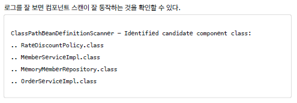
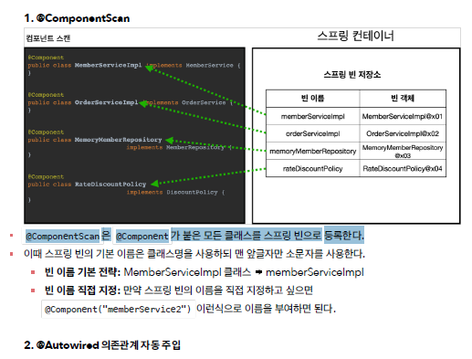
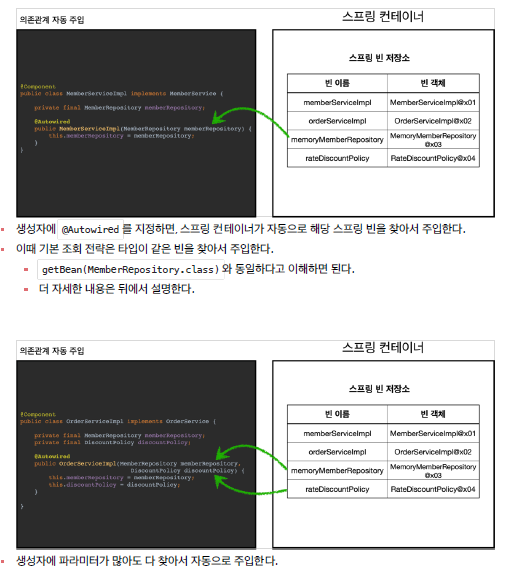
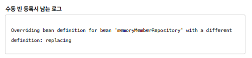
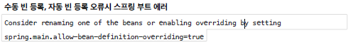

# 컴포넌트 스캔

## 컴포넌트 스캔과 의존관계 자동 주입
- 스프링은 설정 정보가 없어도 자동으로 스프링 빈을 등록하는 컴포넌트 스캔이라는 기능을 제공한다.       
- 또 의존관계도 자동으로 주입하는 @Autowired 라는 기능도 제공한다.      

```java
@Configuration
@ComponentScan(
        excludeFilters = @ComponentScan.Filter(type = FilterType.ANNOTATION, classes = Configuration.class)
)
public class AutoAppConfig {

}// end class
```

→ 컴포넌트 스캔을 사용하려면 먼저 `@ComponentScan` 을 설정 정보에 붙여주면 된다.     
→ 컴포넌트 스캔을 사용하면 `@Configuration` 이 붙은 설정 정보도 자동으로 등록되기 때문에, AppConfig, TestConfig 등 앞서 만들어두었던 설정 정보도 함께 등록되고, 실행되어 버린다. 그래서 excludeFilters 를 이용해서 설정정보는 컴포넌트 스캔 대상에서 제외했다.  보통 설정 정보를 제외하진 않지만 여기서만.. 

<br/>

- 각 클래스가 컴포넌트 스캔의 대상이 되도록 `@Component` 애노테이션을 붙여주자.     
　→ MemoryMemberRepository, RateDiscountPolicy, MemberServiceImpl , OrderServiceImpl     
- 이전에 AppConfig에서는 @Bean 으로 직접 설정 정보를 작성했고, 의존관계도 직접 명시했다.     
이제는 이런 설정 정보 자체가 없기 때문에, @Autowired 로 의존관계를 자동으로 주입해준다.     

```java
		@Autowired // ac.getBean(MemberRepository.class)
    // 생성자에 붙여주면 memberRepository 타입에 맞는 애를 찾아서 의존관계 주입을 자동으로 연결해준다
    public MemberServiceImpl(MemberRepository memberRepository) {
        this.memberRepository = memberRepository;
    } // constructor
```

- Test
```java
public class AutoAppConfigTest {

    @Test
    void basicScan(){
        AnnotationConfigApplicationContext ac = new AnnotationConfigApplicationContext(AutoAppConfig.class);

        MemberService memberService = ac.getBean(MemberService.class);
        assertThat(memberService).isInstanceOf(MemberService.class);
    }// basicScan

}// end class
```

     
     
     

<br/>

## 탐색 위치와 기본 스캔 대상

✅  꼭 필요한 위치부터 탐색하도록 탐색할 패키지의 시작 위치를 지정할 수 있다.     
```java
@ComponentScan(
        basePackages = "hello.core.member",
)
```

- `basePackages = {"hello.core", "hello.service"}` 이렇게 여러 시작 위치를 지정할 수도 있다.      
- basePackageClasses : 지정한 클래스의 패키지를 탐색 시작 위치로 지정한다.      

```java
basePackageClasses = AutoAppConfig.class,
```

- 만약 지정하지 않으면 @ComponentScan 이 붙은 설정 정보 클래스의 패키지가 시작 위치가 된다.      

<br/>

💡 권장하는 방법     
- 패키지 위치를 지정하지 않고, 설정 정보 클래스의 위치를 프로젝트 최상단에 두는 것     
- Ex..    
　- com.hello      
　- com.hello.serivce     
　- com.hello.repository     
　⇒ com.hello 프로젝트 시작 루트, 여기에 AppConfig 같은 메인 설정 정보를 두고, @ComponentScan 애노테이션을 붙이고, basePackages 지정은 생략한다.     
- 참고로 스프링 부트를 사용하면 스프링 부트의 대표 시작 정보인 @SpringBootApplication 를 이 프로젝트 시작 루트 위치에 두는 것이 관례이다. (그리고 이 설정안에 바로 @ComponentScan 이 들어있다!)     

<br/>

✅ 컴포넌트 스캔 기본 대상      
- @Component : 컴포넌트 스캔에서 사용      
- @Controlller : 스프링 MVC 컨트롤러에서 사용     
- @Service : 스프링 비즈니스 로직에서 사용     
- @Repository : 스프링 데이터 접근 계층에서 사용 (JPA, JDBC...)     
- @Configuration : 스프링 설정 정보에서 사용     

<br/>

✅  컴포넌트 스캔의 용도 뿐만 아니라 다음 애노테이션이 있으면 스프링은 부가 기능을 수행한다.     
- @Controller : 스프링 MVC 컨트롤러로 인식     
- @Repository : 스프링 데이터 접근 계층으로 인식하고, 데이터 계층의 예외를 스프링 예외로 변환해준다.      
- @Configuration : 앞서 보았듯이 스프링 설정 정보로 인식하고, 스프링 빈이 싱글톤을 유지하도록 추가 처리를 한다.      
- @Service : 사실 @Service 는 특별한 처리를 하지 않는다. 대신 개발자들이 핵심 비즈니스 로직이 여기에 있겠구나 라고 비즈니스 계층을 인식하는데 도움이 된다.      

<br/>

## 필터

- includeFilters : 컴포넌트 스캔 대상을 추가로 지정한다.      
- excludeFilters : 컴포넌트 스캔에서 제외할 대상을 지정한다.     

```java
public class ComponentFilterAppConfigTest {

    @Test
    void filterScan(){
        AnnotationConfigApplicationContext ac = new AnnotationConfigApplicationContext(ComponentFilterAppConfig.class);
        BeanA beanA = ac.getBean("beanA", BeanA.class);
        assertThat(beanA).isNotNull();

        assertThrows(NoSuchBeanDefinitionException.class,
                () -> ac.getBean("beanB", BeanB.class
        ));

    }// filterScan

    @Configuration
    @ComponentScan(
            includeFilters = @Filter(type = FilterType.ANNOTATION, classes = MyIncludeComponent.class),
            excludeFilters = @Filter(type = FilterType.ANNOTATION, classes = MyExcludeComponent.class)
    )
    static class ComponentFilterAppConfig {

    }// ComponentFilterAppConfig class


} // end class
```

- includeFilters 에 MyIncludeComponent 애노테이션을 추가해서 BeanA가 스프링 빈에 등록된다.     
- excludeFilters 에 MyExcludeComponent 애노테이션을 추가해서 BeanB는 스프링 빈에 등록되지 않는다.      

<br/>

✅ FilterType은 5가지 옵션이 있다.     
- ANNOTATION: 기본값, 애노테이션을 인식해서 동작한다.      
　ex) org.example.SomeAnnotation      
- ASSIGNABLE_TYPE: 지정한 타입과 자식 타입을 인식해서 동작한다.     
　ex) org.example.SomeClass     
- ASPECTJ: AspectJ 패턴 사용      
　ex) org.example..*Service+*     
- *REGEX: 정규 표현식*     
　*ex) org\.example\.Default.*     
- CUSTOM: TypeFilter 이라는 인터페이스를 구현해서 처리     
　ex) org.example.MyTypeFilter      

<br/>

## 중복 등록과 충돌

1. 자동 빈 등록 vs 자동 빈 등록      
→ ConflictingBeanDefinitionException 예외 발생      <br/>

2. 수동 빈 등록 vs 자동 빈 등록     
→ 이 경우 수동 빈 등록이 우선권을 가진다. (수동 빈이 자동 빈을 오버라이딩 해버린다.)     
       
     
→ 스프링 부트인 CoreApplication 을 실행해보면 오류를 볼 수 있다.     