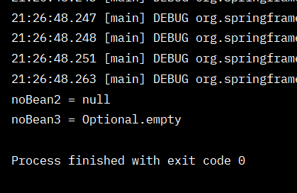
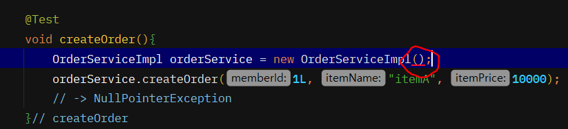
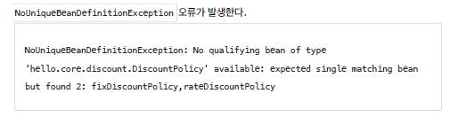

# 의존관계 자동 주입

## 다양한 의존관계 주입 방법

✅ 의존관계 주입은 크게 4가지 방법이 있다.     
- 생성자 주입     
- 수정자 주입(setter 주입)     
- 필드 주입     
- 일반 메서드 주입      

<br/>

✅  생성자 주입     
- 생성자 호출시점에 딱 1번만 호출되는 것이 보장된다.      
- **불변**, **필수** 의존관계에 사용     

```java
@Component
public class OrderServiceImpl implements OrderService{

    private final MemberRepository memberRepository;
    private final DiscountPolicy discountPolicy;

    @Autowired
    public OrderServiceImpl(MemberRepository memberRepository, DiscountPolicy discountPolicy) {
        this.memberRepository = memberRepository;
        this.discountPolicy = discountPolicy;
    } // constructor
}
```     

💡 생성자가 딱 1개만 있으면 @Autowired를 생략해도 자동 주입 된다. 물론 스프링 빈에만 해당한다     

<br/>

✅  수정자 주입(setter 주입)     
- **선택**, **변경** 가능성이 있는 의존관계에 사용     
- 자바빈 프로퍼티 규약의 수정자 메서드 방식을 사용하는 방법이다.     
```java
public class OrderServiceImpl implements OrderService {

    private MemberRepository memberRepository;
    private DiscountPolicy discountPolicy;

    @Autowired
    public void setMemberRepository(MemberRepository memberRepository) {
        System.out.println("memberRepository = " + memberRepository);
        this.memberRepository = memberRepository;
    }

    @Autowired
    public void setDiscountPolicy(DiscountPolicy discountPolicy) {
        System.out.println("discountPolicy = " + discountPolicy);
        this.discountPolicy = discountPolicy;
    }
}
```

→ 주입할 대상이 없어도 동작하게 하려면 @Autowired(required = false) 로 지정하면 된다.     
→ 생성자 주입은 빈에 등록할 때 자동 주입이 되는데 setter 는 주입 2번째 단계에서..       

<br/>

✅  필드 주입     
- 코드가 간결해서 많은 개발자들을 유혹하지만 외부에서 변경이 불가능해서 테스트 하기 힘들다는 치명적인 단점이 있다.     
- DI 프레임워크가 없으면 아무것도 할 수 없다.     
- 사용하지 말자!      
　- 애플리케이션의 실제 코드와 관계 없는 테스트 코드     
　- 스프링 설정을 목적으로 하는 @Configuration 같은 곳에서만 특별한 용도로 사용     

```java
@Autowired private MemberRepository memberRepository;
@Autowired private DiscountPolicy discountPolicy;
```

<br/>

✅ 일반 메서드 주입     
- 한번에 여러 필드를 주입 받을 수 있다.     
- 일반적으로 잘 사용하지 않는다.     

```java
@Component
public class OrderServiceImpl implements OrderService{

    private  MemberRepository memberRepository;
    private  DiscountPolicy discountPolicy;

    @Autowired
    public void init(MemberRepository memberRepository, DiscountPolicy discountPolicy){
        this.memberRepository = memberRepository;
        this.discountPolicy = discountPolicy;
    }// init
}
```

## 옵션 처리

- @Autowired 만 사용하면 required 옵션의 기본값이 true 로 되어 있어서 자동 주입 대상이 없으면 오류가 발생한다.      

<br/>

✅ 자동 주입 대상을 옵션으로 처리하는 방법은 다음과 같다.     
- @Autowired(required=false) : 자동 주입할 대상이 없으면 수정자 메서드 자체가 호출 안됨     
- org.springframework.lang.@Nullable : 자동 주입할 대상이 없으면 null이 입력된다.     
- Optional<> : 자동 주입할 대상이 없으면 Optional.empty 가 입력된다.    

```java
public class AutowiredTest {

    @Test
    void AutowiredOption(){
        ApplicationContext ac = new AnnotationConfigApplicationContext(TestBean.class);

    }// AutowiredOption

    static class TestBean {

        @Autowired(required = false)
        public void setNoBean1(Member noBean1){
            System.out.println("noBean1 = " + noBean1);
        }// setNoBean1

        @Autowired
        public void setNoBean2(@Nullable Member noBean2){
            System.out.println("noBean2 = " + noBean2);
        }// setNoBean2

        @Autowired
        public void setNoBean3(Optional<Member> noBean3){
            System.out.println("noBean3 = " + noBean3);
        }// setNoBean1

    } //TestBean class

}// end class
```



<br/>

## 생성자 주입을 선택해라!

✅ **불변**      
- 대부분의 의존관계 주입은 한번 일어나면 애플리케이션 종료시점까지 의존관계를 변경할 일이 없다. 오히려 대부분의 의존관계는 애플리케이션 종료 전까지 변하면 안된다.(불변해야 한다.)     
- 수정자 주입을 사용하면, setXxx 메서드를 public으로 열어두어야 한다.     
- 누군가 실수로 변경할 수 도 있고, 변경하면 안되는 메서드를 열어두는 것은 좋은 설계 방법이 아니다.     
- 생성자 주입은 객체를 생성할 때 딱 1번만 호출되므로 이후에 호출되는 일이 없다. 따라서 불변하게 설계할 수 있다.     

<br/>

✅ **누락**      
- 프레임워크 없이 순수한 자바 코드를 단위 테스트 하는 경우     

<br/>

- 수정자 주입(setter 주입) 이였을 경우 (순수 자바코드) 
```java
class OrderServiceImplTest {

    @Test
    void createOrder(){
        OrderServiceImpl orderService = new OrderServiceImpl();
        orderService.createOrder(1L, "itemA", 10000);
        // -> NullPointerException 오류
    }// createOrder

} // end class
```
- 생성자 주입을 사용하면 다음처럼 주입 데이터를 누락 했을 때 컴파일 오류가 발생한다     
⇒ IDE에서 바로 어떤 값을 필수로 주입해야 하는지 알 수 있다.    

     

<br/>

✅ final 키워드     
- 생성자 주입을 사용하면 필드에 final 키워드를 사용할 수 있다. 그래서 생성자에서 혹시라도 값이 설정되지 않는 오류를 컴파일 시점에 막아준다     
- 오직 생성자 주입 방식만 final 키워드를 사용할 수 있다.     

<br/>

## 롬복과 최신 트렌드

✅ 롬복 라이브러리 적용 방법     
- build.gradle 라이브러리 추가      

```java
plugins {
	id 'org.springframework.boot' version '2.6.1'
	id 'io.spring.dependency-management' version '1.0.11.RELEASE'
	id 'java'
}

group = 'hello'
version = '0.0.1-SNAPSHOT'
sourceCompatibility = '11'

//lombok 설정 추가 시작
configurations {
	compileOnly {
		extendsFrom annotationProcessor
	}
}
//lombok 설정 추가 끝

repositories {
	mavenCentral()
}

dependencies {
	implementation 'org.springframework.boot:spring-boot-starter'

	//lombok 라이브러리 추가 시작
	compileOnly 'org.projectlombok:lombok'
	annotationProcessor 'org.projectlombok:lombok'

	testCompileOnly 'org.projectlombok:lombok'
	testAnnotationProcessor 'org.projectlombok:lombok'
	//lombok 라이브러리 추가 끝

	testImplementation('org.springframework.boot:spring-boot-starter-test') {
		exclude group: 'org.junit.vintage', module: 'junit-vintage-engine'
	}
}

test {
	useJUnitPlatform()
}

```

1. Preferences(윈도우 File Settings) plugin lombok 검색 설치 실행 (재시작)     
2. Preferences Annotation Processors 검색 Enable annotation processing 체크 (재시작)     
3. 임의의 테스트 클래스를 만들고 @Getter, @Setter 확인      

<br/>

- 생성자가 딱 1개만 있으면 @Autowired 를 생략할 수 있다.     

<br/>

- 최종 결과 코드
```java
@Component
@RequiredArgsConstructor
// final 붙은 걸 가지고 생성자를 만들어줌
public class OrderServiceImpl implements OrderService{

    private final MemberRepository memberRepository;
    private final DiscountPolicy discountPolicy;

/*
    public OrderServiceImpl(MemberRepository memberRepository, DiscountPolicy discountPolicy) {
        this.memberRepository = memberRepository;
        this.discountPolicy = discountPolicy;
    } // constructor
*/
}
```
→ @RequiredArgsConstructor 기능을 사용하면 final이 붙은 필드를 모아서 생성자를 자동으로 만들어준다.     

<br/>

## 조회 빈이 2개 이상 - 문제

- DiscountPolicy 의 하위 타입인 FixDiscountPolicy , RateDiscountPolicy 둘다 스프링 빈으로
선언해보자.  @Component     

     

—> 해결..     

<br/>

## @Autowired 필드명, @Qualifier, @Primary

✅조회 대상 빈이 2개 이상일 때 해결 방법     
- @Autowired 필드 명 매칭     
- @Qualifier @Qualifier끼리 매칭 빈 이름 매칭      
- @Primary 사용     

<br/>

✅ @Autowired 필드 명 매칭

- @Autowired 는 타입 매칭을 시도하고, 이때 여러 빈이 있으면 **필드 이름, 파라미터 이름**으로 빈 이름을 추가 매칭한다.    

<br/>

- 필드명을 빈 이름으로 변경     
```java
@Autowired
    public OrderServiceImpl(MemberRepository memberRepository, DiscountPolicy rateDiscountPolicy) {
        this.memberRepository = memberRepository;
        this.discountPolicy = rateDiscountPolicy;
    } // constructor
```

<br/>

✅ @Qualifier 사용     

- @Qualifier 는 추가 구분자를 붙여주는 방법이다. 주입시 추가적인 방법을 제공하는 것이지 빈 이름을 변경하는 것은 아니다.     
<br/>
- 빈 등록시 @Qualifier를 붙여준다     

```java
@Component
@Qualifier("mainDiscountPolicy")
public class RateDiscountPolicy implements DiscountPolicy {}
```

```java
@Component
@Qualifier("fixDiscountPolicy")
public class FixDiscountPolicy implements DiscountPolicy {}
```
<br/>

- 주입시에 @Qualifier를 붙여주고 등록한 이름을 적어준다.

```java
	@Autowired
    public OrderServiceImpl(MemberRepository memberRepository, @Qualifier("mainDiscountPolicy") DiscountPolicy discountPolicy) {
        this.memberRepository = memberRepository;
        this.discountPolicy = discountPolicy;
    } // constructor
```

<br/>

✅ @Primary 사용     
- @Primary 는 우선순위를 정하는 방법이다. @Autowired 시에 여러 빈이 매칭되면 @Primary 가 우선권을 가진다.

```java
@Component
@Primary
public class RateDiscountPolicy implements DiscountPolicy {}
```

```java
@Component
public class FixDiscountPolicy implements DiscountPolicy {}
```

💡 @Primary 는 기본값 처럼 동작하는 것이고, @Qualifier 는 매우 상세하게 동작한다.      
스프링은 자동보다는 수동이, 넒은 범위의 선택권 보다는 좁은 범위의 선택권이 우선 순위가 높다.       
⇒ 여기서도 @Qualifier 가 우선권이 높다.   

<br/>

## 애노테이션 직접 만들기

- @Qualifier("mainDiscountPolicy") 이렇게 문자를 적으면 컴파일시 타입 체크가 안될 경우..     

```java
package hello.core.annotation;


import org.springframework.beans.factory.annotation.Qualifier;

import java.lang.annotation.*;

@Target({ElementType.FIELD, ElementType.METHOD, ElementType.PARAMETER, ElementType.TYPE, ElementType.ANNOTATION_TYPE})
@Retention(RetentionPolicy.RUNTIME)
@Inherited
@Documented
@Qualifier("mainDiscountPolicy")
public @interface MainDiscountPolicy {
    
} // end interface
```

```java
@Component
@MainDiscountPolicy
public class RateDiscountPolicy implements DiscountPolicy {}
```

```java
@Autowired
    public OrderServiceImpl(MemberRepository memberRepository, @MainDiscountPolicy DiscountPolicy discountPolicy) {
        this.memberRepository = memberRepository;
        this.discountPolicy = discountPolicy;
    } // constructor
```


<br/>

## 조회한 빈이 모두 필요할 때, List, Map

- 예를 들어서 할인 서비스를 제공하는데, 클라이언트가 할인의 종류(rate, fix)를 선택할 수 있다고가정해보자. 스프링을 사용하면 소위 말하는 전략 패턴을 매우 간단하게 구현할 수 있다.

```java
public class AllBeanTest {

    @Test
    void findAllBean(){
        ApplicationContext ac = new AnnotationConfigApplicationContext(AutoAppConfig.class, DiscountService.class);

        DiscountService discountService = ac.getBean(DiscountService.class);
        Member member = new Member(1L, "userA", Grade.VIP);
        int discountPrice = discountService.discount(member, 10000, "fixDiscountPolicy");

        assertThat(discountService).isInstanceOf(DiscountService.class);
        assertThat(discountPrice).isEqualTo(1000);

        int rateDiscountPrice = discountService.discount(member, 20000, "rateDiscountPolicy");
        assertThat(rateDiscountPrice).isEqualTo(2000);
    }// findAllBean

    static class DiscountService {
        private final Map<String, DiscountPolicy> policyMap;
        private final List<DiscountPolicy> policies;

        @Autowired
        public DiscountService(Map<String, DiscountPolicy> policyMap, List<DiscountPolicy> policies) {
            this.policyMap = policyMap;
            this.policies = policies;
            System.out.println("policyMap = " + policyMap);
            System.out.println("policies = " + policies);
        }// constructor

        public int discount(Member member, int price, String discountCode) {
            DiscountPolicy discountPolicy = policyMap.get(discountCode);
            return discountPolicy.discount(member, price);
        }// discount

    } // DiscountService class

}// end class
```

✅ 로직 분석     
- DiscountService는 Map으로 모든 DiscountPolicy 를 주입받는다. 이때 fixDiscountPolicy , rateDiscountPolicy 가 주입된다.      
- discount () 메서드는 discountCode로 "fixDiscountPolicy"가 넘어오면 map에서 fixDiscountPolicy 스프링 빈을 찾아서 실행한다. 물론 “rateDiscountPolicy”가 넘어오면 rateDiscountPolicy 스프링 빈을 찾아서 실행한다.      

<br/>

✅ 주입 분석     
- Map<String, DiscountPolicy> : map의 키에 스프링 빈의 이름을 넣어주고, 그 값으로 DiscountPolicy 타입으로 조회한 모든 스프링 빈을 담아준다.      
- List<DiscountPolicy> : DiscountPolicy 타입으로 조회한 모든 스프링 빈을 담아준다. 만약 해당하는 타입의 스프링 빈이 없으면, 빈 컬렉션이나 Map을 주입한다.     

<br/>

→  new AnnotationConfigApplicationContext() 를 통해 스프링 컨테이너를 생성한다.      
→ AutoAppConfig.class , DiscountService.class 를 파라미터로 넘기면서 해당 클래스를 자동으로 스프링 빈으로 등록한다.      
💡 정리하면 스프링 컨테이너를 생성하면서, 해당 컨테이너에 동시에 AutoAppConfig , DiscountService 를 스프링 빈으로 자동 등록한다.     

<br/>

## 자동, 수동의 올바른 실무 운영 기준

✅ 편리한 자동 기능을 기본으로 사용하자      
- 설정 정보를 기반으로 애플리케이션을 구성하는 부분과 실제 동작하는 부분을 명확하게 나누는 것이 이상적이지만, 개발자 입장에서 스프링 빈을 하나 등록할 때 @Component 만 넣어주면 끝나는 일을 @Configuration 설정 정보에 가서 @Bean 을 적고, 객체를 생성하고, 주입할 대상을 일일이 적어주는 과정은 상당히 번거롭다.      
- 그리고 결정적으로 자동 빈 등록을 사용해도 OCP, DIP를 지킬 수 있다.

<br/>

✅ 그러면 수동 빈 등록은 언제 사용하면 좋을까?      

- 애플리케이션은 크게 업무 로직과 기술 지원 로직으로 나눌 수 있다.      
- **업무 로직 빈**: 웹을 지원하는 컨트롤러, 핵심 비즈니스 로직이 있는 서비스, 데이터 계층의 로직을 처리하는 리포지토리등이 모두 업무 로직이다. 보통 비즈니스 요구사항을 개발할 때 추가되거나 변경된다.     
　⇒  자동 기능 : 숫자 많고, 유사한 패턴..       

- **기술 지원 빈**: 기술적인 문제나 공통 관심사(AOP)를 처리할 때 주로 사용된다. 데이터베이스 연결이나, 공통 로그 처리 처럼 업무 로직을 지원하기 위한 하부 기술이나 공통 기술들이다.      
　⇒ 수동 기능 :  애플리케이션에 광범위하게 영향을 미치는 기술 지원 객체는 수동 빈으로 등록해서 딱! 설정 정보에 바로 나타나게 하는 것이 유지보수 하기 좋다.      

<br/>

✅ 비즈니스 로직 중에서 다형성을 적극 활용할 때      
- 의존관계 자동 주입 - 조회한 빈이 모두 필요할 때, List, Map을 다시 보자.      
　⇒ 수동 빈으로 등록하거나 또는 자동으로하면 특정 패키지에 같이 묶어두는게 좋다!      

```java
@Configuration
public class DiscountPolicyConfig {
		@Bean
		public DiscountPolicy rateDiscountPolicy() {
				return new RateDiscountPolicy();
		}

		@Bean
		public DiscountPolicy fixDiscountPolicy() {
				return new FixDiscountPolicy();
		}
}
```
