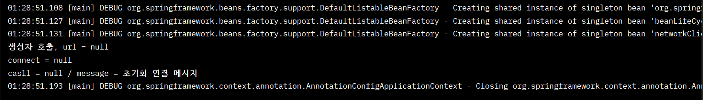
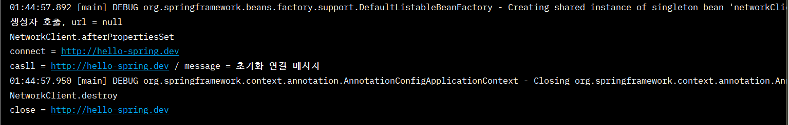
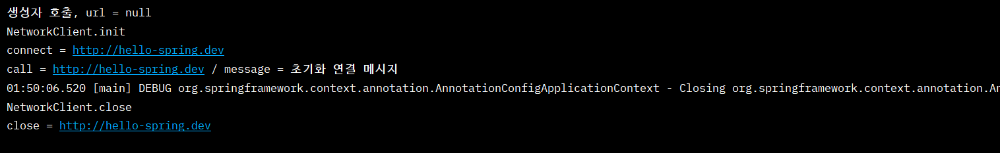

# 빈 생명주기 콜백

## 빈 생명주기 콜백 시작

- 예제코드
```java
package hello.core.lifecycle;

public class NetworkClient {

    private String url;

    public NetworkClient() {
        System.out.println("생성자 호출, url = " + url);
        connect();
        call("초기화 연결 메시지");
    }// constructor

    public void setUrl(String url) {
        this.url = url;
    }

    // 서비스 시작시 호출
    public void connect(){
        System.out.println("connect = " + url);

    }// connect

    public void call(String message){
        System.out.println("casll = " + url + " / message = " + message);

    }// call

    // 서비스 종료시 호출
    public void disconnect(){
        System.out.println("close = " + url);

    }// disconnect


}// end class
```

- 스프링 환경설정과 실행

```java
public class BeanLifeCycleTest {

    @Test
    public void lifeCycleTest(){
        ConfigurableApplicationContext ac = new AnnotationConfigApplicationContext(LifeCycleConfig.class);
        // ConfigurableApplicationContext -> close 를 해야하기 때문에
        NetworkClient bean = ac.getBean(NetworkClient.class);
        ac.close();
    }// lifeCycleTest

    @Configuration
    static class LifeCycleConfig {

        @Bean
        public NetworkClient networkClient(){
            NetworkClient networkClient = new NetworkClient();
            networkClient.setUrl("http://hello-spring.dev");
            return networkClient;
        }// networkClient

    }// LifeCycleConfig class
} // end class
```

     

- 스프링 빈은 간단하게 다음과 같은 라이프사이클을 가진다.      
**객체 생성 → 의존관계 주입**     

<br/>

- 초기화 작업은 의존관계 주입이 모두 완료되고 난 다음에 호출해야 한다.     
- 스프링은 의존관계 주입이 완료되면 스프링 빈에게 콜백 메서드를 통해서 초기화 시점을 알려주는 다양한 기능을 제공     
- 스프링은 스프링 컨테이너가 종료되기 직전에 소멸 콜백을 준다    

<br/>

- 스프링 빈의 이벤트 라이프사이클      
　스프링 컨테이너 생성 → 스프링 빈 생성 → 의존관계 주입 → 초기화 콜백 → 사용 → 소멸전 콜백 → 스프링 종료     
- **초기화 콜백**: 빈이 생성되고, 빈의 의존관계 주입이 완료된 후 호출     
- **소멸전 콜백**: 빈이 소멸되기 직전에 호출     

<br/>

💡 객체의 생성과 초기화를 분리하자.      
- 생성자 안에서 무거운 초기화 작업을 함께 하는 것 보다는 객체를 생성하는 부분과 초기화 하는 부분을 명확하게 나누는 것이 유지보수 관점에서 좋다     

<br/>

✅ 스프링은 크게 **3가지 방법으로 빈 생명주기 콜백**을 지원한다.      
- 인터페이스(InitializingBean, DisposableBean)     
- 설정 정보에 초기화 메서드, 종료 메서드 지정     
- @PostConstruct, @PreDestroy 애노테이션 지원      

<br/>

## 인터페이스 InitializingBean, DisposableBean

```java
public class NetworkClient implements InitializingBean, DisposableBean {

    private String url;

    public NetworkClient() {
        System.out.println("생성자 호출, url = " + url);

    }// constructor

    public void setUrl(String url) {
        this.url = url;
    }

    // 서비스 시작시 호출
    public void connect(){
        System.out.println("connect = " + url);

    }// connect

    public void call(String message){
        System.out.println("call = " + url + " / message = " + message);

    }// call

    // 서비스 종료시 호출
    public void disconnect(){
        System.out.println("close = " + url);

    }// disconnect


    @Override
    public void afterPropertiesSet() throws Exception {
        // 의존관계 주입이 끝나면 호출해주겠다..
        System.out.println("NetworkClient.afterPropertiesSet");
        connect();
        call("초기화 연결 메시지");
    }

    @Override
    public void destroy() throws Exception {
        //빈이 종료될때
        System.out.println("NetworkClient.destroy");
        disconnect();
    }
}// end class
```

     

→ 스프링 전용 인터페이스에 의존     
→ 초기화, 소멸 메서드의 이름을 변경할 수 없다.     
→ 내가 코드를 고칠 수 없는 외부 라이브러리에 적용할 수 없다.     

<br/>

## 빈 등록 초기화, 소멸 메서드 지정

- 설정 정보를 사용하도록 변경

```java
public class NetworkClient {

    private String url;

    public NetworkClient() {
        System.out.println("생성자 호출, url = " + url);

    }// constructor

    public void setUrl(String url) {
        this.url = url;
    }

    // 서비스 시작시 호출
    public void connect(){
        System.out.println("connect = " + url);

    }// connect

    public void call(String message){
        System.out.println("call = " + url + " / message = " + message);

    }// call

    // 서비스 종료시 호출
    public void disconnect(){
        System.out.println("close = " + url);

    }// disconnect


    public void init() {
        // 의존관계 주입이 끝나면 호출해주겠다..
        System.out.println("NetworkClient.init");
        connect();
        call("초기화 연결 메시지");
    }

    public void close() {
        //빈이 종료될때
        System.out.println("NetworkClient.close");
        disconnect();
    }
}// end class
```

- 설정 정보에 초기화 소멸 메서드 지정

```java
@Configuration
    static class LifeCycleConfig {

        @Bean (initMethod = "init", destroyMethod = "close")
        public NetworkClient networkClient(){
            NetworkClient networkClient = new NetworkClient();
            networkClient.setUrl("http://hello-spring.dev");
            return networkClient;
        }// networkClient

    }// LifeCycleConfig class
```

     

→ 스프링 빈이 스프링 코드에 의존하지 않는다.     
→ 코드가 아니라 설정 정보를 사용하기 때문에 코드를 고칠 수 없는 외부 라이브러리에도 초기화, 종료 메서드를 적용할 수 있다.     

<br/>

✅ 종료 메서드 추론     
- @Bean의 destroyMethod 는 기본값이 (inferred) (추론)으로 등록되어 있다.     

```java
        @Bean (initMethod = "init", destroyMethod = "(inferred)")
```

- 이 추론 기능은 close , shutdown 라는 이름의 메서드를 자동으로 호출해준다. 이름 그대로 종료 메서드를 추론해서 호출해준다.     
- 직접 스프링 빈으로 등록하면 종료 메서드는 따로 적어주지 않아도 잘 동작한다.     
- 추론 기능을 사용하기 싫으면 `destroyMethod=""` 처럼 빈 공백을 지정하면 된다.     

<br/>

## ✨ 애노테이션 @PostConstruct, @PreDestroy

```java
public class NetworkClient {

    private String url;

    public NetworkClient() {
        System.out.println("생성자 호출, url = " + url);

    }// constructor

    public void setUrl(String url) {
        this.url = url;
    }

    // 서비스 시작시 호출
    public void connect(){
        System.out.println("connect = " + url);

    }// connect

    public void call(String message){
        System.out.println("call = " + url + " / message = " + message);

    }// call

    // 서비스 종료시 호출
    public void disconnect(){
        System.out.println("close = " + url);

    }// disconnect


    @PostConstruct
    public void init() {
        // 의존관계 주입이 끝나면 호출해주겠다..
        System.out.println("NetworkClient.init");
        connect();
        call("초기화 연결 메시지");
    }

    @PreDestroy
    public void close() {
        //빈이 종료될때
        System.out.println("NetworkClient.close");
        disconnect();
    }
}// end class
```

→ 패키지를 잘 보면 javax.annotation.PostConstruct 이다. 스프링에 종속적인 기술이 아니라 JSR-250 라는 자바 표준이다. 따라서 스프링이 아닌 다른 컨테이너에서도 동작한다.     
→ 유일한 단점은 외부 라이브러리에는 적용하지 못한다는 것이다. 외부 라이브러리를 초기화, 종료 해야 하면 @Bean의 기능을 사용하자.     