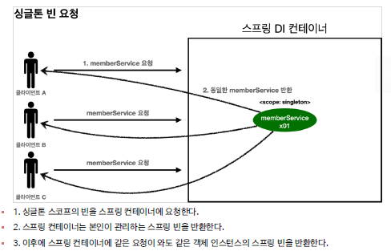
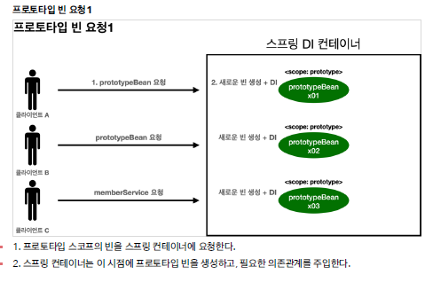
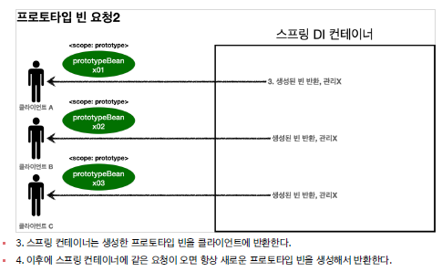
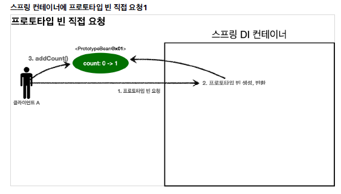
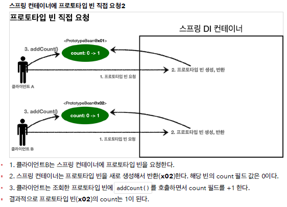
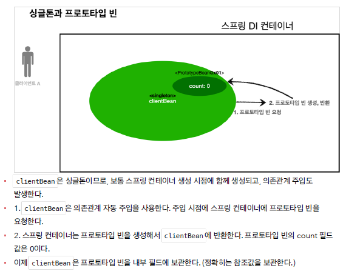
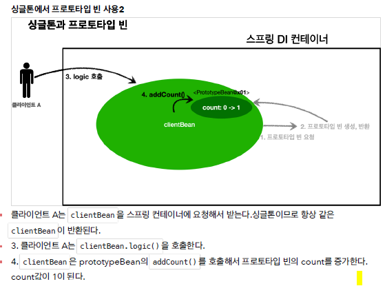
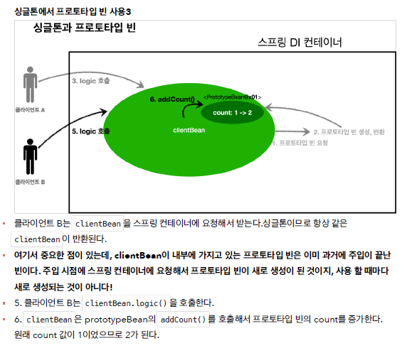
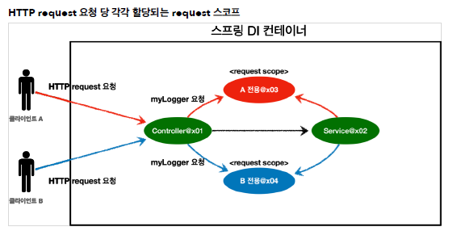
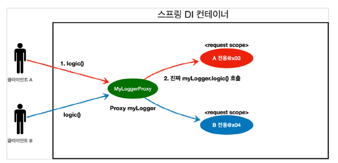

# 빈 스코프

## 빈 스코프란?

스프링 빈은 기본적으로 싱글톤 스코프로 생성된다.     

<br/>

✅ 스프링은 다음과 같은 다양한 스코프를 지원한다.        
- 싱글톤: 기본 스코프, 스프링 컨테이너의 **시작과 종료까지 유지**되는 가장 넓은 범위의 스코프이다.       
- 프로토타입: 스프링 컨테이너는 프로토타입 빈의 생성과 의존관계 주입(초기화 메서드)까지만 관여하고 더는 관리하지 않는 매우 짧은 범위의 스코프이다. (종료메서드 호출 X)       
- 웹 관련 스코프      
　- request: 웹 요청이 들어오고 나갈때 까지 유지되는 스코프이다.     
　- session: 웹 세션이 생성되고 종료될 때 까지 유지되는 스코프이다.      
　- application: 웹의 서블릿 컨텍스트와 같은 범위로 유지되는 스코프이다.      

<br/>

## 프로토타입 스코프

- 싱글톤 스코프의 빈을 조회하면 스프링 컨테이너는 항상 같은 인스턴스의 스프링 빈을 반환한다      
- 반면에, 프로토타입 스코프를 스프링 컨테이너에 조회하면 스프링 컨테이너는 항상 새로운 인스턴스를 생성해서 반환한다. 반환 후 끝..     

       
       
     

❗❗ 핵심은 스프링 컨테이너는 프로토타입 빈을 생성하고, 의존관계 주입, 초기화까지만 처리한다는 것이다. 따라서, @PreDestroy 같은 종료 메서드가 호출되지 않는다.      

<br/>

- 싱글톤 스코프 빈 테스트

```java
public class SingletonTest {

    @Test
    void singletonBeanFind() {
        AnnotationConfigApplicationContext ac = new AnnotationConfigApplicationContext(SingletonBean.class);

        SingletonBean singletonBean1 = ac.getBean(SingletonBean.class);
        SingletonBean singletonBean2 = ac.getBean(SingletonBean.class);
        System.out.println("singletonBean1 = " + singletonBean1);
        System.out.println("singletonBean2 = " + singletonBean2);
        Assertions.assertThat(singletonBean1).isSameAs(singletonBean2);

        ac.close();
    }// singletonBeanFind

    @Scope("singleton")
    static class SingletonBean {

        @PostConstruct
        public void init(){
            System.out.println("SingletonBean.init");
        } // init

        @PreDestroy
        public void destroy(){
            System.out.println("SingletonBean.destroy");
        }// destroy
    } // SingletonBean class

}// end class
```

   

- 프로토타입 스코프 빈 테스트
```java
public class PrototypeTest {

    @Test
    void prototypeBeanFind() {
        AnnotationConfigApplicationContext ac = new AnnotationConfigApplicationContext(PrototypeBean.class);

        System.out.println("find prototypeBean1");
        PrototypeBean prototypeBean1 = ac.getBean(PrototypeBean.class);
        System.out.println("find prototypeBean2");
        PrototypeBean prototypeBean2 = ac.getBean(PrototypeBean.class);

        System.out.println("prototypeBean1 = " + prototypeBean1);
        System.out.println("prototypeBean2 = " + prototypeBean2);

        assertThat(prototypeBean1).isNotSameAs(prototypeBean2);

    }// prototypeBeanFind

    @Scope("prototype")
    static class PrototypeBean {
        @PostConstruct
        public void init(){
            System.out.println("PrototypeBean.init");
        } // init

        @PreDestroy
        public void destroy(){
            System.out.println("PrototypeBean.destroy");
        }// destroy

    }// PrototypeBean class

}// end class
```

    

<br/>

→ 종료 메서드를 실행 해주고 싶으면 직접 호출 해줘야한다.. 

```java
    	prototypeBean1.destroy();
        prototypeBean2.destroy();
```
<br/>

## 프로토타입 스코프 - 싱글톤 빈과 함께 사용시 문제점

    

1. 클라이언트A는 스프링 컨테이너에 프로토타입 빈을 요청한다.      
2. 스프링 컨테이너는 프로토타입 빈을 새로 생성해서 반환(x01)한다. 해당 빈의 count 필드 값은 0이다.      
3. 클라이언트는 조회한 프로토타입 빈에 addCount() 를 호출하면서 count 필드를 +1 한다.      
- 결과적으로 프로토타입 빈(x01)의 count는 1이 된다.     

    

✅ 싱글톤 빈에서 프로토타입 빈 사용      
- 싱글톤에서 프로토타입 빈 사용1     

    
    
    

- 싱글톤 빈은 생성 시점에만 의존관계 주입을 받기 때문에, 프로토타입 빈이 새로 생성되기는 하지만, 싱글톤 빈과 함께 계속 유지되는 것이 문제

<br/>

## 프로토타입 스코프 - 싱글톤 빈과 함께 사용시 Provider로 문제 해결

✅ 스프링 컨테이너에 요청    

```java
@Autowired
private ApplicationContext ac;

public int logic() {
		PrototypeBean prototypeBean = ac.getBean(PrototypeBean.class);
		prototypeBean.addCount();
		int count = prototypeBean.getCount();
		return count;
}
```

→ 의존관계를 외부에서 주입(DI) 받는게 아니라 이렇게 직접 필요한 의존관계를 찾는 것을 Dependency Lookup (DL) 의존관계 조회(탐색) 이라한다.      
→ 그런데 이렇게 스프링의 애플리케이션 컨텍스트 전체를 주입받게 되면, 스프링 컨테이너에 종속적인 코드가 되고, 단위 테스트도 어려워진다.      

<br/>

✅ ObjectFactory, ObjectProvider     
- 지정한 빈을 컨테이너에서 대신 찾아주는 DL 서비스를 제공하는 것이 바로 ObjectProvider 이다     

```java
package hello.core.scope;

import org.assertj.core.api.Assertions;
import org.ietf.jgss.Oid;
import org.junit.jupiter.api.Test;
import org.springframework.beans.factory.ObjectProvider;
import org.springframework.beans.factory.annotation.Autowired;
import org.springframework.context.annotation.AnnotationConfigApplicationContext;
import org.springframework.context.annotation.Scope;

import javax.annotation.PostConstruct;
import javax.annotation.PreDestroy;

import static org.assertj.core.api.Assertions.*;

public class SingletonWithProtytypeTest1 {

    @Test
    void prototypeFind() {
        AnnotationConfigApplicationContext ac = new AnnotationConfigApplicationContext(PrototypeBean.class);
        PrototypeBean prototypeBean1 = ac.getBean(PrototypeBean.class);
        prototypeBean1.addCount();
        assertThat(prototypeBean1.getCount()).isEqualTo(1);

        PrototypeBean prototypeBean2 = ac.getBean(PrototypeBean.class);
        prototypeBean2.addCount();
        assertThat(prototypeBean2.getCount()).isEqualTo(1);
    }// prototypeFind

    @Test
    void singletonClientUsePrototype(){
        AnnotationConfigApplicationContext ac = new AnnotationConfigApplicationContext(ClientBean.class, PrototypeBean.class);

        ClientBean clientBean1 = ac.getBean(ClientBean.class);
        int count1 = clientBean1.logic();
        assertThat(count1).isEqualTo(1);

        ClientBean clientBean2 = ac.getBean(ClientBean.class);
        int count2 = clientBean2.logic();
        assertThat(count2).isEqualTo(1);

    }// singletonClientUsePrototype

    @Scope("singleton")
    static class ClientBean {
//        private final PrototypeBean prototypeBean; // 생성시점에 주입 x01

        @Autowired
        private ObjectProvider<PrototypeBean> prototypeBeanProvider;

//       @Autowired
//        public ClientBean(PrototypeBean prototypeBean) {
//            this.prototypeBean = prototypeBean;
//        } // constructor

        public int logic(){
            PrototypeBean prototypeBean = prototypeBeanProvider.getObject();
            prototypeBean.addCount();
            int count = prototypeBean.getCount();
            return count;
        }// logic

    }// ClientBean class

    @Scope("prototype")
    static class PrototypeBean {
        private int count = 0;

        public void addCount() {
            count++;
        }// addCount

        public int getCount() {
            return count;
        }// getCount

        @PostConstruct
        public void init() {
            System.out.println("PrototypeBean.init " + this);
        }// init

        @PreDestroy
        public void destroy() {
            System.out.println("PrototypeBean.destroy");
        }// destroy
    }// PrototypeBean class

} // end class
```

    

→ prototypeBeanProvider.getObject() 을 통해서 항상 새로운 프로토타입 빈이 생성되는 것을 확인      
→ ObjectProvider 의 getObject() 를 호출하면 내부에서는 스프링 컨테이너를 통해 해당 빈을 찾아서 반환한다. (DL)      
→ ObjectFactory: 기능이 단순, 별도의 라이브러리 필요 없음, 스프링에 의존     
→ ObjectProvider: ObjectFactory 상속, 옵션, 스트림 처리등 편의 기능이 많고, 별도의 라이브러리 필요 없음, 스프링에 의존     

<br/>

✅ JSR-330 Provider     

<br/>

- 라이브러리를 추가해야한다.     

`implementation 'javax.inject:javax.inject:1'`

```java
@Scope("singleton")
    static class ClientBean {
//        private final PrototypeBean prototypeBean; // 생성시점에 주입 x01

        @Autowired
        private Provider<PrototypeBean> prototypeBeanProvider;

//       @Autowired
//        public ClientBean(PrototypeBean prototypeBean) {
//            this.prototypeBean = prototypeBean;
//        } // constructor

        public int logic(){
            PrototypeBean prototypeBean = prototypeBeanProvider.get();
            prototypeBean.addCount();
            int count = prototypeBean.getCount();
            return count;
        }// logic

    }// ClientBean class
```

→ 매번 사용할 때 마다 의존관계 주입이 완료된 새로운 객체가 필요하면 사용하면 된다.     
→ ObjectProvider , JSR330 Provider 등은 프로토타입 뿐만 아니라 DL이 필요한 경우는 언제든지 사용할 수 있다.     

<br/>

## 웹 스코프

✅ 웹 스코프의 특징      
- 웹 스코프는 웹 환경에서만 동작한다.      
- 웹 스코프는 프로토타입과 다르게 스프링이 해당 스코프의 종료시점까지 관리한다. 따라서 종료 메서드가 호출된다       

<br/>

✅ 웹 스코프 종류     
- request: HTTP 요청 하나가 들어오고 나갈 때 까지 유지되는 스코프, 각각의 HTTP 요청마다 별도의 빈 인스턴스가 생성되고, 관리된다.       
- session: HTTP Session과 동일한 생명주기를 가지는 스코프       
- application: 서블릿 컨텍스트( ServletContext )와 동일한 생명주기를 가지는 스코프      
- websocket: 웹 소켓과 동일한 생명주기를 가지는 스코프      

    

<br/>

## request 스코프 예제 만들기

- build.gradle에 추가

`implementation 'org.springframework.boot:spring-boot-starter-web'`

<br/>

✅ request 스코프 예제 개발     
- 동시에 여러 HTTP 요청이 오면 정확히 어떤 요청이 남긴 로그인지 구분하기 어렵다.      
- 기대하는 공통 포멧: `[UUID][requestURL] {message}`      

```java
@Component
@Scope(value = "request")
public class MyLogger {
    private String uuid;
    private String requestURL;

    public void setRequestURL(String requestURL) {
        this.requestURL = requestURL;
    }// setRequestURL

    public void log(String message){
        System.out.println("[" + uuid + "]" + "[" + requestURL + "] " + message);
    }// log

    @PostConstruct
    public void init() {
        uuid = UUID.randomUUID().toString();
        System.out.println("[" + uuid + "] request scope bean create: " + this);
    }// init

    @PreDestroy
    public void close(){
        System.out.println("[" + uuid + "] request scope bean close: " + this);
    }// close


}// end class
```

→ 로그를 출력하기 위한 MyLogger 클래스이다.     
→ @Scope(value = "request") 를 사용해서 request 스코프로 지정했다. 이제 이 빈은 HTTP 요청 당 하나씩 생성되고, HTTP 요청이 끝나는 시점에 소멸된다.     

```java
@Controller
@RequiredArgsConstructor
public class LogDemoController {

    private final LogDemoService logDemoService;
    private final MyLogger myLogger;

    @RequestMapping("log-demo")
    @ResponseBody
    public String logDemo(HttpServletRequest request) {
        String requestURL = request.getRequestURI().toString();
        myLogger.setRequestURL(requestURL);

        myLogger.log("controller test");
        logDemoService.logic("testId");
        return "OK";

    }// logDemo

}// end class
```

- 이렇게 받은 requestURL 값을 myLogger에 저장해둔다. myLogger는 HTTP 요청 당 각각 구분되므로 다른 HTTP 요청 때문에 값이 섞이는 걱정은 하지 않아도 된다.

```java
@Service
@RequiredArgsConstructor
public class LogDemoService {

    private final MyLogger myLogger;

    public void logic(String id) {
        myLogger.log("service id = " + id);
    }// logic

}// end class
```
→ 오류..      
스프링 애플리케이션을 실행하는 시점에 싱글톤 빈은 생성해서 주입이 가능하지만, request 스코프 빈은 아직 생성되지 않는다. 이 빈은 실제 고객의 요청이 와야 생성할 수 있다!     

<br/>

## 스코프와 Provider

- controller

```java
@Controller
@RequiredArgsConstructor
public class LogDemoController {

    private final LogDemoService logDemoService;
    private final ObjectProvider<MyLogger> myLoggerProvider;

    @RequestMapping("log-demo")
    @ResponseBody
    public String logDemo(HttpServletRequest request) {
        String requestURL = request.getRequestURI().toString();
        MyLogger myLogger = myLoggerProvider.getObject();
        myLogger.setRequestURL(requestURL);

        myLogger.log("controller test");
        logDemoService.logic("testId");
        return "OK";

    }// logDemo

}// end class
```

- service

```java
@Service
@RequiredArgsConstructor
public class LogDemoService {

    private final ObjectProvider<MyLogger> myLoggerProvider;

    public void logic(String id) {
        MyLogger myLogger = myLoggerProvider.getObject();
        myLogger.log("service id = " + id);
    }// logic

}// end class
```

    

→ ObjectProvider 덕분에 ObjectProvider.getObject() 를 호출하는 시점까지 request scope 빈의 생성을 지연할 수 있다.      
→ ObjectProvider.getObject() 를 LogDemoController , LogDemoService 에서 각각 한번씩 따로 호출해도 같은 HTTP 요청이면 같은 스프링 빈이 반환된다!      

<br/>

## 스코프와 프록시

```java
@Component
@Scope(value = "request", proxyMode = ScopedProxyMode.TARGET_CLASS)
public class MyLogger {
...
}
```

→ proxyMode = ScopedProxyMode.TARGET_CLASS 를 추가해주자.      
　- 적용 대상이 인터페이스가 아닌 클래스면 TARGET_CLASS 를 선택     
　- 적용 대상이 인터페이스면 INTERFACES 를 선택     
→ 이렇게 하면 MyLogger의 가짜 프록시 클래스를 만들어두고 HTTP request와 상관 없이 가짜 프록시 클래스를 다른 빈에 미리 주입해 둘 수 있다.     

   

<br/>

✅ CGLIB라는 라이브러리로 내 클래스를 상속 받은 가짜 프록시 객체를 만들어서 주입한다.      
- 스프링 컨테이너에 "myLogger"라는 이름으로 진짜 대신에 이 가짜 프록시 객체를 등록한다.      
- ac.getBean("myLogger", MyLogger.class) 로 조회해도 프록시 객체가 조회되는 것을 확인할 수 있다.     
- 그래서 의존관계 주입도 이 가짜 프록시 객체가 주입된다.      

   

✅ 가짜 프록시 객체는 요청이 오면 그때 내부에서 진짜 빈을 요청하는 위임 로직이 들어있다.      
- 가짜 프록시 객체는 원본 클래스를 상속 받아서 만들어졌기 때문에 이 객체를 사용하는 클라이언트 입장에서는 사실 원본인지 아닌지도 모르게, 동일하게 사용할 수 있다(다형성)       

<br/>

- 가짜 프록시 객체는 실제 request scope와는 관계가 없다. 그냥 가짜이고, 내부에 단순한 위임 로직만있고, 싱글톤 처럼 동작한다.      
- 사실 Provider를 사용하든, 프록시를 사용하든 핵심 아이디어는 진짜 객체 조회를 꼭 필요한 시점까지 지연처리 한다는 점이다.      

