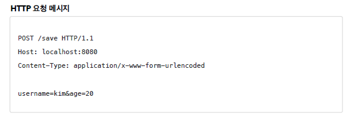
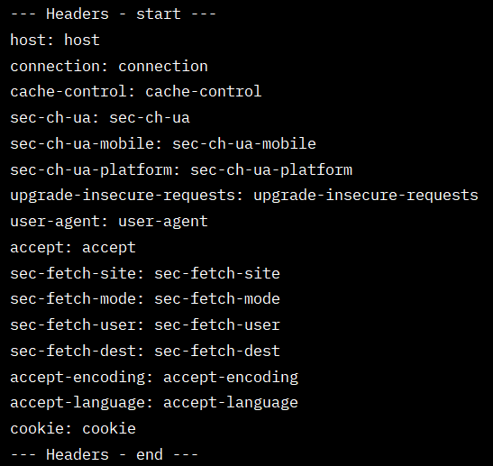
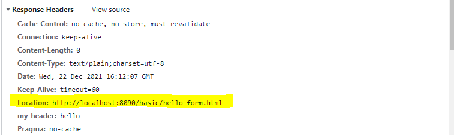

## 프로젝트 생성

[https://start.spring.io](https://start.spring.io/)      
- 프로젝트 선택      
　- Project: Gradle Project     
　- Language: Java      
　- Spring Boot: 2.4.x      
- Project Metadata      
　- Group: hello      
　- Artifact: servlet      
　- Name: servlet      
　- Package name: hello.servlet      
　- Packaging: War (주의!) ❗JSP를 실행하기 위해      
　- Java: 11      
- Dependencies: Spring Web, Lombok      

<br/>

## Hello 서블릿

- 스프링 부트 서블릿 환경 구성      
```java
@ServletComponentScan	// 서블릿 자동 등록
@SpringBootApplication
public class ServletApplication {

	public static void main(String[] args) {
		SpringApplication.run(ServletApplication.class, args);
	}

}
```

- 서블릿 등록하기    
```java

@WebServlet(name = "helloServlet", urlPatterns = "/hello")
public class HelloServlet extends HttpServlet {

    @Override
    protected void service(HttpServletRequest request, HttpServletResponse response) throws ServletException, IOException {
        System.out.println("HelloServlet.service");
        System.out.println("request = " + request);
        System.out.println("response = " + response);

        String username = request.getParameter("username");
        System.out.println("username = " + username);

        // header 정보에 들어간다
        response.setContentType("text/plain");
        response.setCharacterEncoding("utf-8");
        // http 메시지 바디에 데이터가 들어감
        response.getWriter().write("hello " + username);
    }// service

}// end class
```

      
      

- HTTP 요청 메시지 로그로 확인하기     
`application.properties`에 추가     

```java
logging.level.org.apache.coyote.http11=debug
```

       

내장 톰캣 서버 생성     

       
       

- welcome 페이지 추가     

<br/>

## HttpServletRequest - 개요

✅ HttpServletRequest 역할     
서블릿은 개발자가 HTTP 요청 메시지를 편리하게 사용할 수 있도록 개발자 대신에 HTTP 요청 메시지를 파싱한다. 그리고 그 결과를 HttpServletRequest 객체에 담아서 제공한다.      

       

- START LINE       
　- HTTP 메소드       
　- URL       
　- 쿼리 스트링       
　- 스키마, 프로토콜       
- 헤더       
　- 헤더 조회       
- 바디              
　- form 파라미터 형식 조회       
　- message body 데이터 직접 조회       
- 임시 저장소 기능       
해당 HTTP 요청이 시작부터 끝날 때 까지 유지되는 임시 저장소 기능       
　- 저장: request.setAttribute(name, value)       
　- 조회: request.getAttribute(name)       
- 세션 관리 기능       
　- request.getSession(create: true)       
❗이 기능에 대해서 깊이있는 이해를 하려면 **HTTP 스펙이 제공하는 요청, 응답 메시지 자체를 이해**해야 한다.

<br/>

## HttpServletRequest - 기본 사용법

- start-line 정보       

```java
private void printStartLine(HttpServletRequest request) {
        System.out.println("--- REQUEST-LINE - start ---");
        System.out.println("request.getMethod() = " + request.getMethod()); //GET
        System.out.println("request.getProtocal() = " + request.getProtocol()); //HTTP/1.1
        System.out.println("request.getScheme() = " + request.getScheme()); //http
        // http://localhost:8080/request-header
        System.out.println("request.getRequestURL() = " + request.getRequestURL());
        // /request-test
        System.out.println("request.getRequestURI() = " + request.getRequestURI());
        //username=hi
        System.out.println("request.getQueryString() = " + request.getQueryString());
        System.out.println("request.isSecure() = " + request.isSecure()); //https 사용 유무
        System.out.println("--- REQUEST-LINE - end ---");
        System.out.println();
    }
```

 

- 헤더 정보     

```java
//Header 모든 정보
    private void printHeaders(HttpServletRequest request) {
        System.out.println("--- Headers - start ---");

/*
        Enumeration<String> headerNames = request.getHeaderNames();
        while (headerNames.hasMoreElements()) {
            String headerName = headerNames.nextElement();
            System.out.println(headerName + ": " + headerName);
        }// while
*/

        request.getHeaderNames().asIterator()
                .forEachRemaining(headerName -> System.out.println(headerName + ": " + headerName));

        System.out.println("--- Headers - end ---");
        System.out.println();
    }// printHeaders
```

       

- header 편리한 조회     

```java
//Header 편리한 조회
    private void printHeaderUtils(HttpServletRequest request) {
        System.out.println("--- Header 편의 조회 start ---");
        System.out.println("[Host 편의 조회]");
        System.out.println("request.getServerName() = " + request.getServerName()); //Host 헤더
        System.out.println("request.getServerPort() = " + request.getServerPort()); //Host 헤더
        System.out.println();
        
        System.out.println("[Accept-Language 편의 조회]");
        request.getLocales().asIterator()
                .forEachRemaining(locale -> System.out.println("locale = " + locale));
        System.out.println("request.getLocale() = " + request.getLocale());
        System.out.println();
        
        System.out.println("[cookie 편의 조회]");
        if (request.getCookies() != null) {
            for (Cookie cookie : request.getCookies()) {
                System.out.println(cookie.getName() + ": " + cookie.getValue());
            }// for
        }// if
        System.out.println();
        
        System.out.println("[Content 편의 조회]");
        System.out.println("request.getContentType() = " + request.getContentType());
        System.out.println("request.getContentLength() = " + request.getContentLength());
        System.out.println("request.getCharacterEncoding() = " + request.getCharacterEncoding());
        System.out.println("--- Header 편의 조회 end ---");
        System.out.println();
        
    }// printHeaderUtils
```

   

- 기타 정보     

```java
//기타 정보
    private void printEtc(HttpServletRequest request) {
        System.out.println("--- 기타 조회 start ---");
        System.out.println("[Remote 정보]");
        System.out.println("request.getRemoteHost() = " + request.getRemoteHost()); //
        System.out.println("request.getRemoteAddr() = " + request.getRemoteAddr()); //
        System.out.println("request.getRemotePort() = " + request.getRemotePort()); //
        System.out.println();

        System.out.println("[Local 정보]");
        System.out.println("request.getLocalName() = " + request.getLocalName()); //
        System.out.println("request.getLocalAddr() = " + request.getLocalAddr()); //
        System.out.println("request.getLocalPort() = " + request.getLocalPort()); //
        System.out.println("--- 기타 조회 end ---");
        System.out.println();
    }// printEtc
```

       

<br/>

## HTTP 요청 데이터 - 개요

- **GET - 쿼리 파라미터**     
　- /url**?username=hello&age=20**     
　- 메시지 바디 없이, URL의 쿼리 파라미터에 데이터를 포함해서 전달     
　- 예) 검색, 필터, 페이징등에서 많이 사용하는 방식     
- **POST - HTML Form**     
　- content-type: application/x-www-form-urlencoded     
　- 메시지 바디에 쿼리 파리미터 형식으로 전달 username=hello&age=20     
　- 예) 회원 가입, 상품 주문, HTML Form 사용     
- **HTTP message body**에 데이터를 직접 담아서 요청     
　- HTTP API에서 주로 사용, JSON, XML, TEXT     
　- 데이터 형식은 주로 JSON 사용     
　- POST, PUT, PATCH     

       

<br/>

## HTTP 요청 데이터 - GET 쿼리 파라미터

```java
/*
*  1. 파라미터 전송 기능
*  http://localhost:8090/request-param?username=hello&age=20
*
* */
@WebServlet(name = "RequestParamServlet", urlPatterns = "/request-param")
public class RequestParamServlet extends HttpServlet {

    @Override
    protected void service(HttpServletRequest request, HttpServletResponse response) throws ServletException, IOException {

        System.out.println("[전체 파라미터 조회] - start");

        request.getParameterNames().asIterator()
                        .forEachRemaining(paramName -> System.out.println(paramName + "=" + request.getParameter(paramName)));

        System.out.println("[전체 파라미터 조회] - end");
        System.out.println();

        System.out.println("[단일 파라미터 조회]");
        String username = request.getParameter("username");
        String age = request.getParameter("age");

        System.out.println("username = " + username);
        System.out.println("age = " + age);
        System.out.println();

        // http://localhost:8090/request-param?username=hello&age=20&username=hello2
        System.out.println("[이름이 같은 복수 파라미터 조회]");
        String[] usernames = request.getParameterValues("username");
        for (String name : usernames) {
            System.out.println("username = " + name);
        }// for

        response.getWriter().write("ok");

    }// service

}// end class
```

     

✨ 복수 파라미터에서 단일 파라미터 조회      
- 중복일 때는 request.getParameterValues() 를 사용해야 한다.      
- 중복일 때 request.getParameter() 를 사용하면 request.getParameterValues() 의 첫 번째 값을 반환한다.      

<br/>

## HTTP 요청 데이터 - POST HTML Form

- src/main/webapp/basic/hello-form.html 생성      

```java
<!DOCTYPE html>
<html>
<head>
    <meta charset="UTF-8">
    <title>Title</title>
</head>
<body>
<form action="/request-param" method="post">
    username: <input type="text" name="username" />
    age: <input type="text" name="age" />
    <button type="submit">전송</button>
</form>
</body>
</html>
```

         

→ request.getParameter() 는 GET URL 쿼리 파라미터 형식도 지원하고, POST HTML Form 형식도 둘 다 지원한다.     
<br/>

✨ 참고 ✨     
- content-type은 HTTP 메시지 바디의 데이터 형식을 지정한다.     
- **GET URL 쿼리 파라미터 형식**으로 클라이언트에서 서버로 데이터를 전달할 때는 HTTP 메시지 바디를 사용하지 않기 때문에 content-type이 없다.     
- **POST HTML Form 형식**으로 데이터를 전달하면 HTTP 메시지 바디에 해당 데이터를 포함해서 보내기 때문에 바디에 포함된 데이터가 어떤 형식인지 content-type을 꼭 지정해야 한다. 이렇게 폼으로 데이터를 전송하는 형식을 application/x-www-form-urlencoded 라 한다.     

<br/>

## HTTP 요청 데이터 - API 메시지 바디 - 단순 텍스트

```java
@WebServlet(name = "requestBodyStringServlet", urlPatterns = "/request-body-string")
public class RequestBodyStringServlet extends HttpServlet {

    @Override
    protected void service(HttpServletRequest request, HttpServletResponse response) throws ServletException, IOException {
        // 바디 메시지를 바이트 코드로 받을 수 있다.
        ServletInputStream inputStream = request.getInputStream();
        // 바이트 -> 문자
        String messageBody = StreamUtils.copyToString(inputStream, StandardCharsets.UTF_8);

        System.out.println("messageBody = " + messageBody);

        response.getWriter().write("ok");

    }// service

}// end class
```

       

<br/>

## HTTP 요청 데이터 - API 메시지 바디 - JSON

- JSON 형식 파싱 추가 →

```java
@WebServlet(name = "requestBodyJsonServlet", urlPatterns = "/request-body-json")
public class RequestBodyJsonServlet extends HttpServlet {

    private ObjectMapper objectMapper = new ObjectMapper();

    @Override
    protected void service(HttpServletRequest request, HttpServletResponse response) throws ServletException, IOException {
        ServletInputStream inputStream = request.getInputStream();
        String messageBody = StreamUtils.copyToString(inputStream, StandardCharsets.UTF_8);

        System.out.println("messageBody = " + messageBody);

        HelloData helloData = objectMapper.readValue(messageBody, HelloData.class);

        System.out.println("helloData.username = " + helloData.getUsername());
        System.out.println("helloData.age = " + helloData.getAge());

        response.getWriter().write("ok");
    }// service

}// end class
```

       

✨ 참고 ✨       
JSON 결과를 파싱해서 사용할 수 있는 자바 객체로 변환하려면 Jackson, Gson 같은 JSON 변환 라이브러리를 추가해서 사용해야 한다. 스프링 부트로 Spring MVC를 선택하면 기본으로 Jackson 라이브러리( ObjectMapper )를 함께 제공한다.        

<br/>

## HttpServletResponse - 기본 사용법

✅ HttpServletResponse 역할       
- HTTP 응답 메시지 생성       
- HTTP 응답코드 지정       
- 헤더 생성       
- 바디 생성       

✅ 편의 기능 제공       
- Content-Type, 쿠키, Redirect       

<br/>
- hello.servlet.basic.response.ResponseHeaderServlet

```java
@WebServlet(name = "responseHeaderServlet", urlPatterns = "/response-header")
public class ResponseHeaderServlet extends HttpServlet {

    @Override
    protected void service(HttpServletRequest request, HttpServletResponse response) throws ServletException, IOException {
        // [status-line]
        response.setStatus(HttpServletResponse.SC_OK);  // SC_OK == 200

        // [response-headers]
        response.setHeader("Content-Type", "text/plain;charset=utf-8");
        response.setHeader("Cache-Control", "no-cache, no-store, must-revalidate");
        response.setHeader("Pragma", "no-cache");
        response.setHeader("my-header", "hello");

        PrintWriter writer = response.getWriter();
        writer.println("OK");

    }// service

}// end class
```

    

- Content 편의 메서드     

```java
private void content(HttpServletResponse response) {
        //Content-Type: text/plain;charset=utf-8
        //Content-Length: 2
        //response.setHeader("Content-Type", "text/plain;charset=utf-8");
        response.setContentType("text/plain");
        response.setCharacterEncoding("utf-8");
        //response.setContentLength(2); //(생략시 자동 생성)
    }// content
```

- Cookie 편의 메서드     

```java
private void cookie(HttpServletResponse response) {
        //Set-Cookie: myCookie=good; Max-Age=600;
        //response.setHeader("Set-Cookie", "myCookie=good; Max-Age=600");
        Cookie cookie = new Cookie("myCookie", "good");
        cookie.setMaxAge(600); //600초
        response.addCookie(cookie);
    }// cookie
```

       


- redirect 편의 메서드     

```java
private void redirect(HttpServletResponse response) throws IOException {
        //Status Code 302
        //Location: /basic/hello-form.html

        //response.setStatus(HttpServletResponse.SC_FOUND); //302
        //response.setHeader("Location", "/basic/hello-form.html");
        response.sendRedirect("/basic/hello-form.html");
    }// redirect
```

    

<br/>

## HTTP 응답 데이터 - 단순 텍스트, HTML

- 단순 텍스트 응답    
　- 앞에서 살펴봄 ( writer.println("ok"); )    
- HTML 응답    
- HTTP API - MessageBody JSON 응답    
<br/>
- hello.servlet.web.response.ResponseHtmlServlet

```java
@WebServlet(name = "responseHtmlServlet", urlPatterns = "/response-html")
public class ResponseHtmlServlet extends HttpServlet {

    @Override
    protected void service(HttpServletRequest request, HttpServletResponse response) throws ServletException, IOException {
        // Content-Type: text/html;charset=utf-8
        response.setContentType("text/html");
        response.setCharacterEncoding("utf-8");

        PrintWriter writer = response.getWriter();
        writer.println("<html>");
        writer.println("<body>");
        writer.println("    <div>안녕?</div>");
        writer.println("</body>");
        writer.println("</html>");

    }// service

}// end class
```

       

<br/>

## HTTP 응답 데이터 - API JSON

- hello.servlet.web.response. ResponseJsonServlet

```java
@WebServlet(name = "responseJsonServlet", urlPatterns = "/response-json")
public class ResponseJsonServlet extends HttpServlet {

    private ObjectMapper objectMapper = new ObjectMapper();

    @Override

    protected void service(HttpServletRequest request, HttpServletResponse response) throws ServletException, IOException {
        // Content-Type: application/json
        response.setContentType("application/json");
        response.setCharacterEncoding("utf-8");

        HelloData helloData = new HelloData();
        helloData.setUsername("Lee");
        helloData.setAge(27);

        // {"username":"Lee", "age":27}
        String result = objectMapper.writeValueAsString(helloData);
        response.getWriter().write(result);
        

    }// service

}// end class
```

       

→ Jackson 라이브러리가 제공하는 objectMapper.writeValueAsString() 를 사용하면 객체를 JSON 문자로 변경할 수 있다.