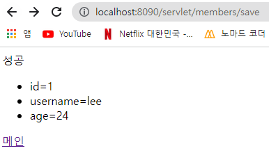
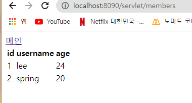
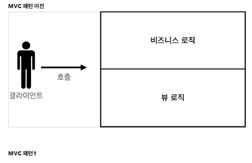
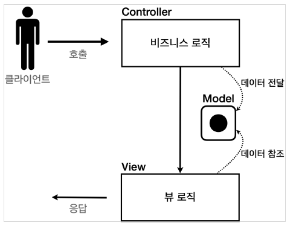
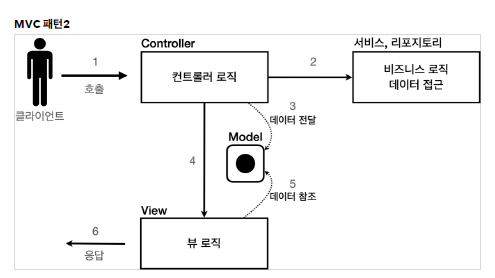

## 회원 관리 웹 애플리케이션 요구사항

- 회원 도메인 →      
- 회원 저장소      

```java
/*
*   동시성 문제가 고려되어 있지 않음, 실무에서는 ConcurrentHashMap, AtomicLong 사용 고려
* */

public class MemberRepository {

    private Map<Long, Member> store = new HashMap<>();
    private static long sequence = 0L;

    private static final MemberRepository instance = new MemberRepository();

    private static MemberRepository getInstance(){
        return instance;
    }

    private MemberRepository(){

    }// constructor

    public Member save(Member member) {
        member.setId(++sequence);
        store.put(member.getId(), member);
        return member;
    }// save

    public Member findById(Long id){
        return store.get(id);
    }// findById

    public List<Member> findAll(){
        return new ArrayList<>(store.values());
        // store에 있는 모든 값을 꺼내서 새로운 arrayList에 넣어준다.
        // 밖에서 조작해도 store에 있는 value를 건들고 싶지 않아서..
    }// findAll

    public void clearStore(){
        store.clear();
    }// clearStore

}// end class
```

- test      

```java
class MemberRepositoryTest {

    MemberRepository memberRepository = MemberRepository.getInstance();

    @AfterEach
    void afterEach() {
				// 다음 테스트에 영향을 주지 않도록 (순서가 보장 X) ..
        memberRepository.clearStore();
    }// afterEach

    @Test
    void save() {
        // given
        Member member = new Member("hello", 20);

        // when
        Member savedMember = memberRepository.save(member);

        // then
        Member findMember = memberRepository.findById(savedMember.getId());
        assertThat(findMember).isEqualTo(savedMember);
    }//save

    @Test
    void findAll() {
        // given
        Member member1 = new Member("member1", 20);
        Member member2 = new Member("member2", 30);

        memberRepository.save(member1);
        memberRepository.save(member2);

        // when
        List<Member> result = memberRepository.findAll();

        // then
        assertThat(result.size()).isEqualTo(2);
        assertThat(result).contains(member1, member2);

    }//findAll

}// end class
```
<br/>

## 서블릿으로 회원 관리 웹 애플리케이션 만들기

- 회원 등록 폼      

```java
@WebServlet(name = "memberFormServlet", urlPatterns = "/servlet/member/new-form")
public class MemberFormServlet extends HttpServlet {

    private MemberRepository memberRepository = MemberRepository.getInstance();

    @Override
    protected void service(HttpServletRequest request, HttpServletResponse response) throws ServletException, IOException {

        response.setContentType("text/html");
        response.setCharacterEncoding("utf-8");

        PrintWriter w = response.getWriter();
        w.write(
                "<!DOCTYPE html>\n" +
                "<html>\n" +
                "<head>\n" +
                " <meta charset=\"UTF-8\">\n" +
                " <title>Title</title>\n" +
                "</head>\n" +
                "<body>\n" +
                "<form action=\"/servlet/members/save\" method=\"post\">\n" +
                " username: <input type=\"text\" name=\"username\" />\n" +
                " age: <input type=\"text\" name=\"age\" />\n" +
                " <button type=\"submit\">전송</button>\n" +
                "</form>\n" +
                "</body>\n" +
                "</html>\n"
        );
    }// service

}// end class
```

<br/>

- **회원 저장**

```java
@WebServlet(name = "memberSaveServlet", urlPatterns = "/servlet/members/save")
public class MemberSaveServlet extends HttpServlet {

    private MemberRepository memberRepository = MemberRepository.getInstance();

    @Override
    protected void service(HttpServletRequest request, HttpServletResponse response) throws ServletException, IOException {
        System.out.println("MemberSaveServlet.service");
        String username = request.getParameter("username");
        int age = Integer.parseInt(request.getParameter("age"));

        Member member = new Member(username, age);
        memberRepository.save(member);

        response.setContentType("text/html");
        response.setCharacterEncoding("utf-8");
        PrintWriter w = response.getWriter();
        w.write(
                "<html>\n" +
                "<head>\n" +
                " <meta charset=\"UTF-8\">\n" +
                "</head>\n" +
                "<body>\n" +
                "성공\n" +
                "<ul>\n" +
                " <li>id="+member.getId()+"</li>\n" +
                " <li>username="+member.getUsername()+"</li>\n" +
                " <li>age="+member.getAge()+"</li>\n" +
                "</ul>\n" +
                "<a href=\"/index.html\">메인</a>\n" +
                "</body>\n" +
                "</html>"
        );

    }// service

}// end class
```

      

- 회원 목록     

```java
@WebServlet(name = "memberListServlet", urlPatterns = "/servlet/members")
public class MemberListServlet extends HttpServlet {

    private MemberRepository memberRepository = MemberRepository.getInstance();

    @Override
    protected void service(HttpServletRequest request, HttpServletResponse response) throws ServletException, IOException {

        List<Member> members = memberRepository.findAll();

        response.setContentType("text/html");
        response.setCharacterEncoding("utf-8");

        PrintWriter w = response.getWriter();
        w.write("<html>");
        w.write("<head>");
        w.write(" <meta charset=\"UTF-8\">");
        w.write(" <title>Title</title>");
        w.write("</head>");
        w.write("<body>");
        w.write("<a href=\"/index.html\">메인</a>");
        w.write("<table>");
        w.write(" <thead>");
        w.write(" <th>id</th>");
        w.write(" <th>username</th>");
        w.write(" <th>age</th>");
        w.write(" </thead>");
        w.write(" <tbody>");

/*
        w.write(" <tr>");
        w.write(" <td>1</td>");
        w.write(" <td>userA</td>");
        w.write(" <td>10</td>");
        w.write(" </tr>");
*/
        for (Member member : members) {
            w.write(" <tr>");
            w.write(" <td>" + member.getId() + "</td>");
            w.write(" <td>" + member.getUsername() + "</td>");
            w.write(" <td>" + member.getAge() + "</td>");
            w.write(" </tr>");
        }
        w.write(" </tbody>");
        w.write("</table>");
        w.write("</body>");
        w.write("</html>");

    }// service

}// end class
```

      

✅ 템플릿 엔진      
HTML 문서에서 필요한 곳만 코드를 적용해서 동적으로 변경할 수 있다.      
템플릿 엔진에는 JSP, Thymeleaf, Freemarker, Velocity등이 있다.      

<br/>

## JSP로 회원 관리 웹 애플리케이션 만들기

- jsp 라이브러리 추가 (build.gradle)      

```java
//JSP 추가 시작
implementation 'org.apache.tomcat.embed:tomcat-embed-jasper'
implementation 'javax.servlet:jstl'
//JSP 추가 끝
```

<br/>

- 회원 등록 폼 JSP →      
- 회원 저장 JSP      

```java
<%@ page contentType="text/html;charset=UTF-8" language="java" %>
<%@ page import="hello.servlet.domain.member.Member" %>
<%@ page import="hello.servlet.domain.member.MemberRepository" %>
<%
    // request, response 사용 가능
    MemberRepository memberRepository = MemberRepository.getInstance();

    System.out.println("MemberSaveServlet.service");
    String username = request.getParameter("username");
    int age = Integer.parseInt(request.getParameter("age"));

    Member member = new Member(username, age);
    memberRepository.save(member);
%>

<html>
<head>
    <title>Title</title>
</head>
<body>
성공
<ul>
    <li>id=<%=member.getId()%></li>
    <li>username=<%=member.getUsername()%></li>
    <li>age=<%=member.getAge()%></li>
</ul>

<a href="/index.html">메인</a>

</body>
</html>
```

<br/>
- 회원 목록 JSP      

```java
<%@ page import="hello.servlet.domain.member.MemberRepository" %>
<%@ page import="hello.servlet.domain.member.Member" %>
<%@ page import="java.util.List" %>
<%@ page contentType="text/html;charset=UTF-8" language="java" %>
<%
    MemberRepository memberRepository = MemberRepository.getInstance();
    List<Member> members = memberRepository.findAll();
%>

<html>
<head>
    <title>Title</title>
</head>
<body>
<a href="/index.html">메인</a>
<table>
    <thead>
    <th>id</th>
    <th>username</th>
    <th>age</th>
    </thead>
    <tbody>
<%--
    <tr>
        <td></td>
        <td></td>
        <td></td>
    </tr>
--%>
    <%
        for (Member member : members) {
            out.write(" <tr>");
            out.write(" <td>" + member.getId() + "</td>");
            out.write(" <td>" + member.getUsername() + "</td>");
            out.write(" <td>" + member.getAge() + "</td>");
            out.write(" </tr>");
        }
    %>
    </tbody>
</table>
</body>
</html>
```

<br/>

## MVC 패턴 - 개요

- 너무 많은 역할      
하나의 서블릿이나 JSP만으로 비즈니스 로직과 뷰 렌더링까지 모두 처리하게 되면, 너무 많은 역할을 하게되고, 결과적으로 유지보수가 어려워진다.      
- 변경의 라이프 사이클      
변경의 라이프 사이클이 다른 부분을 하나의 코드로 관리하는 것은 유지보수하기 좋지 않다.      
- 기능 특화      
특히 JSP 같은 뷰 템플릿은 화면을 렌더링 하는데 최적화 되어 있기 때문에 이 부분의 업무만 담당하는 것이 가장 효과적이다.      
- Model View Controller      
MVC 패턴은 지금까지 학습한 것 처럼 하나의 서블릿이나, JSP로 처리하던 것을 컨트롤러(Controller)와 뷰(View)라는 영역으로 서로 역할을 나눈 것을 말한다.      
<br/>

**컨트롤러**: HTTP 요청을 받아서 파라미터를 검증하고, 비즈니스 로직을 실행한다. 그리고 뷰에 전달할 결과 데이터를 조회해서 모델에 담는다.
<br/>

**모델**: 뷰에 출력할 데이터를 담아둔다. 뷰가 필요한 데이터를 모두 모델에 담아서 전달해주는 덕분에 뷰는 비즈니스 로직이나 데이터 접근을 몰라도 되고, 화면을 렌더링 하는 일에 집중할 수 있다.
<br/>

**뷰**: 모델에 담겨있는 데이터를 사용해서 화면을 그리는 일에 집중한다. 여기서는 HTML을 생성하는 부분을 말한다.      
<br/>

✨ 일반적으로 비즈니스 로직은 서비스(Service)라는 계층을 별도로 만들어서 처리한다. 그리고 컨트롤러는 비즈니스 로직이 있는 서비스를 호출하는 담당한다. 참고로 비즈니스 로직을 변경하면 비즈니스 로직을 호출하는 컨트롤러의 코드도 변경될 수 있다. 앞에서는 이해를 돕기 위해 비즈니스 로직을 호출한다는 표현보다는, 비즈니스 로직이라 설명했다.

      
      
      

<br/>

## MVC 패턴 - 적용

- Model은 HttpServletRequest 객체를 사용한다. request는 내부에 데이터 저장소를 가지고 있는데, request.setAttribute() , request.getAttribute() 를 사용하면 데이터를 보관하고, 조회할 수 있다.      
<br/>
- 회원등록 폼 - controller      

```java

@WebServlet(name = "mvcMemberServlet", urlPatterns = "/servlet-mvc/members/new-form")
public class MvcMemberServlet extends HttpServlet {

    @Override
    protected void service(HttpServletRequest request, HttpServletResponse response) throws ServletException, IOException {
        String viewPath = "/WEB-INF/views/new-form.jsp";
        RequestDispatcher dispatcher = request.getRequestDispatcher(viewPath);  // 컨트롤러에서 뷰로 이동할 때 사용하는 것
        dispatcher.forward(request, response);  // 다른 서블릿이나 JSP로 이동할 수 있는 기능이다. 서버 내부에서 다시 호출이 발생한다.

    }// service

}//end class
```
<br/>

✅ redirect vs forward      
리다이렉트는 실제 클라이언트(웹 브라우저)에 응답이 나갔다가, 클라이언트가 redirect 경로로 다시 요청한다. 따라서 클라이언트가 인지할 수 있고, URL 경로도 실제로 변경된다. 반면에 포워드는 서버 내부에서 일어나는 호출이기 때문에 클라이언트가 전혀 인지하지 못한다.      
<br/>

- 회원 저장 - controller

```java
@WebServlet(name ="mvcMemberSaveServlet", urlPatterns = "/servlet-mvc/members/save")
public class MvcMemberSaveServlet extends HttpServlet {

    private MemberRepository memberRepository = MemberRepository.getInstance();

    @Override
    protected void service(HttpServletRequest request, HttpServletResponse response) throws ServletException, IOException {
        
        String username = request.getParameter("username");
        int age = Integer.parseInt(request.getParameter("age"));
        
        Member member = new Member(username, age);
        System.out.println("member = " + member);
        memberRepository.save(member);
        
        // Model에 데이터를 보관한다.
        request.setAttribute("member", member);

        String viewPath = "/WEB-INF/views/save-result.jsp";
        RequestDispatcher dispatcher = request.getRequestDispatcher(viewPath);
        dispatcher.forward(request, response);

    }// service
}// end class
```

<br/>

- 회원 저장 - 뷰      

```java
<%@ page import="hello.servlet.domain.member.Member" %>
<%@ page contentType="text/html;charset=UTF-8" language="java" %>
<html>
<head>
    <meta charset="UTF-8">
</head>
<body>
성공
<ul>
<%--
    <li>id=<%=((Member)request.getAttribute("member")).getId()%></li>
    <li>username=<%=((Member)request.getAttribute("member")).getUsername()%></li>
    <li>age=<%=((Member)request.getAttribute("member")).getAge()%></li>
--%>

    <li>id=${member.id}</li>
    <li>username=${member.username}</li>
    <li>age=${member.age}</li>
</ul>
<a href="/index.html">메인</a>
</body>
</html>
```

→ JSP는 ${} 문법을 제공하는데, 이 문법을 사용하면 request의 attribute에 담긴 데이터를 편리하게 조회할 수 있다.      

<br/>

- 회원 목록 조회 - controller      

```java
@WebServlet(name = "mvcMemberListServlet", urlPatterns = "/servlet-mvc/members")
public class MvcMemberListServlet extends HttpServlet {

    private MemberRepository memberRepository = MemberRepository.getInstance();

    @Override
    protected void service(HttpServletRequest request, HttpServletResponse response) throws ServletException, IOException {
        List<Member> members = memberRepository.findAll();

        request.setAttribute("members", members);

        String viewPath = "/WEB-INF/views/members/jsp";
        RequestDispatcher dispatcher = request.getRequestDispatcher(viewPath);
        dispatcher.forward(request, response);
    }// service

}// end class
```
      
- 회원 목록 조회 - 뷰      

```java
<%@ page contentType="text/html;charset=UTF-8" language="java" %>
<%@ taglib prefix="c" uri="http://java.sun.com/jsp/jstl/core"%>
<html>
<head>
    <meta charset="UTF-8">
    <title>Title</title>
</head>
<body>
<a href="/index.html">메인</a>
<table>
    <thead>
    <th>id</th>
    <th>username</th>
    <th>age</th>
    </thead>
    <tbody>
    <c:forEach var="item" items="${members}">
        <tr>
            <td>${item.id}</td>
            <td>${item.username}</td>
            <td>${item.age}</td>
        </tr>
    </c:forEach>
    </tbody>
</table>
</body>
</html>
```

<br/>

## MVC 패턴 - 한계

- 포워드 중복      

```java
RequestDispatcher dispatcher = request.getRequestDispatcher(viewPath);
dispatcher.forward(request, response);
```

- ViewPath에 중복      

```java
String viewPath = "/WEB-INF/views/new-form.jsp";
```

- 사용하지 않는 코드      

```java
HttpServletRequest request, HttpServletResponse response
```

- 공통 처리가 어렵다.      
컨트롤러 호출 전에 먼저 공통 기능을 처리해야 한다.      
소위 **수문장 역할**을 하는 기능이 필요하다. **프론트 컨트롤러(Front Controller) 패턴**을 도입하면 이런 문제를 깔끔하게 해결할 수 있다.
