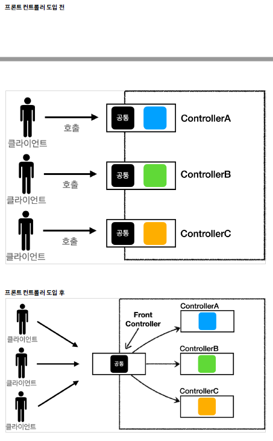
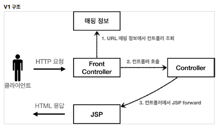
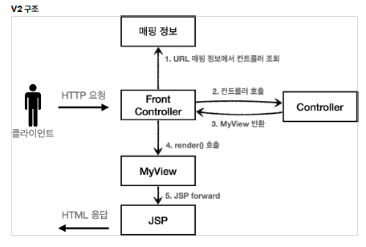
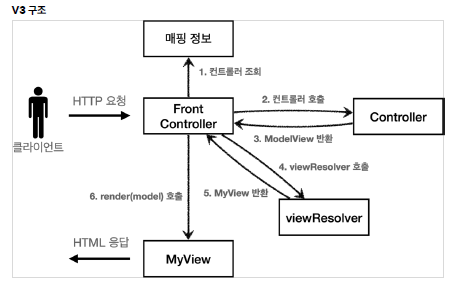
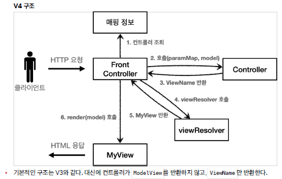
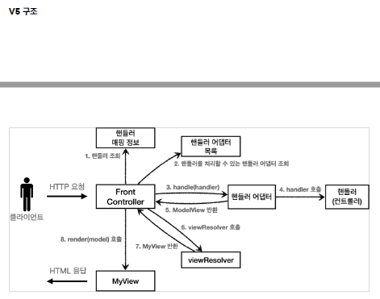

## 프론트 컨트롤러 패턴 소개

      

✅ FrontController 패턴 특징      
- 프론트 컨트롤러 서블릿 하나로 클라이언트의 요청을 받음      
- 프론트 컨트롤러가 요청에 맞는 컨트롤러를 찾아서 호출      
- 공통 처리 가능      
- 프론트 컨트롤러를 제외한 나머지 컨트롤러는 서블릿을 사용하지 않아도 됨      

<br/>

## 프론트 컨트롤러 도입 - v1

      

- controllerV1 (interface)      

```java
public interface ControllerV1 {

    void process(HttpServletRequest request, HttpServletResponse response) throws ServletException, IOException;

}// end interface
```

- 회원 등록 controller      

```java
public class MemberFormControllerV1 implements ControllerV1 {

    @Override
    public void process(HttpServletRequest request, HttpServletResponse response) throws ServletException, IOException {
        String viewPath = "/WEB-INF/views/new-form.jsp";
        RequestDispatcher dispatcher = request.getRequestDispatcher(viewPath);
        dispatcher.forward(request, response);
    }// process

}//end class
```

- 회원 저장 controller →      
- 회원 목록 controller →      
- 프론트 controller      

```java
@WebServlet(name = "frontControllerV1", urlPatterns = "/front-controller/v1/*")
public class FrontControllerV1 extends HttpServlet {

    private Map<String, ControllerV1> controllerMap = new HashMap<>();

    public FrontControllerV1() {
        controllerMap.put("/front-controller/v1/members/new-form", new MemberFormControllerV1());
        controllerMap.put("/front-controller/v1/members/save", new MemberSaveControllerV1());
        controllerMap.put("/front-controller/v1/members", new MemberListControllerV1());
    }// constructor

    @Override
    protected void service(HttpServletRequest request, HttpServletResponse response) throws ServletException, IOException {
        System.out.println("FrontControllerV1.service");

        // /front-controller/v1/members
        String requestURI = request.getRequestURI();

//        ControllerV1 controller = new MemberListControllerV1();
        ControllerV1 controller = controllerMap.get(requestURI);
        if (controller == null){
            response.setStatus(HttpServletResponse.SC_NOT_FOUND);
            return;
        }// if

        controller.process(request, response);

    }// service

}// end class
```

<br/>

✅ controllerMap      
- key: 매핑 URL      
- value: 호출될 컨트롤러      

<br/>

## View 분리 - v2

      

- MyView      
뷰 객체는 이후 다른 버전에서도 함께 사용하므로 패키지 위치를 frontcontroller 에 두었다.      

```java
public class MyView {
    private String viewPath;

    public MyView(String viewPath) {
        this.viewPath = viewPath;
    }// constructor

    public void render(HttpServletRequest request, HttpServletResponse response) throws ServletException, IOException {
        RequestDispatcher dispatcher = request.getRequestDispatcher(viewPath);
        dispatcher.forward(request, response);
    }// render
    
}// end class
```

- ControllerV2      

```java
public interface ControllerV2 {

    MyView process(HttpServletRequest request, HttpServletResponse response) throws ServletException, IOException;

}// end interface
```

- 회원등록 폼      

```java
public class MemberFormControllerV2 implements ControllerV2 {

    @Override
    public MyView process(HttpServletRequest request, HttpServletResponse response) throws ServletException, IOException {
        return new MyView("/WEB-INF/views/new-form.jsp");
    }// process

}// end class
```

- 회원 저장 →      
- 회원 목록 →      
- 프론트 컨트롤러 V2      

```java
@WebServlet(name = "frontControllerV2", urlPatterns = "/front-controller/v2/*")
public class FrontControllerServletV2 extends HttpServlet {

    private Map<String, ControllerV2> controllerMap = new HashMap<>();

    public FrontControllerServletV2() {
        controllerMap.put("/front-controller/v2/members/new-form", new MemberFormControllerV2());
        controllerMap.put("/front-controller/v2/members/save", new MemberSaveControllerV2());
        controllerMap.put("/front-controller/v2/members", new MemberListControllerV2());
    }// constructor

    @Override
    protected void service(HttpServletRequest request, HttpServletResponse response) throws ServletException, IOException {
        System.out.println("FrontControllerV2.service");

        String requestURI = request.getRequestURI();

        ControllerV2 controller = controllerMap.get(requestURI);
        if (controller == null){
            response.setStatus(HttpServletResponse.SC_NOT_FOUND);
            return;
        }// if

        MyView view = controller.process(request, response);
        view.render(request, response);

    }// service

}// end class
```
<br/>

## Model 추가 - v3

- 서블릿 종속성 제거      
- 뷰 이름 중복 제거      

    

- ModelView    

```java
@Getter
@Setter
public class ModelView {
    private String viewName;
    private Map<String, Object> model = new HashMap<>();

    public ModelView(String viewName) {
        this.viewName = viewName;
    }// constructor
    
}// end class
```

- ControllerV3 (interface)    

```java
public interface ControllerV3 {

    ModelView process(Map<String, String> paramMap);
    
}// end interface
```

- 회원 등록 폼    

```java
public class MemberFormControllerV3 implements ControllerV3 {

    @Override
    public ModelView process(Map<String, String> paramMap) {
        return new ModelView("new-form");
    }// process
    
}// end class
```

- 회원 저장 →    
- 회원 목록 →    
- 프론트 컨트롤러 V3    

```java
@WebServlet(name = "frontControllerV3", urlPatterns = "/front-controller/v3/*")
public class FrontControllerServletV3 extends HttpServlet {

    private Map<String, ControllerV3> controllerMap = new HashMap<>();

    public FrontControllerServletV3() {
        controllerMap.put("/front-controller/v3/members/new-form", new MemberFormControllerV3());
        controllerMap.put("/front-controller/v3/members/save", new MemberSaveControllerV3());
        controllerMap.put("/front-controller/v3/members", new MemberListControllerV3());
    }// constructor

    @Override
    protected void service(HttpServletRequest request, HttpServletResponse response) throws ServletException, IOException {
        System.out.println("FrontControllerV3.service");

        String requestURI = request.getRequestURI();

        ControllerV3 controller = controllerMap.get(requestURI);
        if (controller == null){
            response.setStatus(HttpServletResponse.SC_NOT_FOUND);
            return;
        }// if

        // paramMap

        Map<String, String> paramMap = createParamMap(request);

        ModelView mv = controller.process(paramMap);

        String viewName = mv.getViewName();// 논리이름 new-form
        MyView view = viewResolver(viewName);

        view.render(mv.getModel(), request, response);
    }// service

    private MyView viewResolver(String viewName) {
        return new MyView("/WEB-INF/views/" + viewName + ".jsp");
    }// viewResolver

    private Map<String, String> createParamMap(HttpServletRequest request) {
        Map<String, String> paramMap = new HashMap<>();

        request.getParameterNames().asIterator()
                .forEachRemaining(paramName -> paramMap.put(paramName, request.getParameter(paramName)));

        return paramMap;
    }// createParamMap

}// end class
```
    
- MyView 수정    

```java
public class MyView {
    private String viewPath;    // "/WEB-INF/views/new-form.jsp"

    public MyView(String viewPath) {
        this.viewPath = viewPath;
    }// constructor

    public void render(HttpServletRequest request, HttpServletResponse response) throws ServletException, IOException {
        RequestDispatcher dispatcher = request.getRequestDispatcher(viewPath);
        dispatcher.forward(request, response);
    }// render

    public void render(Map<String, Object> model, HttpServletRequest request, HttpServletResponse response) throws ServletException, IOException {
        modelToRequestAttribute(model, request);
        RequestDispatcher dispatcher = request.getRequestDispatcher(viewPath);
        dispatcher.forward(request, response);
    }

    private void modelToRequestAttribute(Map<String, Object> model, HttpServletRequest request) {
        model.forEach((key, value) -> request.setAttribute(key, value));
    }// modelToRequestAttribute

}// end class
```
<br/>

✅ 뷰 리졸버    
`MyView view = viewResolver(viewName)`    
컨트롤러가 반환한 논리 뷰 이름을 실제 물리 뷰 경로로 변경한다. 그리고 실제 물리 경로가 있는 MyView 객체를 반환한다.    
- 논리 뷰 이름: members    
- 물리 뷰 경로: `/WEB-INF/views/members.jsp`    
<br/>

`view.render(mv.getModel(), request, response)`    
- 뷰 객체를 통해서 HTML 화면을 렌더링 한다.    
- 뷰 객체의 render() 는 모델 정보도 함께 받는다.    
- JSP는 `request.getAttribute()` 로 데이터를 조회하기 때문에, 모델의 데이터를 꺼내서 `request.setAttribute()` 로 담아둔다.    
- JSP로 포워드 해서 JSP를 렌더링 한다.    

<br/>

## 단순하고 실용적인 컨트롤러 - v4

      

✅ 모델 객체 전달      
`Map<String, Object> model = new HashMap<>(); //추가`       모델 객체를 프론트 컨트롤러에서 생성해서 넘겨준다. 컨트롤러에서 모델 객체에 값을 담으면 여기에 그대로 담겨있게 된다.      
<br/>

✅ 뷰의 논리 이름을 직접 반환      

<br/>

## 유연한 컨트롤러1 - v5 (v3)

- 어댑터 패턴      
ControllerV3 , ControllerV4 는 완전히 다른 인터페이스이기 때문에 호환이 불가능하다. 이럴 때 사용하는 것이 바로 **어댑터**이다.      

      

- 핸들러 어댑터: 중간에 어댑터 역할을 하는 어댑터가 추가되었는데 이름이 핸들러 어댑터이다. 여기서 어댑터 역할을 해주는 덕분에 다양한 종류의 컨트롤러를 호출할 수 있다.      
- 핸들러: 컨트롤러의 이름을 더 넓은 범위인 핸들러로 변경했다. 그 이유는 이제 어댑터가 있기 때문에 꼭 컨트롤러의 개념 뿐만 아니라 어떠한 것이든 해당하는 종류의 어댑터만 있으면 다 처리할 수 있기 때문이다.      
<br/>

- MyHandlerAdapter      

```java
public interface MyHandlerAdapter {

    boolean supports(Object handler);

    ModelView handle(HttpServletRequest request, HttpServletResponse response, Object handler) throws ServletException, IOException;

}// end interface
```

`boolean supports(Object handler)`      
- handler는 컨트롤러를 말한다.      
- 어댑터가 해당 컨트롤러를 처리할 수 있는지 판단하는 메서드다.      
<br/>

`ModelView handle(HttpServletRequest request, HttpServletResponse response, Object handler)`      
- 어댑터는 실제 컨트롤러를 호출하고, 그 결과로 ModelView를 반환해야 한다.      
- 실제 컨트롤러가 ModelView를 반환하지 못하면, 어댑터가 ModelView를 직접 생성해서라도 반환해야 한다.      
- 이전에는 프론트 컨트롤러가 실제 컨트롤러를 호출했지만 이제는 이 어댑터를 통해서 실제 컨트롤러가 호출된다.      
<br/>

- ControllerV3HandlerAdapter

```java
public class ControllerV3HandlerAdapter implements MyHandlerAdapter {
    @Override
    public boolean supports(Object handler) {
        return (handler instanceof ControllerV3);   // controllerV3을 처리할 수 있는 어댑터
    }// supports

    @Override
    public ModelView handle(HttpServletRequest request, HttpServletResponse response, Object handler) throws ServletException, IOException {
        ControllerV3 controller = (ControllerV3) handler;

        Map<String, String> paramMap = createParamMap(request);
        ModelView mv = controller.process(paramMap);

        return mv;

        /*
            handler를 컨트롤러 V3로 변환한 다음에 V3 형식에 맞도록 호출한다.
            supports() 를 통해 ControllerV3 만 지원하기 때문에 타입 변환은 걱정없이 실행해도 된다.
            ControllerV3는 ModelView를 반환하므로 그대로 ModelView를 반환하면 된다.
        */

    }// handle

    private Map<String, String> createParamMap(HttpServletRequest request) {
        Map<String, String> paramMap = new HashMap<>();
        request.getParameterNames().asIterator()
                        .forEachRemaining(paramName -> paramMap.put(paramName, request.getParameter(paramName)));
        return paramMap;
    }// createParamMap

}// end class
```

- FrontControllerServletV5      

```java
@WebServlet(name = "frontControllerServletV5", urlPatterns = "/front-controller/v5/*")
public class FrontControllerServletV5 extends HttpServlet {

    private final Map<String, Object> handlerMappingMap = new HashMap<>();
    private final List<MyHandlerAdapter> handlerAdapters = new ArrayList<>();

    public FrontControllerServletV5() {
        initHandlerMappingMap();    // handler 매핑 초기화
        initHandlerAdapters();      // 어댑터 초기화
    }// constructor

    private void initHandlerMappingMap() {
        handlerMappingMap.put("/front-controller/v5/v3/members/new-form", new MemberFormControllerV3());
        handlerMappingMap.put("/front-controller/v5/v3/members/save", new MemberSaveControllerV3());
        handlerMappingMap.put("/front-controller/v5/v3/members", new MemberListControllerV3());
    }// initHandlerMappingMap

    private void initHandlerAdapters() {
        handlerAdapters.add(new ControllerV3HandlerAdapter());
    } // initHandlerAdapters

    @Override
    protected void service(HttpServletRequest request, HttpServletResponse response) throws ServletException, IOException {
        System.out.println("FrontControllerServletV5.service");

        //MemberFormControllerV3
        // handler 호출
        Object handler = getHandler(request);
        if (handler == null){
            response.setStatus(HttpServletResponse.SC_NOT_FOUND);
            return;
        }// if

        // ControllerV3HandlerAdapter
        // handlerAdapter 목록 불러오기 (루프 돌려서 찾기) , 핸들러 어댑터 호출
        MyHandlerAdapter adapter = getHandlerAdapter(handler);

        // 핸들러 호출
        ModelView mv = adapter.handle(request, response, handler);

        String viewName = mv.getViewName();// 논리이름 new-form
        MyView view = viewResolver(viewName);

        view.render(mv.getModel(), request, response);

    }// service

    private Object getHandler(HttpServletRequest request) {
        String requestURI = request.getRequestURI();
        return handlerMappingMap.get(requestURI);
    }// getHandler

    private MyHandlerAdapter getHandlerAdapter(Object handler) {
        //MemberFormControllerV3
        for (MyHandlerAdapter adapter : handlerAdapters) {
            if (adapter.supports(handler)){
                return adapter;
            }// if
        }// for
        throw new IllegalArgumentException("handler adapter를 찾을 수 없습니다. handler = " + handler);
    }// getHandlerAdapter

    private MyView viewResolver(String viewName) {
        return new MyView("/WEB-INF/views/" + viewName + ".jsp");
    }// viewResolver

}// end class
```

<br/>

## 유연한 컨트롤러2 - v5 (v4)

- ControllerV4HandlerAdapter

```java
public class ControllerV4HandlerAdapter implements MyHandlerAdapter {

    @Override
    public boolean supports(Object handler) {
        return (handler instanceof ControllerV4);
    }// supports

    @Override
    public ModelView handle(HttpServletRequest request, HttpServletResponse response, Object handler) throws ServletException, IOException {
        ControllerV4 controller = (ControllerV4) handler;

        Map<String, String> paramMap = createParamMap(request);
        HashMap<String, Object> model = new HashMap<>();

        String viewName = controller.process(paramMap, model);

        ModelView mv = new ModelView(viewName);
        mv.setModel(model);

        return mv;
    }// handle

    private Map<String, String> createParamMap(HttpServletRequest request) {
        Map<String, String> paramMap = new HashMap<>();
        request.getParameterNames().asIterator()
                .forEachRemaining(paramName -> paramMap.put(paramName, request.getParameter(paramName)));
        return paramMap;
    }// createParamMap

}// end class
```

```java
public boolean supports(Object handler) {
	return (handler instanceof ControllerV4);
}
```
