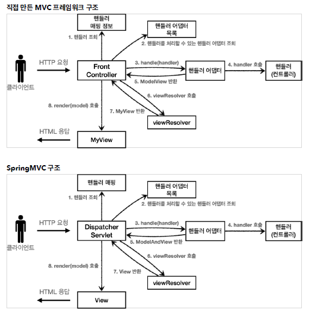
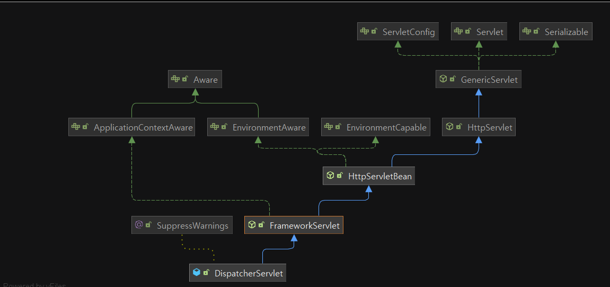
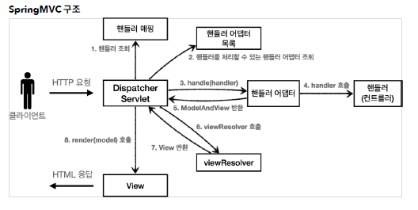
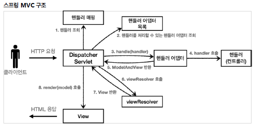
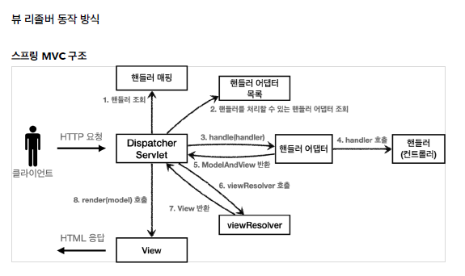

# 스프링 MVC - 구조 이해

## 스프링 MVC 전체 구조

      

✅ DispatcherServlet 구조 살펴보기      
`org.springframework.web.servlet.DispatcherServlet`      

      

- 스프링 부트는 DispacherServlet 을 서블릿으로 자동으로 등록하면서 모든 경로( urlPatterns="/")에 대해서 매핑한다.      
<br/>
- FrameworkServlet.service() 를 시작으로 여러 메서드가 호출되면서 DispacherServlet.doDispatch() 가 호출된다.      
- DispacherServlet.doDispatch()      

```java
protected void doDispatch(HttpServletRequest request, HttpServletResponse response) throws Exception {
        
				HttpServletRequest processedRequest = request;
        HandlerExecutionChain mappedHandler = null;
        ModelAndView mv = null;

        // 1. 핸들러 조회
        mappedHandler = getHandler(processedRequest);
        if (mappedHandler == null) {
            noHandlerFound(processedRequest, response);
            return;
        }

        // 2. 핸들러 어댑터 조회 - 핸들러를 처리할 수 있는 어댑터
        HandlerAdapter ha = getHandlerAdapter(mappedHandler.getHandler());

        // 3. 핸들러 어댑터 실행 -> 4. 핸들러 어댑터를 통해 핸들러 실행 -> 5. ModelAndView 반환
        mv = ha.handle(processedRequest, response, mappedHandler.getHandler());

        processDispatchResult(processedRequest, response, mappedHandler, mv,
                dispatchException);
    }

    private void processDispatchResult(HttpServletRequest request, HttpServletResponse response, HandlerExecutionChain mappedHandler, ModelAndView mv, Exception exception) throws Exception {
        // 뷰 렌더링 호출
        render(mv, request, response);
    }

    protected void render(ModelAndView mv, HttpServletRequest request, HttpServletResponse response) throws Exception {
        View view;
        String viewName = mv.getViewName();
        // 6. 뷰 리졸버를 통해서 뷰 찾기, 7. View 반환
        view = resolveViewName(viewName, mv.getModelInternal(), locale, request);
        // 8. 뷰 렌더링
        view.render(mv.getModelInternal(), request, response);
    }
```

      

**동작 순서**      
1. 핸들러 조회: 핸들러 매핑을 통해 요청 URL에 매핑된 핸들러(컨트롤러)를 조회한다.      
2. 핸들러 어댑터 조회: 핸들러를 실행할 수 있는 핸들러 어댑터를 조회한다.      
3. 핸들러 어댑터 실행: 핸들러 어댑터를 실행한다.      
4. 핸들러 실행: 핸들러 어댑터가 실제 핸들러를 실행한다.      
5. ModelAndView 반환: 핸들러 어댑터는 핸들러가 반환하는 정보를 ModelAndView로 변환해서 반환한다.      
6. viewResolver 호출: 뷰 리졸버를 찾고 실행한다.      
- JSP의 경우: InternalResourceViewResolver 가 자동 등록되고, 사용된다.      
7. View 반환: 뷰 리졸버는 뷰의 논리 이름을 물리 이름으로 바꾸고, 렌더링 역할을 담당하는 뷰 객체를 반환한다.      
- JSP의 경우 InternalResourceView(JstlView) 를 반환하는데, 내부에 forward() 로직이 있다.      
8. 뷰 렌더링: 뷰를 통해서 뷰를 렌더링 한다.      
<br/>

✅ 주요 인터페이스 목록      
- 핸들러 매핑: `org.springframework.web.servlet.HandlerMapping`      
- 핸들러 어댑터: `org.springframework.web.servlet.HandlerAdapter`      
- 뷰 리졸버: `org.springframework.web.servlet.ViewResolver`      
- 뷰: `org.springframework.web.servlet.View`      

<br/>

## 핸들러 매핑과 핸들러 어댑터

✅ OldController      

```java
@Component("/springmvc/old-controller")
public class OldController implements Controller {

    @Override
    public ModelAndView handleRequest(HttpServletRequest request, HttpServletResponse response) throws Exception {
        System.out.println("OldController.handleRequest");
        return null;
    }// handleRequest

}// end class
```

- @Component : 이 컨트롤러는 /springmvc/old-controller 라는 이름의 스프링 빈으로 등록되었다.      
- 빈의 이름으로 URL을 매핑할 것이다.      
<br/>

✅ 이 컨트롤러는 어떻게 호출될 수 있을까?      

      

**→ HandlerMapping(핸들러 매핑)**      
- 핸들러 매핑에서 이 컨트롤러를 찾을 수 있어야 한다.      
- 예) 스프링 빈의 이름으로 핸들러를 찾을 수 있는 핸들러 매핑이 필요하다.      
**→ HandlerAdapter(핸들러 어댑터)**      
- 핸들러 매핑을 통해서 찾은 핸들러를 실행할 수 있는 핸들러 어댑터가 필요하다.      
- 예) Controller 인터페이스를 실행할 수 있는 핸들러 어댑터를 찾고 실행해야 한다.      
<br/>

1. 핸들러 매핑으로 핸들러 조회      
2. 핸들러 어댑터 조회      
3. 핸들러 어댑터 실행      

✨ 정리 - OldController 핸들러매핑, 어댑터      
OldController 를 실행하면서 사용된 객체는 다음과 같다.      
`HandlerMapping = BeanNameUrlHandlerMapping`      
`HandlerAdapter = SimpleControllerHandlerAdapter`      

<br/>

✅ HttpRequestHandler      

```java
@Component("/springmvc/request-handler")
public class MyHttpRequestHandler implements HttpRequestHandler {

    @Override
    public void handleRequest(HttpServletRequest request, HttpServletResponse response) throws ServletException, IOException {
        System.out.println("MyHttpRequestHandler.handleRequest");
    }// handleRequest
}// end class
```

✨정리 - MyHttpRequestHandler 핸들러매핑, 어댑터      
MyHttpRequestHandler 를 실행하면서 사용된 객체는 다음과 같다.      
`HandlerMapping = BeanNameUrlHandlerMapping`      
`HandlerAdapter = HttpRequestHandlerAdapter`      

<br/>

## 뷰 리졸버

- OldController - view 조회할 수 있도록 변경      
→ 실행해보면 컨트롤러를 정상 호출되지만, Whitelabel Error Page 오류가 발생한다.      

- [application.properties] 추가      

```java
spring.mvc.view.prefix=/WEB-INF/views/
spring.mvc.view.suffix=.jsp
```

      

✅ 뷰 리졸버 - InternalResourceViewResolver      
스프링 부트는 `InternalResourceViewResolver` 라는 뷰 리졸버를 자동으로 등록하는데, 이때 application.properties 에 등록한 `spring.mvc.view.prefix` , `spring.mvc.view.suffix `설정 정보를 사용해서 등록한다.      

      


1. 핸들러 어댑터 호출      
- 핸들러 어댑터를 통해 new-form 이라는 논리 뷰 이름을 획득한다.      
2. ViewResolver 호출      
- new-form 이라는 뷰 이름으로 viewResolver를 순서대로 호출한다.      
- BeanNameViewResolver 는 new-form 이라는 이름의 스프링 빈으로 등록된 뷰를 찾아야 하는데 없다.      
- InternalResourceViewResolver 가 호출된다.      
3. InternalResourceViewResolver      
- 이 뷰 리졸버는 InternalResourceView 를 반환한다.      
4. 뷰 - InternalResourceView      
- InternalResourceView 는 JSP처럼 포워드 forward() 를 호출해서 처리할 수 있는 경우에 사용한다.      
5. view.render()      
- view.render() 가 호출되고 InternalResourceView 는 forward() 를 사용해서 JSP를 실행한다.      

<br/>

## 스프링 MVC - 시작하기

✅ @RequestMapping      
- `RequestMappingHandlerMapping`      
- `RequestMappingHandlerAdapter`      

<br/>
- SpringMemberFormControllerV1 - 회원 등록 폼      

```java
@Controller
public class SpringMemberFormControllerV1 {

    @RequestMapping("/springmvc/v1/members/new-form")
    public ModelAndView process(){
        return new ModelAndView("new-form");
    }// process

}// end class
```

- @Controller :      
　- 스프링이 자동으로 스프링 빈으로 등록한다. (내부에 @Component 애노테이션이 있어서 컴포넌트 스캔의 대상이 됨)      
　- 스프링 MVC에서 애노테이션 기반 컨트롤러로 인식한다.      
- @RequestMapping : 요청 정보를 매핑한다. 해당 URL이 호출되면 이 메서드가 호출된다. 애노테이션을 기반으로 동작하기 때문에, 메서드의 이름은 임의로 지으면 된다.      
- ModelAndView : 모델과 뷰 정보를 담아서 반환하면 된다.      
<br/>

✨ 스프링 빈 등록 방법      
1. @Controller      
2. @Component , @RequestMapping      
3. @RequestMapping, 스프링 빈 직접 등록      

```java
@Bean
	SpringMemberFormControllerV1 springMemberFormControllerV1(){
		return new SpringMemberFormControllerV1();
	}// springMemberFormControllerV1
```

- SpringMemberSaveControllerV1 - 회원 저장      

```java
@Controller
public class SpringMemberSaveControllerV1 {

    private MemberRepository memberRepository = MemberRepository.getInstance();

    @RequestMapping("/springmvc/v1/members/save")
    public ModelAndView process(HttpServletRequest request, HttpServletResponse response) {
        String username = request.getParameter("username");
        int age = Integer.parseInt(request.getParameter("age"));

        Member member = new Member(username, age);
        memberRepository.save(member);

        ModelAndView mv = new ModelAndView("save-result");
//        mv.getModel().put("member", member);
        mv.addObject("member", member);

        return mv;
    }// process

}// end class
```

<br/>

✅ mv.addObject("member", member)      
- 스프링이 제공하는 ModelAndView 를 통해 Model 데이터를 추가할 때는 addObject() 를 사용하면 된다. 이 데이터는 이후 뷰를 렌더링 할 때 사용된다.      
<br/>
- SpringMemberListControllerV1 - 회원 목록      

```java
@Controller
public class SpringMemberListControllerV1 {

    private MemberRepository memberRepository = MemberRepository.getInstance();

    @RequestMapping("/springmvc/v1/members")
    public ModelAndView process() {

        List<Member> members = memberRepository.findAll();

        ModelAndView mv = new ModelAndView("members");
//        mv.getModel().put("members", members);
        mv.addObject("members", members);

        return mv;
    }// process

}// end class
```

<br/>

## 스프링 MVC - 컨트롤러 통합

- SpringMemberControllerV2      

```java
/**
 * 클래스 단위 -> 메서드 단위
 * @RequestMapping 클래스 레벨과 메서드 레벨 조합
 */

@Controller
@RequestMapping("/springmvc/v2/members")
public class SpringMemberControllerV2 {

    private MemberRepository memberRepository = MemberRepository.getInstance();

    @RequestMapping("/new-form")
    public ModelAndView newForm() {
        return new ModelAndView("new-form");
    }// process

    @RequestMapping
    public ModelAndView members() {

        List<Member> members = memberRepository.findAll();

        ModelAndView mv = new ModelAndView("members");
//        mv.getModel().put("members", members);
        mv.addObject("members", members);

        return mv;
    }// process

    @RequestMapping("/save")
    public ModelAndView save(HttpServletRequest request, HttpServletResponse response) {
        String username = request.getParameter("username");
        int age = Integer.parseInt(request.getParameter("age"));

        Member member = new Member(username, age);
        memberRepository.save(member);

        ModelAndView mv = new ModelAndView("save-result");
//        mv.getModel().put("member", member);
        mv.addObject("member", member);

        return mv;
    }// process

}// end class
```

<br/>

## 스프링 MVC - 실용적인 방식

- SpringMemberControllerV3      

```java
/**
 * v3
 * Model 도입
 * ViewName 직접 반환
 * @RequestParam 사용
 * @RequestMapping -> @GetMapping, @PostMapping
 */
@Controller
@RequestMapping("/springmvc/v3/members")
public class SpringMemberControllerV3 {

    private MemberRepository memberRepository = MemberRepository.getInstance();

//    @RequestMapping(value = "new-form", method = RequestMethod.GET)
    @GetMapping("/new-form")
    public String newForm() {
        return "new-form";
//        return new ModelAndView("new-form");
    }// process

    @GetMapping
    public String members(Model model) {

        List<Member> members = memberRepository.findAll();

        model.addAttribute("members", members);
        return "members";
    }// process

    @PostMapping( "/save")
    public String save(
            @RequestParam("username") String username,
            @RequestParam("age") int age,
            Model model) {

        Member member = new Member(username, age);
        memberRepository.save(member);

        model.addAttribute("member", member);
        return "save-result";
    }// process

}// end class
```

<br/>

✅ Model 파라미터      
save() , members() 를 보면 Model을 파라미터로 받는 것을 확인할 수 있다. 스프링 MVC도 이런 편의 기능을 제공한다.      

<br/>

✅ @RequestParam 사용      
@RequestParam("username") 은 request.getParameter("username") 와 거의 같은 코드라 생각하면 된다.      
물론 GET 쿼리 파라미터, POST Form 방식을 모두 지원한다.      

<br/>

✅ @RequestMapping @GetMapping, @PostMapping      
@RequestMapping 은 URL만 매칭하는 것이 아니라, HTTP Method도 함께 구분할 수 있다.      