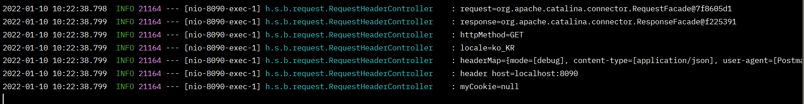
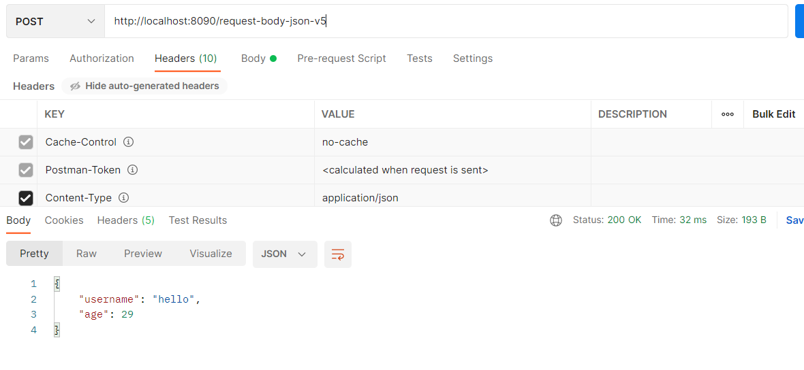
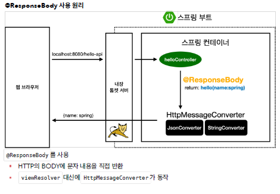
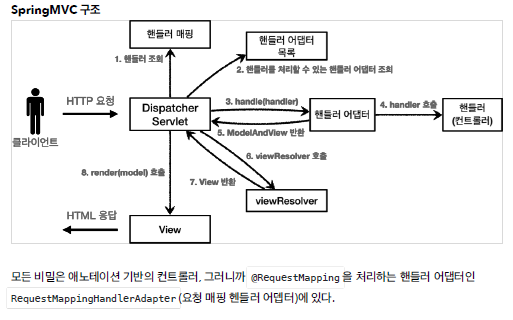
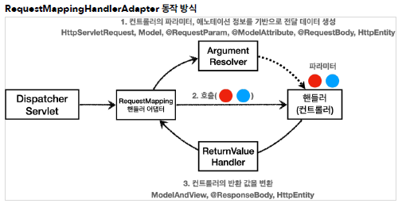
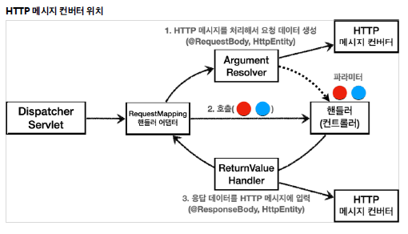

# 스프링 MVC - 기본 기능

## 프로젝트 생성

❗❗주의!     
Packaging는 War가 아니라 **Jar**를 선택해주세요. JSP를 사용하지 않기 때문에 Jar를 사용하는 것이 좋습니다.     
Jar를 사용하면 항상 내장 서버(톰캣등)을 사용하고, `webapp`경로도 사용하지 않습니다. **내장 서버 사용에 최적화** 되어 있는 기능입니다.      
War를 사용하면 내장 서버도 사용가능 하지만, 주로 외부 서버에 배포하는 목적으로 사용합니다.     

<br/>

## 로깅 간단히 알아보기

- LogTestController     

```java
//@Slf4j
@RestController
public class LogTestController {

    private final Logger log = LoggerFactory.getLogger(getClass());

    @RequestMapping("/log-test")
    public String logTest(){
        String name = "Spring";

        System.out.println("name = " + name);
        
        log.trace(" trace log={}", name);
        log.debug(" debug log={}", name);
        log.info(" info log={}", name);
        log.warn(" warn log={}", name);
        log.error(" error log={}", name);

        //로그를 사용하지 않아도 a+b 계산 로직이 먼저 실행됨, 이런 방식으로 사용하면 X
        log.debug("String concat log=" + name);

        return "ok";
    }// logTest

}// end class
```

<br/>

✅ @RestController     
- `@Controller` 는 반환 값이 String 이면 뷰 이름으로 인식된다. 그래서 **뷰를 찾고 뷰가 랜더링** 된다.     
- **@RestController** 는 반환 값으로 뷰를 찾는 것이 아니라, **HTTP 메시지 바디에 바로 입력**한다. 따라서 실행 결과로 ok 메세지를 받을 수 있다. @ResponseBody 와 관련이 있는데..     
<br/>

✅ 테스트     
- 로그가 출력되는 포멧 확인     
　- 시간, 로그 레벨, 프로세스 ID, 쓰레드 명, 클래스명, 로그 메시지     
- 로그 레벨     
　- LEVEL: TRACE > DEBUG > INFO > WARN > ERROR     
　- 개발 서버는 debug 출력     
　- 운영 서버는 info 출력     
- @Slf4j 로 변경     
<br/>

✅ 로그 레벨 설정     
- application.properties     

```java
#전체 로그 레벨 설정(기본 info)
logging.level.root=info
#hello.springmvc 패키지와 그 하위 로그 레벨 설정
logging.level.hello.springmvc=debug
```

<br/>

- log.debug("data="+data)     
로그 출력 레벨을 info로 설정해도 해당 코드에 있는 "data="+data가 실제 실행이 되어 버린다.     
결과적으로 **문자 더하기 연산**이 발생한다.     
<br/>

✅ 장점     
- 쓰레드 정보, 클래스 이름 같은 **부가 정보**를 함께 볼 수 있고, **출력 모양을 조정**할 수 있다.     
- 로그 레벨에 따라 개발 서버에서는 모든 로그를 출력하고, 운영서버에서는 출력하지 않는 등 로그를 **상황에 맞게 조절**할 수 있다.     
- 시스템 아웃 콘솔에만 출력하는 것이 아니라, **파일이나 네트워크 등, 로그를 별도의 위치에** 남길 수 있다. (설정시) 특히 파일로 남길 때는 일별, 특정 용량에 따라 **로그를 분할하는 것도 가능**하다.     
- 성능도 일반 System.out보다 좋다. (내부 버퍼링, 멀티 쓰레드 등등)     

<br/>

## 요청 매핑

- MappingController     

```java
@RestController
public class MappingController {

    private Logger log = LoggerFactory.getLogger(getClass());
    
    /**
     * 기본 요청
     * 둘다 허용 /hello-basic, /hello-basic/
     * HTTP 메서드 모두 허용 GET, HEAD, POST, PUT, PATCH, DELETE
     */
    @RequestMapping("/hello-basic")
    public String helloBasic(){
        log.info("helloBasic");
        return "ok";
    }// helloBasic

}// end class

```

→ @RequestMapping("/hello-basic")     
대부분의 속성을 배열[] 로 제공하므로 다중 설정이 가능하다. {"/hello-basic", "/hello-go"}     
<br/>

✅ HTTP 메서드 매핑 축약     
- @GetMapping     
- @PostMapping     
- @PutMapping     
- @DeleteMapping     
- @PatchMapping     

<br/>

## 요청 매핑 - API 예시

✅ 회원 관리 API     
- 회원 목록 조회: GET `/users`     
- 회원 등록: POST `/users`     
- 회원 조회: GET `/users/{userId}`     
- 회원 수정: PATCH `/users/{userId}`     
- 회원 삭제: DELETE `/users/{userId}`     
<br/>

- MappingClassController     

```java
@RestController
@RequestMapping("/mapping/users")
public class MappingClassController {

    /*
        회원 목록 조회: GET /users
        회원 등록: POST /users
        회원 조회: GET /users/{userId}
        회원 수정: PATCH /users/{userId}
        회원 삭제: DELETE /users/{userId}
     */

    @GetMapping
    public String user(){
        return "get users";
    }// user

    @PostMapping
    public String addUser(){
        return "post user";
    }// addUser

    @GetMapping("/{userId}")
    public String findUser(@PathVariable String userId){
        return "get userId = " + userId;
    }// findUser

    @PatchMapping("/{userId}")
    public String updateUser(@PathVariable String userId){
        return "update userId = " + userId;
    }// updateUser

    @DeleteMapping("/{userId}")
    public String deleteUser(@PathVariable String userId){
        return "delete userId = " + userId;
    }// deleteUser

}// end class
```

<br/>

## HTTP 요청 - 기본, 헤더 조회

```java
@Slf4j
@RestController
public class RequestHeaderController {

    @RequestMapping("/headers")
    public String headers(HttpServletRequest request,
                          HttpServletResponse response,
                          HttpMethod httpMethod,
                          Locale locale,
                          @RequestHeader MultiValueMap<String, String> headerMap,
                          @RequestHeader("host") String host,
                          @CookieValue(value = "myCookie", required = false) String cookie
                          ){

        log.info("request={}", request);
        log.info("response={}", response);
        log.info("httpMethod={}", httpMethod);
        log.info("locale={}", locale);
        log.info("headerMap={}", headerMap);
        log.info("header host={}", host);
        log.info("myCookie={}", cookie);

        return "ok";

    }// headers

}// end class
```

      

<br/>

`HttpMethod` : HTTP 메서드를 조회한다. `org.springframework.http.HttpMethod`      
`@RequestHeader MultiValuMap<String, String> headerMap`      
: 모든 HTTP 헤더를 MultiValueMap 형식으로 조회한다.      
`@RequestHeader("host") String host` : 특정 HTTP 헤더를 조회한다.      
- 속성      
　- 필수 값 여부: required      
　- 기본 값 속성: defaultValue      
`@CookieValue(value = "myCookie", required = false) String cookie` : 특정 쿠키를 조회한다.      
- 속성      
　- 필수 값 여부: required      
　- 기본 값: defaultValue      
<br/>

`MultiValueMap`      
- MAP과 유사한데, 하나의 키에 여러 값을 받을 수 있다.      
- HTTP header, HTTP 쿼리 파라미터와 같이 하나의 키에 여러 값을 받을 때 사용한다.      
keyA=value1&keyA=value2      

```java
MultiValueMap<String, String> map = new LinkedMultiValueMap();
map.add("keyA", "value1");
map.add("keyA", "value2");
//[value1,value2]
List<String> values = map.get("keyA");
```

<br/>

## HTTP 요청 파라미터 - 쿼리 파라미터, HTML Form

클라이언트에서 서버로 요청 데이터를 전달할 때는 주로 다음 3가지 방법을 사용한다.      
- GET - 쿼리 파라미터      
- POST - HTML Form      
- HTTP message body에 데이터를 직접 담아서 요청      
<br/>

- RequestParamController      

```java
@Slf4j
@Controller
public class RequestParamController {

    /*
        반환 타입이 없으면서 이렇게 응답에 값을 직접 집어넣으면, view 조회X
     */

    @RequestMapping("/request-param-v1")
    public void requestParamV1(HttpServletRequest request, HttpServletResponse response) throws IOException {
        String username = request.getParameter("username");
        int age = Integer.parseInt(request.getParameter("age"));
        log.info("username={} , age={}", username, age);

        response.getWriter().write("ok");
    }// requestParamV1

}// end class
```

<br/>

## HTTP 요청 파라미터 - @RequestParam      

```java
@Slf4j
@Controller
public class RequestParamController {

    /*
        반환 타입이 없으면서 이렇게 응답에 값을 직접 집어넣으면, view 조회X
     */

    @RequestMapping("/request-param-v1")
    public void requestParamV1(HttpServletRequest request, HttpServletResponse response) throws IOException {
        String username = request.getParameter("username");
        int age = Integer.parseInt(request.getParameter("age"));
        log.info("username={} , age={}", username, age);

        response.getWriter().write("ok");
    }// requestParamV1

    /**
     * @RequestParam 사용
     * - 파라미터 이름으로 바인딩
     * @ResponseBody 추가
     * - View 조회를 무시하고, HTTP message body에 직접 해당 내용 입력
     */
    @ResponseBody   // view 조회를 무시하고, HTTP message body 에 직접 해당 내용 입력
    @RequestMapping("/request-param-v2")
    public String requestParamV2(
            @RequestParam("username") String memberName,
            @RequestParam("age") int memberAge){

        log.info("username={} , age={}", memberName, memberAge);
        return "ok";
    }// requestParamV2

    /**
     * @RequestParam 사용
     * HTTP 파라미터 이름이 변수 이름과 같으면 @RequestParam(name="xx") 생략 가능
     */
    @ResponseBody
    @RequestMapping("/request-param-v3")
    public String requestParamV3(
            @RequestParam String username,
            @RequestParam int age){

        log.info("username={} , age={}", username, age);
        return "ok";
    }// requestParamV3

    /**
     * @RequestParam 사용
     * String, int 등의 단순 타입이면 @RequestParam 도 생략 가능
     */
    @ResponseBody
    @RequestMapping("/request-param-v4")
    public String requestParamV4(String username, int age){
        log.info("username={} , age={}", username, age);
        return "ok";
    }// requestParamV4

    /**
     * @RequestParam.required
     * /request-param -> username이 없으므로 예외
     *
     * 주의!
     * /request-param?username= -> 빈문자로 통과
     *
     * 주의!
     * /request-param
     * int age -> null을 int에 입력하는 것은 불가능, 따라서 Integer 변경해야 함(또는 다음에 나오는
    defaultValue 사용)
     */
    @ResponseBody
    @RequestMapping("/request-param-required")
    public String requestParamRequired(
            @RequestParam(required = true) String username,
            @RequestParam(required = false) Integer age){

        log.info("username={} , age={}", username, age);
        return "ok";

    }// requestParamRequired

    /**
     * @RequestParam
     * - defaultValue 사용
     *
     * 참고: defaultValue는 빈 문자의 경우에도 적용
     * /request-param?username=
     */
    @ResponseBody
    @RequestMapping("/request-param-default")
    public String requestParamDefault(
            @RequestParam(required = true, defaultValue = "guest") String username,
            @RequestParam(required = false, defaultValue = "-1") Integer age){

        log.info("username={} , age={}", username, age);
        return "ok";

    }// requestParamDefault

    
    /**
     * @RequestParam Map, MultiValueMap
     * Map(key=value)
     * MultiValueMap(key=[value1, value2, ...] ex) (key=userIds, value=[id1, id2])
     */
    @ResponseBody
    @RequestMapping("/request-param-map")
    public String requestParamMap(@RequestParam Map<String, Object> paramMap){

        log.info("username={} , age={}", paramMap.get("username"), paramMap.get("age"));
        return "ok";

    }// requestParamMap

}// end class
```

<br/>

## HTTP 요청 파라미터 - @ModelAttribute

- @ModelAttribute 적용 - modelAttributeV1      

```java

    @ResponseBody
    @RequestMapping("/model-attribute-v1")
    public String modelAttributeV1(@RequestParam String username, @RequestParam int age) {
        HelloData helloData = new HelloData();
        helloData.setUsername(username);
        helloData.setAge(age);

        log.info("username={} , age={}", helloData.getUsername(), helloData.getAge());

        return "ok";
    }// modelAttributeV1
```

—>      

```java
/**
     * @ModelAttribute 사용
     * 참고: model.addAttribute(helloData) 코드도 함께 자동 적용됨, 뒤에 model을 설명할 때
    자세히 설명
     */
    @ResponseBody
    @RequestMapping("/model-attribute-v1")
    public String modelAttributeV1(@ModelAttribute HelloData helloData) {

        log.info("username={} , age={}", helloData.getUsername(), helloData.getAge());

        return "ok";
    }// modelAttributeV1
```

→       
✅ 스프링MVC는 @ModelAttribute 가 있으면 다음을 실행한다.      
- HelloData 객체를 생성한다.      
- 요청 파라미터의 이름으로 HelloData 객체의 프로퍼티를 찾는다. 그리고 해당 프로퍼티의 setter를 호출해서 파라미터의 값을 입력(바인딩) 한다.      
- 예) 파라미터 이름이 username 이면 setUsername() 메서드를 찾아서 호출하면서 값을 입력한다      
<br/>

- @ModelAttribute 생략 - modelAttributeV2      

```java
/**
     * @ModelAttribute 생략 가능
     * String, int 같은 단순 타입 = @RequestParam
     * argument resolver 로 지정해둔 타입 외 = @ModelAttribute
     */
    @ResponseBody
    @RequestMapping("/model-attribute-v2")
    public String modelAttributeV2(HelloData helloData) {

        log.info("username={} , age={}", helloData.getUsername(), helloData.getAge());

        return "ok";
    }// modelAttributeV2
```

<br/>

## HTTP 요청 메시지 - 단순 텍스트

- RequestBodyStringController      

```java
@PostMapping("/request-body-string-v1")
    public void requestBodyString(HttpServletRequest request, HttpServletResponse response) throws IOException {
        ServletInputStream inputStream = request.getInputStream();
        String messageBody = StreamUtils.copyToString(inputStream, StandardCharsets.UTF_8);

        log.info("messageBody={}", messageBody);

        response.getWriter().write("ok");
    } // requestBodyString
```

<br/>

- Input, Output 스트림, Reader - requestBodyStringV2      

```java
/**
     * InputStream(Reader): HTTP 요청 메시지 바디의 내용을 직접 조회
     * OutputStream(Writer): HTTP 응답 메시지의 바디에 직접 결과 출력
     */
    @PostMapping("/request-body-string-v2")
    public void requestBodyStringV2(InputStream inputStream, Writer responsWriter) throws IOException {
        String messageBody = StreamUtils.copyToString(inputStream, StandardCharsets.UTF_8);
        log.info("messageBody={}", messageBody);
        responsWriter.write("ok");
    } // requestBodyStringV2
```

<br/>

- HttpEntity - requestBodyStringV3      

```java
/**
     * HttpEntity: HTTP header, body 정보를 편라하게 조회
     * - 메시지 바디 정보를 직접 조회(@RequestParam X, @ModelAttribute X)
     * - HttpMessageConverter 사용 -> StringHttpMessageConverter 적용
     *
     * 응답에서도 HttpEntity 사용 가능
     * - 메시지 바디 정보 직접 반환(view 조회X)
     * - HttpMessageConverter 사용 -> StringHttpMessageConverter 적용
     */
    @PostMapping("/request-body-string-v3")
    public HttpEntity<String> requestBodyStringV3(HttpEntity<String> httpEntity) throws IOException {

        String messageBody = httpEntity.getBody();
        log.info("messageBody={}", messageBody);

        return new HttpEntity<>("ok");
    } // requestBodyStringV3
```

<br/>
- @RequestBody - requestBodyStringV4      

```java
/**
     * @RequestBody
     * - 메시지 바디 정보를 직접 조회(@RequestParam X, @ModelAttribute X)
     * - HttpMessageConverter 사용 -> StringHttpMessageConverter 적용
     *
     * @ResponseBody
     * - 메시지 바디 정보 직접 반환(view 조회X)
     * - HttpMessageConverter 사용 -> StringHttpMessageConverter 적용
     */
    @ResponseBody
    @PostMapping("/request-body-string-v4")
    public String requestBodyStringV4(@RequestBody String messageBody) throws IOException {

        log.info("messageBody={}", messageBody);

        return "ok";
   } // requestBodyStringV4
```

<br/>

## HTTP 요청 메시지 - JSON

- RequestBodyJsonController      

```jsx
/**
 * {"username":"hello", "age":20}
 * content-type: application/json
 */
@Slf4j
@Controller
public class RequestBodyJsonController {

    private ObjectMapper objectMapper = new ObjectMapper();

    @PostMapping("/request-body-json-v1")
    public void requestBodyJsonV1(HttpServletRequest request, HttpServletResponse response) throws IOException {
        ServletInputStream inputStream = request.getInputStream();
        String messageBody = StreamUtils.copyToString(inputStream, StandardCharsets.UTF_8);

        log.info("messageBody={}", messageBody);
        HelloData helloData = objectMapper.readValue(messageBody, HelloData.class);

        log.info("username={}, age={}", helloData.getUsername(), helloData.getAge());

        response.getWriter().write("ok");

    }// requestBodyJsonV1

}// end class
```

<br/>

- requestBodyJsonV2 - @RequestBody 문자 변환      

```jsx
/**
     * @RequestBody
     * HttpMessageConverter 사용 -> StringHttpMessageConverter 적용
     *
     * @ResponseBody
     * - 모든 메서드에 @ResponseBody 적용
     * - 메시지 바디 정보 직접 반환(view 조회X)
     * - HttpMessageConverter 사용 -> StringHttpMessageConverter 적용
     */
    @ResponseBody
    @PostMapping("/request-body-json-v2")
    public String requestBodyJsonV2(@RequestBody String messageBody) throws IOException {

        log.info("messageBody={}", messageBody);
        HelloData helloData = objectMapper.readValue(messageBody, HelloData.class);
        log.info("username={}, age={}", helloData.getUsername(), helloData.getAge());

        return "ok";
    }// requestBodyJsonV2
```

<br/>
- requestBodyJsonV3 - @RequestBody 객체 변환      

```jsx
/**
     * @RequestBody 생략 불가능(@ModelAttribute 가 적용되어 버림)
     * HttpMessageConverter 사용 -> MappingJackson2HttpMessageConverter (contenttype:
    application/json)
     *
     */
    @ResponseBody
    @PostMapping("/request-body-json-v3")
    public String requestBodyJsonV3(@RequestBody HelloData helloData){

        log.info("username={}, age={}", helloData.getUsername(), helloData.getAge());
        return "ok";

    }// requestBodyJsonV3
```

<br/>

❗스프링은 @ModelAttribute , @RequestParam 해당 생략시 다음과 같은 규칙을 적용한다.      
- String , int , Integer 같은 단순 타입 = @RequestParam      
- 나머지 = @ModelAttribute (argument resolver 로 지정해둔 타입 외)      

<br/>

- requestBodyJsonV4 - HttpEntity      

```jsx
@ResponseBody
    @PostMapping("/request-body-json-v4")
    public String requestBodyJsonV4(HttpEntity<HelloData> httpEntity){

        HelloData helloData = httpEntity.getBody();
        log.info("username={}, age={}", helloData.getUsername(), helloData.getAge());
        return "ok";

    }// requestBodyJsonV4
```

<br/>
- requestBodyJsonV5      

```jsx
/**
     * @RequestBody 생략 불가능(@ModelAttribute 가 적용되어 버림)
     * HttpMessageConverter 사용 -> MappingJackson2HttpMessageConverter (contenttype:
    application/json)
     *
     * @ResponseBody 적용
     * - 메시지 바디 정보 직접 반환(view 조회X)
     * - HttpMessageConverter 사용 -> MappingJackson2HttpMessageConverter 적용
    (Accept: application/json)
     */
    @ResponseBody
    @PostMapping("/request-body-json-v5")
    public HelloData requestBodyJsonV5(@RequestBody HelloData helloData){

        log.info("username={}, age={}", helloData.getUsername(), helloData.getAge());
        return helloData;

    }// requestBodyJsonV5
```

     

✅ @RequestBody 요청     
- JSON 요청 HTTP 메시지 컨버터 객체     
✅ @ResponseBody 응답     
- 객체 HTTP 메시지 컨버터 JSON 응답     

<br/>

## HTTP 응답 - 정적 리소스, 뷰 템플릿

✅ 정적 리소스     
예) 웹 브라우저에 정적인 HTML, css, js을 제공할 때는, 정적 리소스를 사용한다.     
- src/main/resources 는 리소스를 보관하는 곳     
- /static , /public , /resources , /META-INF/resources     
- `src/main/resources/static/basic/hello-form.html` → http://localhost:8080/basic/hello-form.html     

<br/>

✅ 뷰 템플릿 사용     
예) 웹 브라우저에 동적인 HTML을 제공할 때는 뷰 템플릿을 사용한다.     
- 뷰 템플릿 경로 ( `src/main/resources/templates` )     
- 뷰 템플릿 생성 ( `src/main/resources/templates/response/hello.html` )     

```html
<!DOCTYPE html>
<html xmlns:th="http://www.thymeleaf.org">
<head>
    <meta charset="UTF-8">
    <title>Title</title>
</head>
<body>
<p th:text="${data}">empty</p>
</body>
</html>
```

- ResponseViewController - 뷰 템플릿을 호출하는 컨트롤러     

```jsx
@Controller
public class ResponseViewController {

    @RequestMapping("/response-view-v1")
    public ModelAndView responseViewV1(){
        ModelAndView mav = new ModelAndView("response/hello")
                .addObject("data", "hello!");

        return mav;
    }// responseViewV1

    @RequestMapping("/response-view-v2")
    public String responseViewV2(Model model){
        model.addAttribute("data", "hello!");
        return "response/hello";
    }// responseViewV2

    @RequestMapping("/response/hello")
    public void responseViewV3(Model model){
        model.addAttribute("data", "hello!");
    }// responseViewV3

}// end class
```

<br/>
✅ HTTP 메시지 사용     
HTTP API를 제공하는 경우에는 HTML이 아니라 데이터를 전달해야 하므로, HTTP 메시지 바디에 JSON 같은 형식으로 데이터를 실어 보낸다.     
<br/>

✅ Thymeleaf 스프링 부트 설정     
- build.gradle     

```jsx
`implementation 'org.springframework.boot:spring-boot-starter-thymeleaf'`
```

- application.properties     

```jsx
spring.thymeleaf.prefix=classpath:/templates/
spring.thymeleaf.suffix=.html
```

<br/>

## HTTP 응답 - HTTP API, 메시지 바디에 직접 입력

- ResponseBodyController     

```jsx
@Slf4j
@Controller
//@RestController
public class ResponseBodyController {

    /**
     * 서블릿을 직접 다룰 때 처럼
     * HttpServletResponse 객체를 통해서 HTTP 메시지 바디에 직접 ok 응답 메시지를 전달한다.
     */
    @GetMapping("/response-body-string-v1")
    public void responseBodyV1(HttpServletResponse response) throws IOException {
        response.getWriter().write("ok");
    }// responseBodyV1

    /**
     * HttpEntity, ResponseEntity(Http Status 추가)
     * @return
     */
    @GetMapping("/response-body-string-v2")
    public ResponseEntity<String> responseBodyV2() {
        return new ResponseEntity<>("ok", HttpStatus.OK);
    }// responseBodyV2

    @ResponseBody
    @GetMapping("/response-body-string-v3")
    public String responseBodyV3() {
        return "ok";
    }// responseBodyV3

    /**
     * ResponseEntity 를 반환한다. HTTP 메시지 컨버터를 통해서 JSON 형식으로 변환되어서 반환된다.
     */
    @GetMapping("/response-body-json-v1")
    public ResponseEntity<HelloData> responseBodyJsonV1(){
        HelloData helloData = new HelloData();
        helloData.setUsername("userA");
        helloData.setAge(20);

        return new ResponseEntity<>(helloData, HttpStatus.OK);
    }// responseBodyJsonV1

    /**
     * ResponseEntity 는 HTTP 응답 코드를 설정할 수 있는데, @ResponseBody 를 사용하면 이런 것을
     * 설정하기 까다롭다.
     * @ResponseStatus(HttpStatus.OK) 애노테이션을 사용하면 응답 코드도 설정할 수 있다.
     */
    @ResponseStatus(HttpStatus.OK)
    @ResponseBody
    @GetMapping("/response-body-json-v2")
    public HelloData responseBodyJsonV2(){
        HelloData helloData = new HelloData();
        helloData.setUsername("userA");
        helloData.setAge(20);

        return helloData;
    }// responseBodyJsonV2

}// end class
```

<br/>

✅ @RestController     
@Controller 대신에 @RestController 애노테이션을 사용하면, 해당 컨트롤러에 모두@ResponseBody 가 적용되는 효과가 있다. 따라서 뷰 템플릿을 사용하는 것이 아니라, HTTP 메시지 바디에 직접 데이터를 입력한다. 이름 그대로 Rest API(HTTP API)를 만들 때 사용하는 컨트롤러이다.     

<br/>

## HTTP 메시지 컨버터

      

✅ 스프링 MVC는 다음의 경우에 HTTP 메시지 컨버터를 적용한다.      
- HTTP 요청: @RequestBody , HttpEntity(RequestEntity) ,      
- HTTP 응답: @ResponseBody , HttpEntity(ResponseEntity) ,      
<br/>

✅ HTTP 메시지 컨버터 인터페이스      
- `org.springframework.http.converter.HttpMessageConverter`      

<br/>

✅ 메시지 컨버트      
- `ByteArrayHttpMessageConverter` : byte[] 데이터를 처리한다.      
　- 클래스 타입: byte[] , 미디어타입: */* ,      
　- 요청 예) @RequestBody byte[] data      
　- 응답 예) @ResponseBody return byte[] 쓰기 미디어타입 application/octet-stream      
- `StringHttpMessageConverter` : String 문자로 데이터를 처리한다.      
　- 클래스 타입: String , 미디어타입: */*      
　- 요청 예) @RequestBody String data      
　- 응답 예) @ResponseBody return "ok" 쓰기 미디어타입 text/plain      
- `MappingJackson2HttpMessageConverter` : application/json      
　- 클래스 타입: 객체 또는 HashMap , 미디어타입 application/json 관련      
　- 요청 예) @RequestBody HelloData data      
　- 응답 예) @ResponseBody return helloData 쓰기 미디어타입 application/json 관련      

<br/>

✅ HTTP 요청 데이터 읽기      
- HTTP 요청이 오고, 컨트롤러에서 @RequestBody , HttpEntity 파라미터를 사용한다.      
- 메시지 컨버터가 메시지를 읽을 수 있는지 확인하기 위해 canRead() 를 호출한다.      
　- 대상 클래스 타입을 지원하는가.      
　　- 예) @RequestBody 의 대상 클래스 ( byte[] , String , HelloData )      
　- HTTP 요청의 Content-Type 미디어 타입을 지원하는가.      
　　- 예) text/plain , application/json , */*      
- canRead() 조건을 만족하면 read() 를 호출해서 객체 생성하고, 반환한다.      

<br/>

- 예시      

```jsx
content-type: application/json

@RequestMapping
void hello(@RequetsBody String data) {}
```

→ StringHttpMessageConverter      

```jsx
content-type: application/json

@RequestMapping
void hello(@RequetsBody HelloData data) {}
```

→ MappingJackson2HttpMessageConverter

```jsx
content-type: text/html

@RequestMapping
void hello(@RequetsBody HelloData data) {}
```

→ X

<br/>

✅ HTTP 응답 데이터 생성      
- 컨트롤러에서 @ResponseBody , HttpEntity 로 값이 반환된다.      
- 메시지 컨버터가 메시지를 쓸 수 있는지 확인하기 위해 canWrite() 를 호출한다.      
　- 대상 클래스 타입을 지원하는가.      
　　- 예) return의 대상 클래스 ( byte[] , String , HelloData )      
　- HTTP 요청의 Accept 미디어 타입을 지원하는가.(더 정확히는 @RequestMapping 의 produces)      
　　- 예) text/plain , application/json , */*      
- canWrite() 조건을 만족하면 write() 를 호출해서 HTTP 응답 메시지 바디에 데이터를 생성한다.

<br/>

## 요청 매핑 헨들러 어뎁터 구조

      
      

✅ HandlerMethodArgumentResolver      
- 동작 방식      
ArgumentResolver 의 supportsParameter() 를 호출해서 해당 파라미터를 지원하는지 체크하고, 지원하면 resolveArgument() 를 호출해서 실제 객체를 생성한다. 그리고 이렇게 생성된 객체가 컨트롤러 호출시 넘어가는 것이다      

<br/>

✅ HTTP 메시지 컨버터      

      

- **요청의 경우** @RequestBody 를 처리하는 ArgumentResolver 가 있고, HttpEntity 를 처리하는 ArgumentResolver 가 있다. 이 ArgumentResolver 들이 HTTP 메시지 컨버터를 사용해서 필요한
객체를 생성하는 것이다. (어떤 종류가 있는지 코드로 살짝 확인해보자)      
- **응답의 경우** @ResponseBody 와 HttpEntity 를 처리하는 ReturnValueHandler 가 있다. 그리고 여기에서 HTTP 메시지 컨버터를 호출해서 응답 결과를 만든다.      

<br/>

✅ 확장      
스프링은 다음을 모두 인터페이스로 제공한다. 따라서 필요하면 언제든지 기능을 확장할 수 있다.      
- `HandlerMethodArgumentResolver`      
- `HandlerMethodReturnValueHandler`      
- `HttpMessageConverter`      
- 스프링이 필요한 대부분의 기능을 제공하기 때문에 실제 기능을 확장할 일이 많지는 않다. 기능 확장은 WebMvcConfigurer 를 상속 받아서 스프링 빈으로 등록하면 된다.