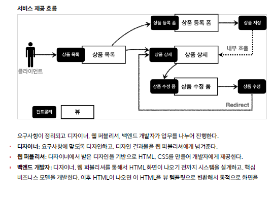

# 스프링 MVC - 웹 페이지 만들기

## 요구사항 분석

      


<br/>

## 상품 목록 - 타임리프

✅ 타임리프 사용 선언      
`<html xmlns:th="[http://www.thymeleaf.org](http://www.thymeleaf.org/)">`      

<br/>

✅  속성 변경 - th:href      
`th:href="@{/css/bootstrap.min.css}"`      
- href="value1" 을 th:href="value2" 의 값으로 변경한다.      
- 타임리프 뷰 템플릿을 거치게 되면 원래 값을 th:xxx 값으로 변경한다. 만약 값이 없다면 새로 생성한다.      
- HTML을 그대로 볼 때는 href 속성이 사용되고, 뷰 템플릿을 거치면 th:href 의 값이 href 로 대체되면서 동적으로 변경할 수 있다.      
- 대부분의 HTML 속성을 th:xxx 로 변경할 수 있다.      
<br/>

✅ 타임리프 핵심      
- 핵심은 th:xxx 가 붙은 부분은 서버사이드에서 렌더링 되고, 기존 것을 대체한다. th:xxx 이 없으면 기존 html의 xxx 속성이 그대로 사용된다.      
- HTML을 파일로 직접 열었을 때, th:xxx 가 있어도 웹 브라우저는 th: 속성을 알지 못하므로 무시한다.      
- 따라서 HTML을 파일 보기를 유지하면서 템플릿 기능도 할 수 있다. (jsp는 불가..)      

<br/> 

✅ URL 링크 표현식 - @{...},      
`th:href="@{/css/bootstrap.min.css}"`      
- `@{...}` : 타임리프는 URL 링크를 사용하는 경우 @{...} 를 사용한다. 이것을 URL 링크 표현식이라 한다.      
- URL 링크 표현식을 사용하면 서블릿 컨텍스트를 자동으로 포함한다.      
<br/>

✅ 상품 등록 폼으로 이동      
속성 변경 - th:onclick      
- `onclick="location.href='addForm.html'"`      
- `th:onclick="|location.href='@{/basic/items/add}'|"`      
여기에는 다음에 설명하는 리터럴 대체 문법이 사용되었다.

<br/>

✅ 리터럴 대체 - |...|      
`|...|` :이렇게 사용한다.      
- 타임리프에서 문자와 표현식 등은 분리되어 있기 때문에 더해서 사용해야 한다.      
`<span th:text="'Welcome to our application, ' + ${[user.name](http://user.name/)} + '!'">`      
- 다음과 같이 리터럴 대체 문법을 사용하면, 더하기 없이 편리하게 사용할 수 있다.      
`<span th:text="|Welcome to our application, ${[user.name](http://user.name/)}!|">`      
- 결과를 다음과 같이 만들어야 하는데      
`location.href='/basic/items/add'`            
- 그냥 사용하면 문자와 표현식을 각각 따로 더해서 사용해야 하므로 다음과 같이 복잡해진다.      
`th:onclick="'location.href=' + '\'' + @{/basic/items/add} + '\''"`      
- 리터럴 대체 문법을 사용하면 다음과 같이 편리하게 사용할 수 있다.      
`th:onclick="|location.href='@{/basic/items/add}'|"`      

<br/>

✅ 반복 출력 - th:each      
`<tr th:each="item : ${items}">`      
- 반복은 th:each 를 사용한다. 이렇게 하면 모델에 포함된 items 컬렉션 데이터가 item 변수에 하나씩 포함되고, 반복문 안에서 item 변수를 사용할 수 있다.      
- 컬렉션의 수 만큼 <tr>..</tr> 이 하위 테그를 포함해서 생성된다.      

<br/>

✅ 변수 표현식 - ${...}      
`<td th:text="${item.price}">10000</td>`      
- 모델에 포함된 값이나, 타임리프 변수로 선언한 값을 조회할 수 있다.      
- 프로퍼티 접근법을 사용한다. ( item.getPrice() )      

<br/>

✅ 내용 변경 - th:text      
`<td th:text="${item.price}">10000</td>`      
- 내용의 값을 th:text 의 값으로 변경한다.      
- 여기서는 10000을 ${item.price} 의 값으로 변경한다.      

<br/>

✅ URL 링크 표현식2 - @{...},      
`th:href="@{/basic/items/{itemId}(itemId=${[item.id](http://item.id/)})}"`      
- 상품 ID를 선택하는 링크를 확인해보자.      
- URL 링크 표현식을 사용하면 경로를 템플릿처럼 편리하게 사용할 수 있다.      
- 경로 변수( {itemId} ) 뿐만 아니라 쿼리 파라미터도 생성한다.
- 예) `th:href="@{/basic/items/{itemId}(itemId=${[item.id](http://item.id/)}, query='test')}"`      
　- 생성 링크: http://localhost:8080/basic/items/1?query=test      

<br/>

✅ URL 링크 간단히      
`th:href="@{|/basic/items/${[item.id](http://item.id/)}|}"`      
- 상품 이름을 선택하는 링크를 확인해보자.      
- 리터럴 대체 문법을 활용해서 간단히 사용할 수도 있다      

<br/>

## 상품 상세

✅ 속성 변경 - th:value      
`th:value="${[item.id](http://item.id/)}"`      
- 모델에 있는 item 정보를 획득하고 프로퍼티 접근법으로 출력한다. ( item.getId() )      
- value 속성을 th:value 속성으로 변경한다.      

<br/>

✅ 상품수정 링크      
`th:onclick="|location.href='@{/basic/items/{itemId}/edit(itemId=${[item.id](http://item.id/)})}'|"`      

<br/>

✅ 목록으로 링크      
`th:onclick="|location.href='@{/basic/items}'|"`

<br/>

## 상품등록 폼

✅ 속성 변경 - th:action      
- `th:action`      
- HTML form에서 action 에 값이 없으면 현재 URL에 데이터를 전송한다.      
- 상품 등록 폼의 URL과 실제 상품 등록을 처리하는 URL을 똑같이 맞추고 HTTP 메서드로 두 기능을 구분한다.      
　- 상품 등록 폼: GET /basic/items/add      
　- 상품 등록 처리: POST /basic/items/add      
- 이렇게 하면 하나의 URL로 등록 폼과, 등록 처리를 깔끔하게 처리할 수 있다.      

<br/>

✅ 취소      
취소시 상품 목록으로 이동한다.      
`th:onclick="|location.href='@{/basic/items}'|"`

<br/>

## 상품 등록 처리 - @ModelAttribute

✅ POST - HTML Form      
- content-type: application/x-www-form-urlencoded      
- 메시지 바디에 쿼리 파리미터 형식으로 전달 itemName=itemA&price=10000&quantity=10      
- 예) 회원 가입, 상품 주문, HTML Form 사용      

<br/>

- 요청 파라미터 형식을 처리해야 하므로 @RequestParam 을 사용하자      
<br/>

- addItemV1 - BasicItemController에 추가

```java
//    @PostMapping("/add")
    public String addItemV1(@RequestParam String itemName,
                       @RequestParam int price,
                       @RequestParam Integer quantity,
                       Model model) {

        Item item = new Item();
        item.setItemName(itemName);
        item.setPrice(price);
        item.setQuantity(quantity);

        itemRepository.save(item);

        model.addAttribute("item", item);

        return "/basic/item";
    }// addItemV1
```

- addItemV2 - 상품 등록 처리 - ModelAttribute      

```jsx

//    @PostMapping("/add")
    public String addItemV2(@ModelAttribute("item") Item item, Model model) {

        itemRepository.save(item);
//        model.addAttribute("item", item); // 자동 추가, 생략 가능

        return "/basic/item";
    }// addItemV2
```

- addItemV3 - 상품 등록 처리 - ModelAttribute 이름 생략      

```jsx
//    @PostMapping("/add")
    public String addItemV3(@ModelAttribute Item item) {

        itemRepository.save(item);
        return "/basic/item";
    }// addItemV3
```

- addItemV4 - 상품 등록 처리 - ModelAttribute 전체 생략      

```java
    @PostMapping("/add")
public String addItemV4(Item item) {

				itemRepository.save(item);
        return "/basic/item";
}// addItemV4
```

<br/>

## 상품 수정

✅ 리다이렉트      
- 상품 수정은 마지막에 뷰 템플릿을 호출하는 대신에 상품 상세 화면으로 이동하도록 리다이렉트를 호출한다.      
- 스프링은 redirect:/... 으로 편리하게 리다이렉트를 지원한다.      
- redirect:/basic/items/{itemId}"      
　- 컨트롤러에 매핑된 @PathVariable 의 값은 redirect 에도 사용 할 수 있다.      
　- redirect:/basic/items/{itemId} {itemId} 는 @PathVariable Long itemId 의 값을 그대로 사용한다.      

<br/>

## PRG Post/Redirect/Get

      
      

✅ 웹 브라우저의 새로 고침은 마지막에 서버에 전송한 데이터를 다시 전송한다.      
상품 등록 폼에서 데이터를 입력하고 저장을 선택하면 `POST /add` + 상품 데이터를 서버로 전송한다      
이 상태에서 새로 고침을 또 선택하면 마지막에 전송한 `POST /add` + 상품 데이터를 서버로 다시 전송하게 된다.      
→ 그래서 내용은 같고, ID만 다른 상품 데이터가 계속 쌓이게 된다.      

      


✅ 새로 고침 문제를 해결하려면 상품 저장 후에 뷰 템플릿으로 이동하는 것이 아니라, 상품 상세 화면으로 리다이렉트를 호출해주면 된다.      

웹 브라우저는 리다이렉트의 영향으로 상품 저장 후에 실제 상품 상세 화면으로 다시 이동한다. 따라서 마지막에 호출한 내용이 상품 상세 화면인 GET /items/{id} 가 되는 것이다.      

```java
/**
     * PRG - Post/Redirect/Get
     */
    @PostMapping("/add")
    public String addItemV5(Item item) {

        itemRepository.save(item);
        return "redirect:/basic/items/" + item.getId();
    }// addItemV5
```

<br/>

## RedirectAttributes

```java
/**
     * RedirectAttributes
     */
    @PostMapping("/add")
    public String addItemV6(Item item, RedirectAttributes redirectAttributes) {
        Item savedItem = itemRepository.save(item);
        redirectAttributes.addAttribute("itemId", savedItem.getId());
        redirectAttributes.addAttribute("status", true);
        return "redirect:/basic/items/{itemId}";
    }// addItemV6
```

→ `http://localhost:8080/basic/items/3?status=true`      
- `redirect:/basic/items/{itemId}`      
　- pathVariable 바인딩: `{itemId}`      
　- 나머지는 쿼리 파라미터로 처리: `?status=true`      

<br/>

- 뷰템플릿      

```java
<!-- 추가 -->
    <h2 th:if="${param.status}" th:text="'저장 완료'"></h2>
```

- `th:if` : 해당 조건이 참이면 실행      
- `${param.status}` : 타임리프에서 쿼리 파라미터를 편리하게 조회하는 기능      
　- 원래는 컨트롤러에서 모델에 직접 담고 값을 꺼내야 한다.       그런데 쿼리 파라미터는 자주 사용해서 타임리프에서 직접 지원한다.      